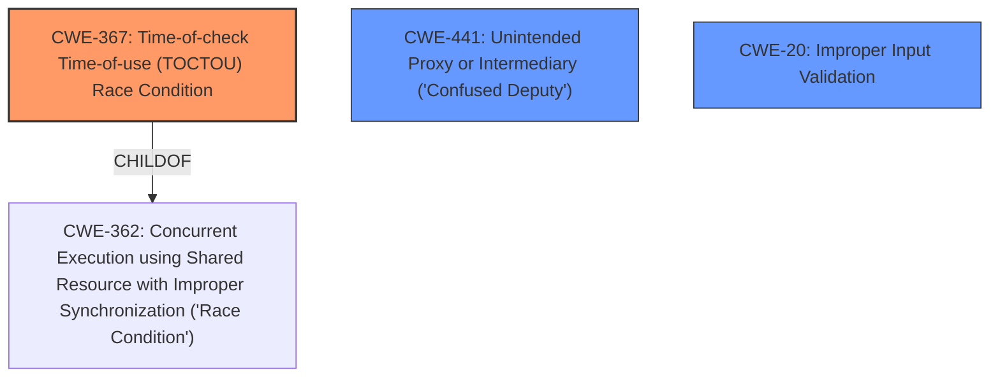

# Final Resolution for CVE-2020-0238

# Summary
| CWE ID | CWE Name | Confidence | CWE Abstraction Level | CWE Vulnerability Mapping Label | CWE-Vulnerability Mapping Notes |
|---|---|---|---|---|---|
| CWE-367 | Time-of-check Time-of-use (TOCTOU) Race Condition | 0.9 | Base | Allowed | The root cause is a TOCTOU **race condition** during permission checks. |
| CWE-441 | Unintended Proxy or Intermediary (**'Confused Deputy'**) | 0.7 | Class | Allowed-with-Review | The vulnerability is a **confused deputy** attack. |
| CWE-20 | Improper Input Validation | 0.5 | Base | Allowed | The XML configuration isn't being properly validated. |

## Evidence and Confidence

*   **Confidence Score:** 0.8
*   **Evidence Strength:** HIGH

## Relationship Analysis
The primary relationship influencing the decision was the parent-child relationship between CWE-362 (Race Condition) and CWE-367 (Time-of-check Time-of-use (TOCTOU) Race Condition). Identifying CWE-367 provided a more specific classification for the **race condition** described in the vulnerability. There were no direct relationships that caused a change in the selection of CWE-441, but its relationship to CWE-610 was considered.

## Vulnerability Chain
The vulnerability chain starts with **CWE-20 (Improper Input Validation)** of the XML configuration. This leads to a **CWE-367 (Time-of-check Time-of-use (TOCTOU) Race Condition)** during permission checks, where an attacker can exploit the timing window. Finally, this results in **CWE-441 (Unintended Proxy or Intermediary ('Confused Deputy'))**, where the system is tricked into launching an activity on behalf of an unauthorized attacker.

## Summary of Analysis
The initial analysis correctly identified CWE-362 and CWE-441 as primary weaknesses. The criticism suggested refining the classification by identifying a more specific, base-level CWE for the **race condition**. Based on the description of the vulnerability, which mentions a possible **confused deputy** attack due to a **race condition** in `updatePreferenceIntents` of `AccountTypePreferenceLoader`, where the system checks the `exported` attribute and permissions before launching an activity, **CWE-367 (Time-of-check Time-of-use (TOCTOU) Race Condition)** was chosen as a more precise classification for the **race condition**.

The vulnerability description includes: "In updatePreferenceIntents of AccountTypePreferenceLoader, there is a possible confused deputy attack due to a **race condition**. This could lead to local escalation of privilege and launching privileged activities with no additional execution privileges needed." This directly supports the **race condition** and **confused deputy** aspects.

The decision to include **CWE-20 (Improper Input Validation)** is based on the understanding that the XML configuration is not being properly validated, which contributes to the overall vulnerability.

The selected CWEs are at the optimal level of specificity because **CWE-367** is a base-level CWE that accurately describes the **TOCTOU race condition**, **CWE-441** captures the **confused deputy** aspect, and **CWE-20** highlights the lack of input validation.