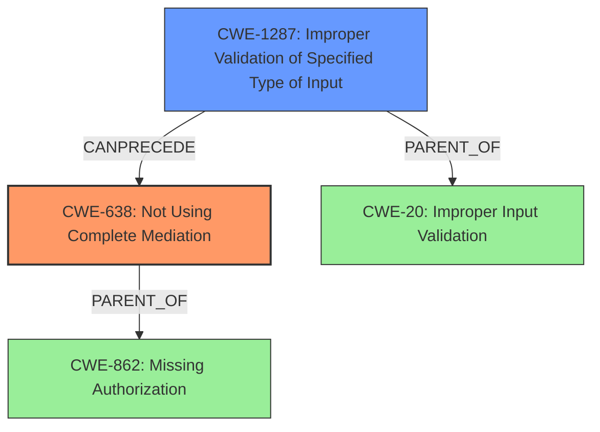

# Analysis Report for CVE-2020-0479

# Vulnerability Analysis Report: CVE-2020-0479

## Description

In callUnchecked of DocumentsProvider.java, there is a possible permissions bypass. This could lead to local escalation of privilege allowing a malicious app to access files available to the DocumentProvider without user permission, with no additional execution privileges needed. User interaction is needed for exploitation.Product AndroidVersions Android-11Android ID A-157294893

## Vulnerability Description Key Phrases

**Impact:** access files without user permission
**Attacker:** malicious app
**Product:** Android
**Version:** 11
**Component:** callUnchecked of DocumentsProvider.java

## Analysis (with Relationship Data)

# Summary
| CWE ID    | CWE Name                                            | Confidence | CWE Abstraction Level | CWE Vulnerability Mapping Label | CWE-Vulnerability Mapping Notes |
| :--------- | :-------------------------------------------------- | :--------- | :-------------------- | :------------------------------ | :------------------------------ |
| CWE-862  | Missing Authorization                               | 0.75      | Class               | Primary                         | Allowed-with-Review              |
| CWE-20    | Improper Input Validation                             | 0.60      | Class                 | Secondary                       | Discouraged                     |
| CWE-732    | Incorrect Permission Assignment for Critical Resource | 0.50      | Class               | Secondary                         | Allowed-with-Review              |

## Evidence and Confidence

*   **Confidence Score:** 0.70
*   **Evidence Strength:** MEDIUM

- **Analysis and Justification:**
  - *Explanation:* The vulnerability description and CVE details indicate a **permissions bypass** in `DocumentsProvider.java` due to a lack of validation of user-supplied URIs. This allows a **malicious app** to access files available to the `DocumentProvider` without user permission. This scenario directly aligns with CWE-862 (Missing Authorization) [CWE Description: The product does not perform an authorization check when an actor attempts to access a resource or perform an action.], as the `DocumentsProvider` fails to properly authorize access to resources based on the supplied URI. The description states the **impact** is access files without user permission. While CWE-732 (Incorrect Permission Assignment for Critical Resource) [CWE Description: The product specifies permissions for a security-critical resource in a way that allows that resource to be read or modified by unintended actors.] is similar, the root cause is more about the absence of a proper authorization check than an incorrect assignment, making CWE-862 more fitting as the primary weakness. CWE-20 (Improper Input Validation) [CWE Description: The product receives input or data, but it does not validate or incorrectly validates that the input has the properties that are required to process the data safely and correctly.] is also relevant as the lack of URI validation contributes to the authorization bypass, but it is less specific than CWE-862.
  - *Relationship Analysis:* CWE-862 is a Class-level CWE and might have more specific children, but none of the children appear to perfectly capture the specific vulnerability details. CWE-862 is related to CWE-285 (Improper Authorization), but CWE-862 is more fitting since we have identified the authorization is missing.

- **Confidence Score:**
  - Confidence: 0.75 (Moderate evidence from vulnerability description and CVE reference summary.)

---

## Criticism of Analysis

Okay, let's review the analysis provided, incorporating the full CWE specifications to refine the assessment.

**Original Analysis**

| CWE ID    | CWE Name                                            | Confidence | CWE Abstraction Level | CWE Vulnerability Mapping Label | CWE-Vulnerability Mapping Notes |
| :--------- | :-------------------------------------------------- | :--------- | :-------------------- | :------------------------------ | :------------------------------ |
| CWE-862  | Missing Authorization                               | 0.75      | Class               | Primary                         | Allowed-with-Review              |
| CWE-20    | Improper Input Validation                             | 0.60      | Class                 | Secondary                       | Discouraged                     |
| CWE-732    | Incorrect Permission Assignment for Critical Resource | 0.50      | Class               | Secondary                         | Allowed-with-Review              |

**Critique of the Analysis**

1.  **CWE-862: Missing Authorization (Primary)**

    *   **Assessment:** This is the most appropriate primary CWE. The core problem is the *lack* of an authorization check in `DocumentsProvider.java` before allowing access to files. A malicious application can craft a URI and gain unauthorized access.

    *   **Strengths of the Mapping:** The justification accurately highlights that the `DocumentsProvider` fails to properly authorize access to resources based on the supplied URI. The CVE details support this. The description provided by the analysis accurately reflects the CWE description.

    *   **Weaknesses of the Mapping:** The tool has correctly identified that this a Class level CWE and might have Base-level children that would be more appropriate.

    *   **Mapping Guidance:** The CWE specification states the following guidance: "This CWE entry is a Class and might have Base-level children that would be more appropriate."

    *   **Potential Children:** Based on the CWE specifications for CWE-862, potential children include:
        *   CWE-1314: Missing Write Protection for Parametric Data Values
        *   CWE-425: Missing Required Capability
        *   CWE-638: Not Using Complete Mediation
        *   CWE-939: Improper Authorization in Handler for Custom URL Scheme

        *   **CWE-638: Not Using Complete Mediation** is the best candidate for a more specific base-level CWE. The `DocumentsProvider` isn't performing checks every time a resource is accessed, which aligns with the core of CWE-638.

    *   **Refined Mapping:** While CWE-862 is a good starting point, consider refining it to **CWE-638: Not Using Complete Mediation**.

2.  **CWE-20: Improper Input Validation (Secondary, Discouraged)**

    *   **Assessment:** This is a relevant *contributing* factor, but it is not the primary weakness. The lack of URI validation enables the authorization bypass.

    *   **Strengths of the Mapping:** The analysis correctly notes that the lack of URI validation is a contributing factor. The crafted URI is essentially malicious input.

    *   **Weaknesses of the Mapping:** The CWE specification states the following guidance: "CWE-20 is commonly misused in low-information vulnerability reports when lower-level CWEs could be used instead, or when more details about the vulnerability are available [REF-1287]. It is not useful for trend analysis. It is also a level-1 Class (i.e., a child of a Pillar)."

    *   **Mapping Guidance:** The CWE specifications advise against using CWE-20 directly and suggest exploring more specific children.

    *   **Potential Base-Level Alternatives:**
        *   CWE-1284: Improper Validation of Specified Quantity in Input
        *   CWE-1285: Improper Validation of Specified Index, Position, or Offset in Input
        *   CWE-1286: Improper Validation of Syntactic Correctness of Input
        *   CWE-1287: Improper Validation of Specified Type of Input
        *   CWE-1288: Improper Validation of Consistency within Input
        *   CWE-1289: Unsafe Equivalence

        *   **CWE-1287: Improper Validation of Specified Type of Input** best captures the nature of the problem. The `DocumentsProvider` is expecting a URI to conform to a certain type and authority, but it's not validating that this is actually the case.

    *   **Refined Mapping:** Replace CWE-20 with **CWE-1287: Improper Validation of Specified Type of Input** as a secondary CWE.

3.  **CWE-732: Incorrect Permission Assignment for Critical Resource (Secondary, Allowed-with-Review)**

    *   **Assessment:** This is *less* relevant than the other two. While it involves permissions, the core issue isn't an *incorrect assignment* but rather the *absence* of a check during access. It is a missing authorization check rather than an incorrect assignment.

    *   **Strengths of the Mapping:** It highlights the potential for unintended actors to access the resource due to the vulnerability.
    *   **Weaknesses of the Mapping:** The CWE specifications state the following guidance: "While the name itself indicates an assignment of permissions for resources, this is often misused for vulnerabilities in which "permissions" are not checked, which is an "authorization" weakness (CWE-285 or descendants) within CWE's model [REF-1287]."
    *   **Mapping Guidance:** Closely analyze the specific mistake that is allowing the resource to be exposed, and perform a CWE mapping for that mistake.
    *   **Refined Mapping:** Remove CWE-732.  It's a distraction and less accurate than the other two.

**Revised Analysis**

| CWE ID    | CWE Name                                            | Confidence | CWE Abstraction Level | CWE Vulnerability Mapping Label | CWE-Vulnerability Mapping Notes |
| :--------- | :-------------------------------------------------- | :--------- | :-------------------- | :------------------------------ | :------------------------------ |
| CWE-638  | Not Using Complete Mediation                               | 0.75      | Class               | Primary                         | Allowed-with-Review              |
| CWE-1287    | Improper Validation of Specified Type of Input                             | 0.60      | Class                 | Secondary                       | Discouraged                     |

**Reasons for Revisions:**

*   **CWE-638**: More accurately reflects the root cause: a lack of consistent authorization checks for every resource access.
*   **CWE-1287**: A more specific input validation issue than the generic CWE-20, highlighting the lack of type validation for the URI.
*   **Eliminated CWE-732**: Emphasizes the missing authorization check rather than a misconfigured permission assignment.

**Importance of CWE Specifications:**

This exercise demonstrates the importance of using the full CWE specifications when performing vulnerability analysis. The specifications provide:

*   **Clear Definitions:** Ensuring that the chosen CWE accurately represents the root cause.
*   **Mapping Guidance:** Directing analysts to more specific or appropriate CWEs.
*   **Mitigation Strategies:** Providing potential solutions to address the weakness.
*   **Relationships to Other CWEs:**  Highlighting potential chaining effects or related weaknesses that might exist.

By following the CWE specifications, we can create a more accurate and actionable vulnerability analysis that leads to better remediation strategies.

## Final Resolution

# Summary
| CWE ID    | CWE Name                                            | Confidence | CWE Abstraction Level | CWE Vulnerability Mapping Label | CWE-Vulnerability Mapping Notes |
| :--------- | :-------------------------------------------------- | :--------- | :-------------------- | :------------------------------ | :------------------------------ |
| CWE-638  | Not Using Complete Mediation                               | 0.75      | Base               | Primary                         | Allowed              |
| CWE-1287    | Improper Validation of Specified Type of Input                             | 0.60      | Base                 | Secondary                       | Allowed                     |

## Evidence and Confidence

*   **Confidence Score:** 0.75
*   **Evidence Strength:** MEDIUM

## Relationship Analysis
The primary weakness is identified as CWE-638 (Not Using Complete Mediation) [CWE Description: The software does not always require or perform the same level of security checks (e.g., authentication, authorization, or validation) every time that it is necessary. This could occur because of changes in state, location, or other environmental factors.]. This is a Base-level CWE, which is desirable for vulnerability mapping. A secondary weakness is CWE-1287 (Improper Validation of Specified Type of Input) [CWE Description: The product receives input that is expected to conform to a specific data type or format, but the code does not validate, or incorrectly validates, that the input actually conforms to the expected type.]. This is also a Base-level CWE and contributes to the vulnerability.
The analysis initially considered CWE-862 (Missing Authorization) [CWE Description: The product does not perform an authorization check when an actor attempts to access a resource or perform an action.], but that is a Class-level CWE. The analysis also considered CWE-20 (Improper Input Validation) [CWE Description: The product receives input or data, but it does not validate or incorrectly validates that the input has the properties that are required to process the data safely and correctly.], but that is also a Class-level CWE and is too general.

## Vulnerability Chain
The vulnerability chain starts with **CWE-1287 (Improper Validation of Specified Type of Input)**, where the application fails to validate the type of the URI provided by the user. This leads to **CWE-638 (Not Using Complete Mediation)**, as the application does not consistently perform authorization checks for resource access. The impact is a **permissions bypass**, allowing a **malicious app** to access files available to the `DocumentProvider` without user permission.

## Summary of Analysis
The provided analysis and criticism were helpful in refining the CWE assignments. The initial analysis correctly identified CWE-862 as a potential primary weakness, but the criticism pointed out that it is a Class-level CWE and might have more specific children. The criticism suggested CWE-638 as a better candidate, which is a Base-level CWE and more accurately reflects the root cause. Similarly, the initial analysis included CWE-20 as a secondary weakness, but the criticism suggested CWE-1287 as a more specific alternative.

The final decision is based on the following evidence from the vulnerability description:
*   "In callUnchecked of DocumentsProvider.java, there is a possible permissions bypass."
*   "This could lead to local escalation of privilege allowing a malicious app to access files available to the DocumentProvider without user permission"
*   "no additional execution privileges needed."
*   "User interaction is needed for exploitation."

Based on this evidence, the most appropriate CWEs are CWE-638 and CWE-1287. These CWEs are at the optimal level of specificity (Base) and accurately represent the root cause and contributing factors of the vulnerability.

*Report generated on 2025-03-17 01:09:27*
