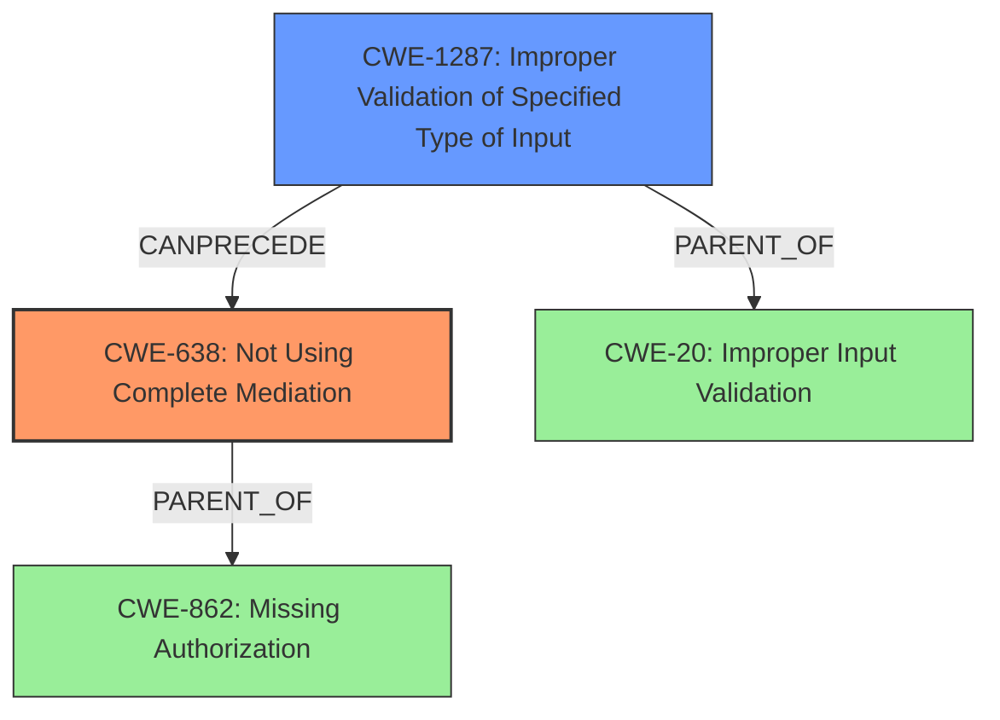

# Final Resolution for CVE-2020-0479

# Summary
| CWE ID    | CWE Name                                            | Confidence | CWE Abstraction Level | CWE Vulnerability Mapping Label | CWE-Vulnerability Mapping Notes |
| :--------- | :-------------------------------------------------- | :--------- | :-------------------- | :------------------------------ | :------------------------------ |
| CWE-638  | Not Using Complete Mediation                               | 0.75      | Base               | Primary                         | Allowed              |
| CWE-1287    | Improper Validation of Specified Type of Input                             | 0.60      | Base                 | Secondary                       | Allowed                     |

## Evidence and Confidence

*   **Confidence Score:** 0.75
*   **Evidence Strength:** MEDIUM

## Relationship Analysis
The primary weakness is identified as CWE-638 (Not Using Complete Mediation) [CWE Description: The software does not always require or perform the same level of security checks (e.g., authentication, authorization, or validation) every time that it is necessary. This could occur because of changes in state, location, or other environmental factors.]. This is a Base-level CWE, which is desirable for vulnerability mapping. A secondary weakness is CWE-1287 (Improper Validation of Specified Type of Input) [CWE Description: The product receives input that is expected to conform to a specific data type or format, but the code does not validate, or incorrectly validates, that the input actually conforms to the expected type.]. This is also a Base-level CWE and contributes to the vulnerability.
The analysis initially considered CWE-862 (Missing Authorization) [CWE Description: The product does not perform an authorization check when an actor attempts to access a resource or perform an action.], but that is a Class-level CWE. The analysis also considered CWE-20 (Improper Input Validation) [CWE Description: The product receives input or data, but it does not validate or incorrectly validates that the input has the properties that are required to process the data safely and correctly.], but that is also a Class-level CWE and is too general.

## Vulnerability Chain
The vulnerability chain starts with **CWE-1287 (Improper Validation of Specified Type of Input)**, where the application fails to validate the type of the URI provided by the user. This leads to **CWE-638 (Not Using Complete Mediation)**, as the application does not consistently perform authorization checks for resource access. The impact is a **permissions bypass**, allowing a **malicious app** to access files available to the `DocumentProvider` without user permission.

## Summary of Analysis
The provided analysis and criticism were helpful in refining the CWE assignments. The initial analysis correctly identified CWE-862 as a potential primary weakness, but the criticism pointed out that it is a Class-level CWE and might have more specific children. The criticism suggested CWE-638 as a better candidate, which is a Base-level CWE and more accurately reflects the root cause. Similarly, the initial analysis included CWE-20 as a secondary weakness, but the criticism suggested CWE-1287 as a more specific alternative.

The final decision is based on the following evidence from the vulnerability description:
*   "In callUnchecked of DocumentsProvider.java, there is a possible permissions bypass."
*   "This could lead to local escalation of privilege allowing a malicious app to access files available to the DocumentProvider without user permission"
*   "no additional execution privileges needed."
*   "User interaction is needed for exploitation."

Based on this evidence, the most appropriate CWEs are CWE-638 and CWE-1287. These CWEs are at the optimal level of specificity (Base) and accurately represent the root cause and contributing factors of the vulnerability.