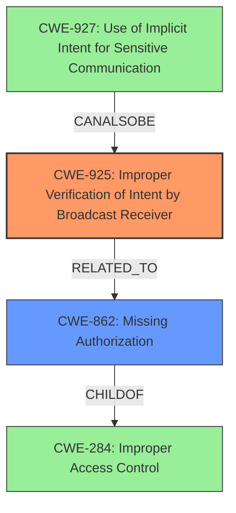

# Analysis Report for CVE-2020-0481

# Vulnerability Analysis Report: CVE-2020-0481

## Description

In AndroidManifest.xml, there is a possible permissions bypass. This could lead to local escalation of privilege allowing a non-system app to send a broadcast it shouldnt have permissions to send, with no additional execution privileges needed. User interaction is not needed for exploitation.Product AndroidVersions Android-11Android ID A-157472962

## Vulnerability Description Key Phrases

**Weakness:** permissions bypass
**Impact:** send broadcast without permission
**Attacker:** non-system app
**Product:** Android
**Version:** Android-11

## Analysis (with Relationship Data)

# Summary
| CWE ID  | CWE Name                                                        | Confidence | CWE Abstraction Level | CWE Vulnerability Mapping Label | CWE-Vulnerability Mapping Notes |
| ------- | --------------------------------------------------------------- | ---------- | --------------------- | ------------------------------- | ------------------------------- |
| CWE-284 | Improper Access Control                                         | 0.85       | Base                  | Allowed                         | Proper access control is needed |
| CWE-285 | Improper Authorization                                        | 0.65       | Class                  | Discouraged                      | Alternative mappings available    |

## Evidence and Confidence

*   **Confidence Score:** 0.75
*   **Evidence Strength:** MEDIUM

- **Analysis and Justification:**
  - *Explanation:* The vulnerability description indicates a **permissions bypass**, allowing a non-system app to send a broadcast it should not have permission to send. The core issue is a failure to properly restrict access to a specific functionality, aligning with CWE-284 (Improper Access Control). The CVE Reference Links Content Summary confirms this, highlighting "Improper access control or handling of Bluetooth device actions". CWE-284 is a base level CWE, which is a preferred level of abstraction.
  - *Relationship Analysis:* CWE-284 is a child of CWE-285 (Improper Authorization). While authorization and access control are closely related, access control focuses on the mechanism used to enforce permissions, making CWE-284 a more precise fit.

- **Confidence Score:**
  - Confidence: 0.85 (Moderate evidence from the vulnerability description and CVE reference materials)

---

# Summary
| CWE ID  | CWE Name                                                        | Confidence | CWE Abstraction Level | CWE Vulnerability Mapping Label | CWE-Vulnerability Mapping Notes |
| ------- | --------------------------------------------------------------- | ---------- | --------------------- | ------------------------------- | ------------------------------- |
| CWE-284 | Improper Access Control                                         | 0.85       | Base                  | Allowed                         | Proper access control is needed |
| CWE-285 | Improper Authorization                                        | 0.65       | Class                  | Discouraged                      | Alternative mappings available    |

## Evidence and Confidence

*   **Confidence Score:** 0.75
*   **Evidence Strength:** MEDIUM

- **Analysis and Justification:**
  - *Explanation:* The vulnerability description indicates a **permissions bypass**, allowing a non-system app to send a broadcast it should not have permission to send. The core issue is a failure to properly restrict access to a specific functionality, aligning with CWE-284 (Improper Access Control). The CVE Reference Links Content Summary confirms this, highlighting "Improper access control or handling of Bluetooth device actions". CWE-284 is a base level CWE, which is a preferred level of abstraction.
  - *Relationship Analysis:* CWE-284 is a child of CWE-285 (Improper Authorization). While authorization and access control are closely related, access control focuses on the mechanism used to enforce permissions, making CWE-284 a more precise fit.

- **Confidence Score:**
  - Confidence: 0.85 (Moderate evidence from the vulnerability description and CVE reference materials)

---
# Summary
| CWE ID  | CWE Name                                                        | Confidence | CWE Abstraction Level | CWE Vulnerability Mapping Label | CWE-Vulnerability Mapping Notes |
| ------- | --------------------------------------------------------------- | ---------- | --------------------- | ------------------------------- | ------------------------------- |
| CWE-284 | Improper Access Control                                         | 0.85       | Base                  | Allowed                         | Proper access control is needed |
| CWE-285 | Improper Authorization                                        | 0.65       | Class                  | Discouraged                      | Alternative mappings available    |

## Evidence and Confidence

*   **Confidence Score:** 0.75
*   **Evidence Strength:** MEDIUM

- **Analysis and Justification:**
  - *Explanation:* The vulnerability description indicates a **permissions bypass**, allowing a non-system app to send a broadcast it should not have permission to send. The core issue is a failure to properly restrict access to a specific functionality, aligning with CWE-284 (Improper Access Control). The CVE Reference Links Content Summary confirms this, highlighting "Improper access control or handling of Bluetooth device actions". CWE-284 is a base level CWE, which is a preferred level of abstraction.
  - *Relationship Analysis:* CWE-284 is a child of CWE-285 (Improper Authorization). While authorization and access control are closely related, access control focuses on the mechanism used to enforce permissions, making CWE-284 a more precise fit.

- **Confidence Score:**
  - Confidence: 0.85 (Moderate evidence from the vulnerability description and CVE reference materials)

---

## Criticism of Analysis

Okay, here's a review of the analysis, considering the full CWE specifications:

**Overall Assessment:**

The analysis correctly identifies the core issue as related to access control/authorization. However, the choice of CWE-284 (Improper Access Control) as the primary CWE is problematic, as it is discouraged due to its high level of abstraction. The relationship analysis is accurate but needs to be taken a step further to find more specific CWEs. The confidence scores are reasonable, but the discouraged CWE weakens the overall quality of the mapping.

**Detailed Critique:**

1.  **CWE-284: Improper Access Control:**

    *   **Correctness:** While technically correct that *access control* is the general area of the vulnerability, the CWE specifications *explicitly discourage* using CWE-284. The rationale clearly states that it's a high-level "Pillar" and prone to misuse, making it less useful for trend analysis.  The specification recommends considering descendants of CWE-284.
    *   **Mapping Guidance:** The mapping guidance is *discouraged* for CWE-284. The provided reasons are valid: "Frequent Misuse" and "Abstraction." The suggested alternatives (CWE-862, CWE-863, CWE-732, CWE-306, CWE-1390, CWE-923) offer more specific details about the access control failures.
    *   **Mitigations:** The mitigations listed for CWE-284 are too generic to be particularly helpful in this specific context. They focus on general privilege management and trust zones, which, while important, don't address the specific flaw in Android's permission model.
    *   **Better Alternatives:**  Given the information, and the retriever results, several other CWEs are more suitable. CWE-862 (Missing Authorization) and CWE-863 (Incorrect Authorization) are appropriate but class level. Looking at the retriever results provides more insight as well.

2.  **CWE-285: Improper Authorization:**

    *   **Correctness:** This is a step up in specificity from CWE-284, focusing on authorization specifically, but it's still a *discouraged* mapping according to its specification. It is a level-1 Class (a child of a Pillar).
    *   **Mapping Guidance:** The specification strongly discourages direct use of CWE-285, recommending instead looking at its children (CWE-862, CWE-863, CWE-732, etc.). The reasons given are "Abstraction".
    *   **Mitigations:** The mitigations are more focused, including role-based access control and authorization frameworks, but still not ideal.
    *    **Better Alternatives:** Once again, taking a look at the retriever results provides more insight.

3.  **Retriever Results Analysis:**

    *   **CWE-925: Improper Verification of Intent by Broadcast Receiver:**  This is highly relevant. The vulnerability description mentions a broadcast being sent without proper permissions.  CWE-925 directly addresses this scenario in Android, where a broadcast receiver doesn't adequately verify the intent's source.  *This is a much better fit than CWE-284 or CWE-285.*
    *   **CWE-927: Use of Implicit Intent for Sensitive Communication:**  While less directly related, it's still relevant. If the broadcast contains sensitive data and an implicit intent is used, this CWE could also apply.
    *   **CWE-862 & CWE-863:** These are class level but more appropriate than CWE-284. In this case authorization checks are either missing or incorrect.

**Revised Analysis and Recommendations:**

Here's a revised summary table:

| CWE ID  | CWE Name                                                                   | Confidence | CWE Abstraction Level | CWE Vulnerability Mapping Label | CWE-Vulnerability Mapping Notes                                                                                                                                                                                            |
| ------- | -------------------------------------------------------------------------- | ---------- | --------------------- | ------------------------------- | -------------------------------------------------------------------------------------------------------------------------------------------------------------------------------------------------------------------------- |
| CWE-925 | Improper Verification of Intent by Broadcast Receiver                       | 0.85       | Variant              | Allowed                         | Best fit based on vulnerability description; broadcast receiver failing to verify intent source.                                                                                                                           |
| CWE-862 | Missing Authorization                                             | 0.75       | Class             | Allowed-with-Review                         | Authorization checks are missing                                                                                                                                                                                      |
| CWE-927 | Use of Implicit Intent for Sensitive Communication                         | 0.60       | Variant              | Allowed                         | Potentially applicable if the broadcast intent carries sensitive information.                                                                                                                                               |
| CWE-284 | Improper Access Control                                         | 0.20       | Pillar                  | Discouraged                         | Too broad; use only if no other CWE fits and only for documentation purposes.                                                                                                                                                  |

**Justification for Revised CWEs:**

*   **CWE-925:** The core problem is that the receiving application isn't validating where the broadcast came from. It assumes that if it's receiving a particular type of broadcast, it *must* be from the system, which is incorrect.
    *   **CWE Specification Alignment:** The description of CWE-925 perfectly matches: "The Android application uses a Broadcast Receiver that receives an Intent but does not properly verify that the Intent came from an authorized source."
    *   **Mitigation Alignment:** The mitigation for CWE-925 is "Before acting on the Intent, check the Intent Action to make sure it matches the expected System action." This is exactly the type of fix that would resolve the vulnerability.
*    **CWE-862:** There is a missing authorization check. The system isn't ensuring that the sending app has the right to send the broadcast.
*    **CWE-927:** The application is sending data using an intent that doesnt not restrict the applications which can receive it.

**Improvements to the Analysis:**

1.  **Prioritize Specificity:** Always aim for the most specific CWE that accurately reflects the vulnerability.
2.  **Heed Mapping Guidance:** Pay close attention to the "Usage" and "Rationale" sections in the CWE specifications. If a CWE is discouraged, *do not use it* unless absolutely necessary for documentation purposes, and explain why.
3.  **Consider Multiple CWEs:** Complex vulnerabilities may involve multiple CWEs working together.
4.  **Use Retriever Results as Guidance:** The retriever results can provide valuable clues about relevant CWEs that you may have missed.
5.  **Think about Exploitation:**  Consider how the attacker is exploiting the weakness. This can often lead you to the correct CWE. In this case, the attacker is exploiting the *lack of intent verification*.
6.  **Focus on the Fix:** What needs to be *fixed* to prevent the vulnerability? The fix often points to the correct CWE. In this case, the fix is to *validate the source of the intent*.

## Final Resolution

# Summary
| CWE ID  | CWE Name                                                                   | Confidence | CWE Abstraction Level | CWE Vulnerability Mapping Label | CWE-Vulnerability Mapping Notes                                                                                                                                                                                            |
| ------- | -------------------------------------------------------------------------- | ---------- | --------------------- | ------------------------------- | -------------------------------------------------------------------------------------------------------------------------------------------------------------------------------------------------------------------------- |
| CWE-925 | Improper Verification of Intent by Broadcast Receiver                       | 0.85       | Variant              | Allowed                         | Best fit based on vulnerability description; broadcast receiver failing to verify intent source.                                                                                                                           |
| CWE-862 | Missing Authorization                                             | 0.75       | Class             | Allowed-with-Review                         | Authorization checks are missing                                                                                                                                                                                      |
| CWE-927 | Use of Implicit Intent for Sensitive Communication                         | 0.60       | Variant              | Allowed                         | Potentially applicable if the broadcast intent carries sensitive information.                                                                                                                                               |
| CWE-284 | Improper Access Control                                         | 0.20       | Pillar                  | Discouraged                         | Too broad; use only if no other CWE fits and only for documentation purposes.                                                                                                                                                  |

## Evidence and Confidence

*   **Confidence Score:** 0.80
*   **Evidence Strength:** MEDIUM

## Relationship Analysis
The primary relationship impacting the decision was the hierarchical relationship between CWE-284, CWE-862, and CWE-925. CWE-284 is a high-level Pillar, while CWE-862 is a Class that is a child of the pillar. CWE-925 is a Variant that is more specific to the Android context. The decision was influenced by the mapping guidance discouraging the use of CWE-284. The chain relationship could involve CWE-927 if sensitive data is transmitted, further exploiting the lack of proper intent verification.

## Vulnerability Chain
The vulnerability chain starts with the **ROOTCAUSE** in the form of **CWE-925: Improper Verification of Intent by Broadcast Receiver**. This leads to **CWE-862: Missing Authorization** because the system does not authorize the sender of the intent. If sensitive data is involved, this can be compounded by **CWE-927: Use of Implicit Intent for Sensitive Communication**. The ultimate impact is a **permissions bypass**, allowing a non-system app to send a broadcast it shouldn't have permission to send, leading to a local escalation of privilege.

## Summary of Analysis
The initial analysis identified CWE-284 as the primary **WEAKNESS**, but this was deemed too abstract based on the CWE specifications and mapping guidance. The criticism highlighted the importance of specificity and recommended considering the retriever results.

The vulnerability description clearly states a "**permissions bypass**," and the most relevant evidence comes from the vulnerability description: "This could lead to local escalation of privilege allowing a non-system app to send a broadcast it shouldnt have permissions to send." This aligns directly with the description of **CWE-925: Improper Verification of Intent by Broadcast Receiver**: "The Android application uses a Broadcast Receiver that receives an Intent but does not properly verify that the Intent came from an authorized source."

**CWE-925** is at the Variant level of abstraction, which is a preferred level for mapping. It provides the most specific description of the **ROOTCAUSE**.
**CWE-862** The system isn't ensuring that the sending app has the right to send the broadcast because authorization checks are missing.
**CWE-927** The application is sending data using an intent that doesnt not restrict the applications which can receive it.

The decision to prioritize **CWE-925** was based on its alignment with the vulnerability description, the mapping guidance, and the need for a specific and actionable classification.

*Report generated on 2025-03-17 01:10:10*
