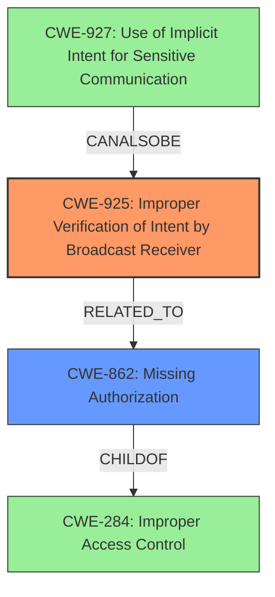

# Final Resolution for CVE-2020-0481

# Summary
| CWE ID  | CWE Name                                                                   | Confidence | CWE Abstraction Level | CWE Vulnerability Mapping Label | CWE-Vulnerability Mapping Notes                                                                                                                                                                                            |
| ------- | -------------------------------------------------------------------------- | ---------- | --------------------- | ------------------------------- | -------------------------------------------------------------------------------------------------------------------------------------------------------------------------------------------------------------------------- |
| CWE-925 | Improper Verification of Intent by Broadcast Receiver                       | 0.85       | Variant              | Allowed                         | Best fit based on vulnerability description; broadcast receiver failing to verify intent source.                                                                                                                           |
| CWE-862 | Missing Authorization                                             | 0.75       | Class             | Allowed-with-Review                         | Authorization checks are missing                                                                                                                                                                                      |
| CWE-927 | Use of Implicit Intent for Sensitive Communication                         | 0.60       | Variant              | Allowed                         | Potentially applicable if the broadcast intent carries sensitive information.                                                                                                                                               |
| CWE-284 | Improper Access Control                                         | 0.20       | Pillar                  | Discouraged                         | Too broad; use only if no other CWE fits and only for documentation purposes.                                                                                                                                                  |

## Evidence and Confidence

*   **Confidence Score:** 0.80
*   **Evidence Strength:** MEDIUM

## Relationship Analysis
The primary relationship impacting the decision was the hierarchical relationship between CWE-284, CWE-862, and CWE-925. CWE-284 is a high-level Pillar, while CWE-862 is a Class that is a child of the pillar. CWE-925 is a Variant that is more specific to the Android context. The decision was influenced by the mapping guidance discouraging the use of CWE-284. The chain relationship could involve CWE-927 if sensitive data is transmitted, further exploiting the lack of proper intent verification.

## Vulnerability Chain
The vulnerability chain starts with the **ROOTCAUSE** in the form of **CWE-925: Improper Verification of Intent by Broadcast Receiver**. This leads to **CWE-862: Missing Authorization** because the system does not authorize the sender of the intent. If sensitive data is involved, this can be compounded by **CWE-927: Use of Implicit Intent for Sensitive Communication**. The ultimate impact is a **permissions bypass**, allowing a non-system app to send a broadcast it shouldn't have permission to send, leading to a local escalation of privilege.

## Summary of Analysis
The initial analysis identified CWE-284 as the primary **WEAKNESS**, but this was deemed too abstract based on the CWE specifications and mapping guidance. The criticism highlighted the importance of specificity and recommended considering the retriever results.

The vulnerability description clearly states a "**permissions bypass**," and the most relevant evidence comes from the vulnerability description: "This could lead to local escalation of privilege allowing a non-system app to send a broadcast it shouldnt have permissions to send." This aligns directly with the description of **CWE-925: Improper Verification of Intent by Broadcast Receiver**: "The Android application uses a Broadcast Receiver that receives an Intent but does not properly verify that the Intent came from an authorized source."

**CWE-925** is at the Variant level of abstraction, which is a preferred level for mapping. It provides the most specific description of the **ROOTCAUSE**.
**CWE-862** The system isn't ensuring that the sending app has the right to send the broadcast because authorization checks are missing.
**CWE-927** The application is sending data using an intent that doesnt not restrict the applications which can receive it.

The decision to prioritize **CWE-925** was based on its alignment with the vulnerability description, the mapping guidance, and the need for a specific and actionable classification.