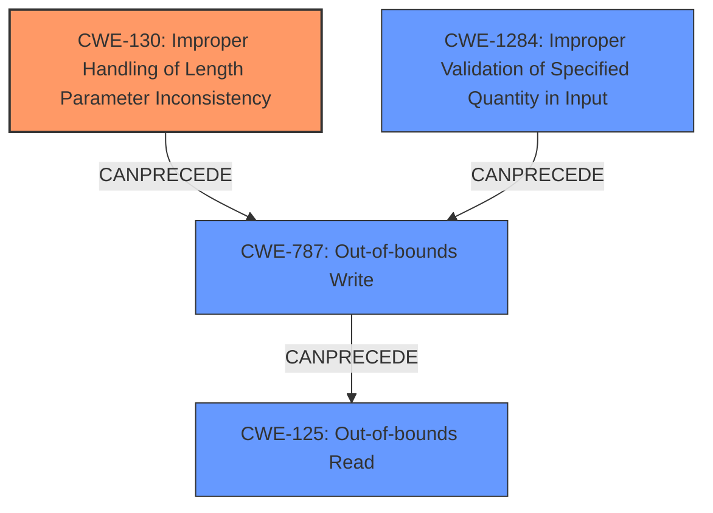

# Final Resolution for CVE-2020-10065

# Summary
| CWE ID | CWE Name | Confidence | CWE Abstraction Level | CWE Vulnerability Mapping Label | CWE-Vulnerability Mapping Notes |
|---|---|---|---|---|---|
| **CWE-130** | **Improper Handling of Length Parameter Inconsistency** | 1.0 | Base | Primary | Allowed. Mitigation: Validate that the length of the user-supplied data is consistent with the buffer size (Mitigation 3). |
| **CWE-787** | **Out-of-bounds Write** | 0.8 | Base | Secondary | Allowed. Results from the inconsistent length. Mitigation: Use safer string-handling functions or automatic buffer overflow detection mechanisms (Mitigation 2 & 3). |
| **CWE-1284** | **Improper Validation of Specified Quantity in Input** | 0.7 | Base | Secondary | Allowed. The length field is not validated. Mitigation: Assume all input is malicious (Mitigation 1). |
| **CWE-125** | **Out-of-bounds Read** | 0.6 | Base | Secondary | Allowed. Could occur due to tightly packed memory after write out of bounds. Mitigation: Adequate Input Validation (Mitigation 1). |

## Evidence and Confidence

*   **Confidence Score:** 0.95
*   **Evidence Strength:** HIGH

## Relationship Analysis
The primary **CWE-130 (Improper Handling of Length Parameter Inconsistency)** sets the stage. The unvalidated length then leads to **CWE-787 (Out-of-bounds Write)** because the write operation uses the inconsistent length. **CWE-1284 (Improper Validation of Specified Quantity in Input)** is a contributing factor because the input length is not checked. **CWE-125 (Out-of-bounds Read)** is a possible consequence of the out-of-bounds write, as subsequent reads may access unintended memory. All selected CWEs are at the Base level of abstraction, providing the desired specificity.

## Vulnerability Chain
The vulnerability chain starts with the receipt of a Bluetooth HCI message over SPI.

1.  The `acl_hdr.len` field is read from the SPI message. (**ROOTCAUSE: CWE-130 Improper Handling of Length Parameter Inconsistency**)
2.  The code does not validate `acl_hdr.len`. (**CWE-1284: Improper Validation of Specified Quantity in Input**)
3.  Data is written to a fixed-size buffer based on the unvalidated `acl_hdr.len`. (**CWE-787: Out-of-bounds Write**)
4.  Subsequent read operations might access unintended memory locations. (**CWE-125: Out-of-bounds Read**)

## Summary of Analysis
The initial analysis correctly identified **CWE-130 (Improper Handling of Length Parameter Inconsistency)** as the primary **WEAKNESS**, supported by the vulnerability description and the CVE reference: "Zephyr versions >= v1.14.2, >= v2.2.0 contain Improper Handling of Length Parameter Inconsistency (CWE-130)." The criticism suggested improving the justification for secondary CWEs and including mitigation references.

The graph relationships clarify how **CWE-130** leads to **CWE-787**, with **CWE-1284** as a contributing factor. The potential for **CWE-125** arises from the memory corruption caused by the **CWE-787**.

The selected CWEs are at the optimal level of specificity because they are all at the Base level of abstraction, providing a detailed and actionable classification of the vulnerability. The mitigation references from the CWE specifications enhance the analysis and provide clear recommendations for remediation.