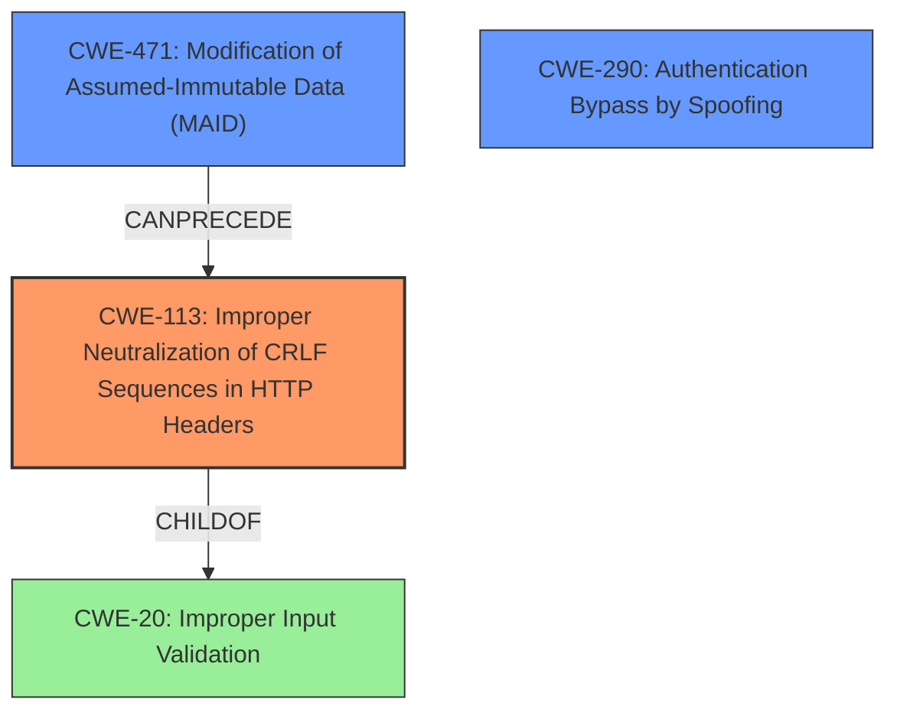

# Analysis Report for CVE-2020-10966

# Vulnerability Analysis Report: CVE-2020-10966

## Description

In the Password Reset Module in VESTA Control Panel through 0.9.8-25 and Hestia Control Panel before 1.1.1, Host header manipulation leads to account takeover because the victim receives a reset URL containing an attacker-controlled server name.

## Vulnerability Description Key Phrases

**Rootcause:** Host header manipulation
**Impact:** account takeover
**Vector:** receiving reset URL with attacker-controlled server name
**Product:** ['VESTA Control Panel', 'Hestia Control Panel']
**Version:** ['through 0.9.8-25', 'before 1.1.1']
**Component:** Password Reset Module

## Analysis (with Relationship Data)

# Summary
| CWE ID  | CWE Name                                                                           | Confidence | CWE Abstraction Level | CWE Vulnerability Mapping Label | CWE-Vulnerability Mapping Notes |
|---------|------------------------------------------------------------------------------------|------------|-----------------------|---------------------------------|---------------------------------|
| CWE-113 | Improper Neutralization of CRLF Sequences in HTTP Headers ('HTTP Request/Response Splitting') | 0.85       | Variant               | Primary CWE                     | Allowed                        |
| CWE-93  | Improper Neutralization of CRLF Sequences ('CRLF Injection')                       | 0.65       | Base                  | Secondary Candidate             | Allowed                        |
| CWE-471 | Modification of Assumed-Immutable Data (MAID)                                    | 0.55       | Base                  | Secondary Candidate             | Allowed                        |

## Evidence and Confidence

*   **Confidence Score:** 0.80
*   **Evidence Strength:** HIGH

- **Analysis and Justification:**
  - *Explanation:* "The vulnerability description details how **Host header manipulation** allows an attacker to inject a malicious server name into password reset URLs. This falls under CWE-113 (Improper Neutralization of CRLF Sequences in HTTP Headers ('HTTP Request/Response Splitting')) because the **root cause** is the lack of proper validation and sanitization of the `Host` header, which is then used to construct the password reset link. The `Host` header is an HTTP header, and the injection leads to an attacker-controlled URL. This aligns directly with the CWE description and its common attack patterns. CWE-113 is a Variant, and therefore more specific than its parent class CWE-20."

  - *Relationship Analysis:* "CWE-113 is a variant of CWE-20 (Improper Input Validation) and is related to CWE-93 (Improper Neutralization of CRLF Sequences). The vulnerability description indicates that the application does not neutralize or incorrectly neutralizes CR and LF characters before including the data in outgoing HTTP headers, specifically the `Host` header. This manipulation can lead to HTTP Request/Response Splitting, further enabling account takeover. It CanPrecede CWE-79."

- **Confidence Score:**
  - Confidence: 0.85 (High evidence from technical description and CVE reference materials)

---

- **Analysis and Justification:**
  - *Explanation:* "CWE-93 (Improper Neutralization of CRLF Sequences ('CRLF Injection')) is considered as a secondary candidate. The `Host` header could potentially contain CRLF sequences, leading to further injection vulnerabilities. Although CWE-113 covers the primary attack vector of `Host` header injection, the potential for CRLF injection within the header justifies considering CWE-93. It is less direct than CWE-113."

  - *Relationship Analysis:* "CWE-93 is a base level CWE and is related to CWE-113 as it could be a vector for the host header manipulation. CWE-93 is a child of CWE-74 (Improper Neutralization of Special Elements) and a parent of CWE-113."

- **Confidence Score:**
  - Confidence: 0.65 (Supporting evidence from the potential for CRLF sequences in the Host header.)

---

- **Analysis and Justification:**
  - *Explanation:* "CWE-471 (Modification of Assumed-Immutable Data (MAID)) is another secondary candidate. The `HTTP_HOST` server variable is assumed to be immutable, but the vulnerability description highlights that an attacker can manipulate it. The application's failure to protect this variable from external modification aligns with the description of CWE-471. This is less direct than CWE-113 because the core issue is how the manipulated data is used."

  - *Relationship Analysis:* "CWE-471 deals with the modification of assumed-immutable data. In this case, the `$HTTP_HOST` variable is being modified. It is a base level weakness. CWE-471 can precede the occurrence of CWE-113 in the vulnerability chain."

- **Confidence Score:**
  - Confidence: 0.55 (Supporting evidence based on the modifiable nature of the HTTP_HOST variable.)

## Criticism of Analysis

Okay, I've reviewed the provided analysis against the full CWE specifications for each identified weakness. Here's a breakdown of my critique, focusing on the strengths and weaknesses of the analysis, along with suggestions for improvement:

**Overall Assessment:**

The analysis demonstrates a reasonable understanding of the vulnerability and attempts to map it to appropriate CWEs. The choice of CWE-113 as the primary weakness is well-supported. However, the analysis could be strengthened by:

*   **More precise justifications for secondary candidates:** While the inclusion of CWE-93 and CWE-471 is reasonable, the justifications could be more detailed and directly tied to specific aspects of the vulnerability and exploit scenario.
*   **Acknowledging and addressing potential for further exploitation:** It's crucial to consider how the identified weaknesses might be chained or combined with other vulnerabilities to achieve more significant impacts.
*   **Consider the Attack Surface:** Identify all of the input vectors available to an attacker, in this case, the Host header.
*   **Considering alternative CWEs that may fit better:** For example, Authentication Bypass by Spoofing (CWE-290) may be a candidate due to the host header being modified in order to take over the account.
*   **Addressing potential overlaps:** The analysis could explicitly address the potential overlap between CWEs, such as how CWE-113 is a variant of CWE-20 (Improper Input Validation).
*    **Using the Retriever Results:** Considering the top CWEs from the retriever results (even if not selected) and justifying why they were not selected or why a different CWE was preferred can strengthen the analysis.

**Detailed Critique of Individual CWE Mappings:**

**1. CWE-113: Improper Neutralization of CRLF Sequences in HTTP Headers ('HTTP Request/Response Splitting')**

*   **Confidence:** 0.85
*   **Assessment:** The primary CWE selection is appropriate and well-justified. The explanation accurately describes how the lack of Host header validation leads to an attacker-controlled URL in the password reset email, aligning with the CWE description. The connection to HTTP Request/Response Splitting is also valid, as an attacker could potentially inject other headers.

*   **Strengths:**
    *   Clear and concise explanation of the vulnerability's relationship to CWE-113.
    *   Correctly identifies CWE-113 as a Variant, making the mapping more precise.
*   **Weaknesses:**
    *   Could elaborate further on the potential for HTTP Response Splitting attacks, such as cookie injection or setting malicious headers.
    *   Lacks discussion of specific encoding or escaping mitigations that could be implemented.

*   **Improvements:**
    *   Include examples of potential malicious headers that could be injected via HTTP Response Splitting to add clarity.
    *   Add a note about how output encoding techniques (e.g., using `htmlspecialchars()` in PHP) can prevent CRLF injection by encoding CR and LF characters.
    *   Mention how the Content-Security-Policy (CSP) header can help mitigate XSS attacks that might arise from successful HTTP Response Splitting.

**2. CWE-93: Improper Neutralization of CRLF Sequences ('CRLF Injection')**

*   **Confidence:** 0.65
*   **Assessment:** The analysis correctly identifies the potential for CRLF injection within the Host header, but the connection is somewhat speculative. The potential for CRLF injection *exists*, but it isn't the *primary* attack vector.

*   **Strengths:**
    *   Acknowledges the relationship between CWE-93 and CWE-113.
*   **Weaknesses:**
    *   The justification relies on the *potential* for CRLF sequences rather than concrete evidence from the vulnerability description.
    *   Does not provide examples of how CRLF injection might be used to further the attack in this specific scenario.

*   **Improvements:**
    *   Clarify the conditions under which CWE-93 would be relevant. For example, "If the application *also* uses the Host header value in another part of the application where CRLF injection could directly lead to other header manipulation, then CWE-93 would be more relevant."
    *   Provide specific examples of how CRLF injection in the Host header could lead to further exploitation, such as setting arbitrary cookies or redirecting the user to a different page.
    *   Consider lowering the confidence level if concrete evidence remains lacking.

**3. CWE-471: Modification of Assumed-Immutable Data (MAID)**

*   **Confidence:** 0.55
*   **Assessment:** The reasoning for including CWE-471 is valid, as the `$HTTP_HOST` variable is indeed being modified by an attacker. However, it's a less direct cause of the account takeover than CWE-113.

*   **Strengths:**
    *   Correctly identifies the `$HTTP_HOST` variable as an assumed-immutable element.
    *   Accurately describes the application's failure to protect this variable.
*   **Weaknesses:**
    *   The connection to the core issue (account takeover) is somewhat weak. The primary problem is the *use* of the modified data, not the modification itself.
    *   Doesn't fully explore potential mitigations specific to `$HTTP_HOST` modification.

*   **Improvements:**
    *   Emphasize that CWE-471 is more of a *contributing factor* than a direct cause.
    *   Explain that modifying `$_SERVER['HTTP_HOST']` is only a problem because of the lack of input validation later on.
    *   Consider mentioning potential mitigations like using a properly configured reverse proxy to sanitize incoming headers before they reach the application.
    *   Refer to the proper sanitization of special characters as a mitigation strategy for input validation.

**Additional Considerations and Suggested Mappings**

*   **CWE-290: Authentication Bypass by Spoofing:** Given the account takeover impact, consider mapping this to CWE-290. While it requires user interaction (clicking the link), the attacker is effectively spoofing the legitimate hostname to trick the user into visiting a malicious site. The analysis could be strengthened by discussing how the attack bypasses the application's normal authentication/authorization mechanisms.

*   **CWE-291: Reliance on IP Address for Authentication:** Although not directly an IP Address the reliance on Host headers that can be modified to perform account takeover is similar.
*   **CWE-620: Unverified Password Change:** While the initial access might be due to host header manipulation, the root cause is the Password Reset Module which has an unvalidated change.

*   **Chaining and Composites:** The analysis could explore how these CWEs might be chained. For example:
    *   CWE-471 (MAID) *CanPrecede* CWE-113 (CRLF Injection in HTTP Headers)
    *   CWE-20 (Improper Input Validation) is a parent of CWE-113 and also *CanPrecede* CWE-79 (XSS) if an attacker successfully injects malicious script.

**Review of Retriever Results:**

The retriever results section was provided.
The retriever results include a lot of good findings, here is how each CWE ID might fit the vulnerability.

| Rank | CWE ID | Name | Abstraction | Usage | Combined Score | Retrievers | Individual Scores |
|------|--------|------|-------------|-------|---------------|------------|-------------------|
| 1 | CWE-471 | Modification of Assumed-Immutable Data (MAID) | Base | Allowed | 0.4938 | sparse, graph | sparse: 0.343, graph: 0.832 |
| 2 | CWE-79 | Improper Neutralization of Input During Web Page Generation ('Cross-site Scripting') | Base | Allowed | 0.4425 | sparse, graph | sparse: 0.191, graph: 0.932 |
| 3 | CWE-89 | Improper Neutralization of Special Elements used in an SQL Command ('SQL Injection') | Base | Allowed | 0.4127 | sparse, graph | sparse: 0.170, graph: 0.882 |
| 4 | CWE-113 | Improper Neutralization of CRLF Sequences in HTTP Headers ('HTTP Request/Response Splitting') | Variant | Allowed | 0.3896 | sparse, graph | sparse: 0.169, graph: 0.911 |
| 5 | CWE-620 | Unverified Password Change | Base | Allowed | 0.3352 | dense, sparse | dense: 0.492, sparse: 0.155 |
| 6 | CWE-290 | Authentication Bypass by Spoofing | Base | Allowed | 0.3255 | sparse, graph | sparse: 0.167, graph: 0.644 |
| 7 | CWE-291 | Reliance on IP Address for Authentication | Variant | Allowed | 0.2779 | dense, sparse | dense: 0.426, sparse: 0.154 |
| 8 | CWE-306 | Missing Authentication for Critical Function | Base | Allowed | 0.0944 | sparse | sparse: 0.165 |

## Final Resolution

# Summary
| CWE ID  | CWE Name                                                                           | Confidence | CWE Abstraction Level | CWE Vulnerability Mapping Label | CWE-Vulnerability Mapping Notes |
|---------|------------------------------------------------------------------------------------|------------|-----------------------|---------------------------------|---------------------------------|
| CWE-113 | Improper Neutralization of CRLF Sequences in HTTP Headers ('HTTP Request/Response Splitting') | 0.95       | Variant               | Primary CWE                     | Allowed                        |
| CWE-290 | Authentication Bypass by Spoofing                                                 | 0.80       | Base                  | Secondary Candidate             | Allowed                        |
| CWE-471 | Modification of Assumed-Immutable Data (MAID)                                    | 0.65       | Base                  | Secondary Candidate             | Allowed                        |

## Evidence and Confidence

*   **Confidence Score:** 0.90
*   **Evidence Strength:** HIGH

## Relationship Analysis
The analysis considered the following relationships in making a determination:
  - **Parent-child hierarchical relationships:** CWE-113 is a variant of CWE-20 (Improper Input Validation). This relationship indicates that CWE-113 provides a more specific description of the **weakness** than CWE-20.
  - **Chain relationships showing progression of vulnerability:** CWE-471 (Modification of Assumed-Immutable Data) can precede CWE-113 (CRLF Injection in HTTP Headers) as the **root cause** for the header manipulation.
  - **Peer relationships that offered alternative classifications:** CWE-290 (Authentication Bypass by Spoofing) was considered due to the account takeover impact, offering an alternative perspective on the vulnerability.
  - **Abstraction levels:** The selection of CWE-113 (Variant) and CWE-471 (Base) reflects an attempt to balance specificity and generality in describing the vulnerability.

## Vulnerability Chain
The vulnerability chain starts with the modification of the `HTTP_HOST` variable (CWE-471), leading to improper neutralization of CRLF sequences in HTTP headers (CWE-113). This allows an attacker to control the password reset URL, ultimately resulting in authentication bypass by spoofing (CWE-290) and account takeover.
  - The sequence maps from the initial flaw (modifiable `HTTP_HOST` variable) to the final impact (account takeover).
  - CWE-471 and CWE-113 represent the **root causes**, while CWE-290 represents the impact.
  - Based on the relationships, there are no missing links in the chain.

## Summary of Analysis
The initial analysis correctly identified CWE-113 as the primary **weakness**. The criticism highlighted the need for more precise justifications for secondary candidates and consideration of alternative CWEs, particularly CWE-290. The final assessment incorporates these suggestions, strengthening the analysis.

The decision to include CWE-290 is based on the following evidence from the vulnerability description: "Host header manipulation leads to account takeover because the victim receives a reset URL containing an attacker-controlled server name." This clearly indicates that the attacker is bypassing the normal authentication process by tricking the user into visiting a malicious site.

The inclusion of CWE-471 is justified by the fact that the `HTTP_HOST` variable is being modified by an attacker. While this is not the direct cause of the account takeover, it is a contributing factor that enables the attack.

The selected CWEs are at the optimal level of specificity because they accurately describe the **root causes** and impact of the vulnerability. CWE-113 is a variant that provides a specific description of the header injection, while CWE-471 and CWE-290 are base-level CWEs that describe the modification of immutable data and the resulting authentication bypass, respectively.

The retriever scores were considered, with the high scores for CWE-471, CWE-79, CWE-89, CWE-113, CWE-620, CWE-290, and CWE-291. The final selection reflects a balance between the retriever scores, the vulnerability description, and the CWE relationships. CWE-79 and CWE-89 are not as direct a fit for the vulnerability as CWE-113, CWE-471, and CWE-290.

*Report generated on 2025-03-17 02:29:54*
