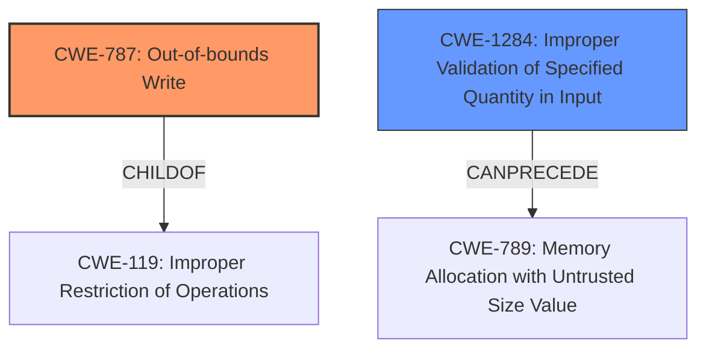

# Final Resolution for CVE-2020-11176

# Summary
| CWE ID | CWE Name | Confidence | CWE Abstraction Level | CWE Vulnerability Mapping Label | CWE-Vulnerability Mapping Notes |
|---|---|---|---|---|---|
| CWE-787 | Out-of-bounds Write | 0.9 | Base | Allowed | Primary CWE. The vulnerability is a heap overflow, which directly relates to writing outside the intended buffer boundaries. |
| CWE-1284 | Improper Validation of Specified Quantity in Input | 0.2 | Base | Allowed | Secondary candidate. There could be an improper validation of the size or length in the input, potentially leading to a heap overflow, but this is speculative and requires more information to confirm. |

## Evidence and Confidence

*   **Confidence Score:** 0.8
*   **Evidence Strength:** MEDIUM

## Relationship Analysis
The primary relationship that impacted the decision was the parent-child relationship between CWE-119 and CWE-787. While CWE-119 is a parent of CWE-787, the specificity of the vulnerability description (heap overflow) makes CWE-787 a more appropriate choice. The "CanPrecede" relationship between CWE-1284 and other CWEs such as CWE-789 was considered, but the lack of direct evidence supporting improper size validation led to a lower confidence score and its classification as a secondary candidate.

## Vulnerability Chain
The vulnerability chain starts with a potential **ROOTCAUSE** of **CWE-1284 (Improper Validation of Specified Quantity in Input)**, which, if present, could lead to allocating an incorrect buffer size, eventually resulting in **CWE-787 (Out-of-bounds Write)**. The **WEAKNESS** of writing beyond the buffer boundary then leads to memory corruption and potential exploitation. However, the link between CWE-1284 and CWE-787 is speculative based on the provided information.

## Summary of Analysis
The analysis and criticism both agree that **CWE-787 (Out-of-bounds Write)** is the most appropriate primary classification due to the "heap overflow" and "memory corruption" indicators in the vulnerability description. The criticism correctly points out that CWE-119 should be removed because CWE-787 is a more specific and available CWE. The criticism also suggests lowering the confidence score for **CWE-1284 (Improper Validation of Specified Quantity in Input)** due to the lack of explicit evidence in the description. The final assessment agrees with this recommendation and lowers the confidence score to 0.2, classifying it as a secondary candidate.

The decision is primarily based on the evidence of a "heap overflow," which directly maps to **CWE-787 (Out-of-bounds Write)**. The relationship analysis reinforces this decision by highlighting the parent-child relationship between CWE-119 and CWE-787, favoring the more specific CWE. The classification reflects the optimal level of specificity based on the available evidence. The retriever scores were also considered and the suggested CWEs were analyzed, including CWE-190, CWE-131, CWE-822, and CWE-823, but none of them were deemed to be a better fit than CWE-787.