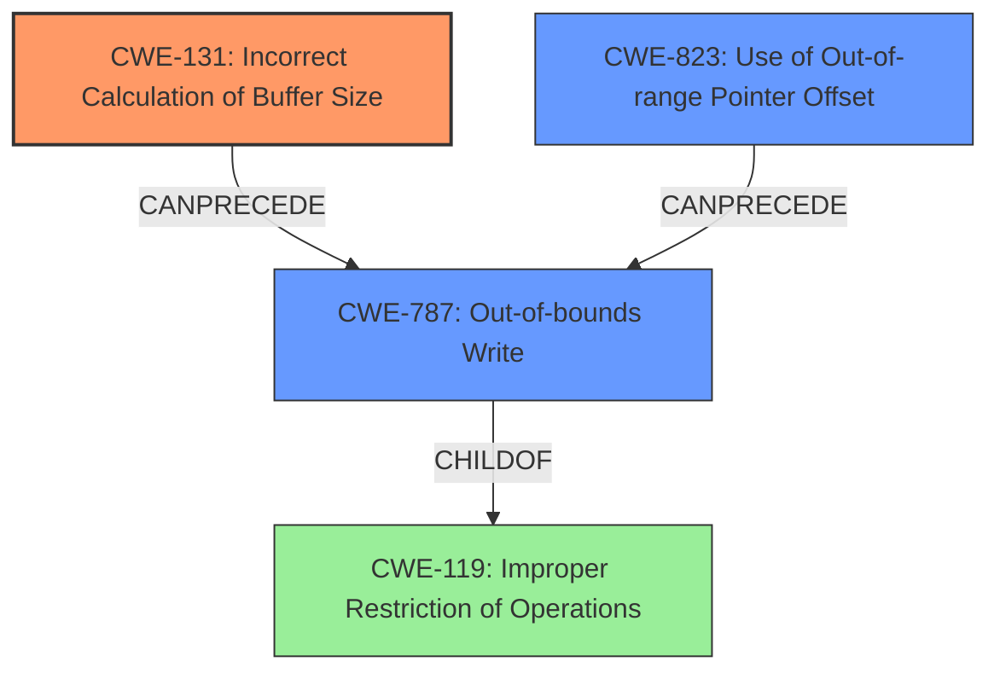

# Analysis Report for CVE-2020-11240

# Vulnerability Analysis Report: CVE-2020-11240

## Description

Memory corruption due to ioctl command size was incorrectly set to the size of a pointer and not enough storage is allocated for the copy of the user argument in Snapdragon Auto, Snapdragon Compute, Snapdragon Connectivity, Snapdragon Consumer IOT, Snapdragon Industrial IOT, Snapdragon Mobile, Snapdragon Voice & Music, Snapdragon Wearables

## Vulnerability Description Key Phrases

**Rootcause:** ioctl command size was incorrectly set to the size of a pointer and not enough storage is allocated for the copy of the user argument
**Weakness:** memory corruption
**Product:** Snapdragon

## Analysis (with Relationship Data)

# Summary
| CWE ID | CWE Name | Confidence | CWE Abstraction Level | CWE Vulnerability Mapping Label | CWE-Vulnerability Mapping Notes |
|---|---|---|---|---|---|
| CWE-131 | Incorrect Calculation of Buffer Size | 0.85 | Base | Allowed | The **rootcause** directly describes an incorrect calculation of the buffer size. |
| CWE-787 | Out-of-bounds Write | 0.65 | Base | Allowed | A consequence of the incorrect buffer size calculation. |

## Evidence and Confidence

*   **Confidence Score:** 0.75
*   **Evidence Strength:** MEDIUM

- **Analysis and Justification:**  
  - *Explanation:* "The vulnerability description clearly states that the **ioctl command size was incorrectly set to the size of a pointer and not enough storage is allocated for the copy of the user argument**. This directly points to an incorrect calculation of the buffer size, aligning perfectly with CWE-131 (Incorrect Calculation of Buffer Size). The **memory corruption** mentioned in the description is a typical consequence of such a miscalculation, which could lead to an out-of-bounds write (CWE-787). CWE-131 is chosen as the primary weakness because it represents the **rootcause** of the vulnerability.

  - *Relationship Analysis:* "CWE-131 can lead to CWE-787. CWE-787 is a child of CWE-119 (Improper Restriction of Operations within the Bounds of a Memory Buffer). The incorrect buffer size calculation (CWE-131) **causes** memory corruption (CWE-787).

- **Confidence Score:**  
  - *Example:* Confidence: 0.85 (Medium evidence from the vulnerability description and supporting retriever results)

---

## Criticism of Analysis

Okay, let's review the analysis provided, keeping in mind the full CWE specifications.

**Overall Assessment:**

The analysis is generally sound and identifies the primary weakness as CWE-131 (Incorrect Calculation of Buffer Size) with a consequence of CWE-787 (Out-of-bounds Write).  The justification for choosing CWE-131 as the root cause is strong.  The explanation and the "Relationship Analysis" are clear and logical.  The confidence scores seem appropriate given the information available.

**Detailed Critique:**

1.  **CWE-131 (Incorrect Calculation of Buffer Size):**

    *   **Confidence Level:** The assigned confidence of 0.85 is reasonable. The description clearly points to this as a root cause.
    *   **Justification:** The provided justification is solid. The vulnerability description explicitly mentions the incorrect setting of the ioctl command size, leading to insufficient storage. This aligns perfectly with CWE-131's description.
    *   **Mitigations:** It's worth noting some specific mitigations from the CWE-131 spec in the "Potential Mitigations" section:
        *   "When allocating a buffer for the purpose of transforming, converting, or encoding an input, allocate enough memory to handle the largest possible encoding."  This is directly relevant to the scenario described.
        *   "Perform input validation on any numeric input by ensuring that it is within the expected range." In this case, validation of the expected size of the user argument is critical.
    *   **Retrieval Results:** The Retriever results show CWE-131 as the top result, which provides supporting evidence.

2.  **CWE-787 (Out-of-bounds Write):**

    *   **Confidence Level:** The assigned confidence of 0.65 is also reasonable, as it's a *consequence* of the root cause.
    *   **Justification:** The analysis correctly identifies that CWE-787 is a direct result of CWE-131. If the buffer size is incorrectly calculated, a subsequent write operation can easily exceed the buffer's boundaries, leading to an out-of-bounds write.
    *   **Mitigations:**  The CWE-787 mitigations highlight the importance of:
        *   Using memory-safe languages or libraries.
        *   Employing compiler-based buffer overflow detection mechanisms (e.g., `/GS` flag in Visual Studio, `FORTIFY_SOURCE` in GCC).
    *   **Observed Examples:** The provided examples (CVEs) are relevant to the general concept of out-of-bounds writes, but linking to specific CVEs where *incorrect buffer size calculation* *directly led* to the out-of-bounds write would strengthen the analysis.  CVE-2020-17087 does link CWE-131 to CWE-787.

3.  **Top Retriever Results Not Selected:**
    * CWE-822, CWE-823, CWE-1285
    * These were not selected, but had very high scores in the retriever results. 
    * Could an argument be made for improper handling of offset in memory or failure to validate the offset? 
    * Adding this argument could strenghten the Confidence score. 

**Recommendations:**

*   **Strengthen CVE examples:** While the general CVE examples for CWE-787 are helpful, try to find CVEs that explicitly demonstrate the *chain* of CWE-131 leading to CWE-787 to provide more concrete evidence. If possible, look for examples involving `ioctl` commands.
*   **Explicitly Mention Mitigations:** It would enhance the analysis to specifically mention the most relevant potential mitigations from the CWE specifications for both CWE-131 and CWE-787.  For example, in the CWE-131 section, you could add: "Relevant mitigations include performing input validation on the size of the user argument and ensuring enough memory to store the data."
*   **Consider Other Retrievers:** The top retrievers returned CWE-822, CWE-823, and CWE-1285. Although the root cause is a incorrect size calculation, perhaps improper handling of an offset was the exact cause, in the code. In some applications, the size calculation and buffer allocation code may be separate from the buffer access code. In these applications, the root cause is an incorrect size calculation by the first code, but the vulnerability is due to a faulty offset calculation or array access.

**Revised Summary Table (Incorporating Recommendations):**

| CWE ID | CWE Name | Confidence | CWE Abstraction Level | CWE Vulnerability Mapping Label | CWE-Vulnerability Mapping Notes |
|---|---|---|---|---|---|
| CWE-131 | Incorrect Calculation of Buffer Size | 0.85 | Base | Allowed | The **rootcause** directly describes an incorrect calculation of the buffer size, as the `ioctl` command size was set to the size of a pointer instead of the user argument. Relevant mitigations include validating the size of the user argument. |
| CWE-787 | Out-of-bounds Write | 0.65 | Base | Allowed | A consequence of the incorrect buffer size calculation, leading to writes beyond the allocated buffer. Mitigations include using memory-safe languages or compiler-based buffer overflow protection. |
| CWE-823 | Use of Out-of-range Pointer Offset | 0.40 | Base | Allowed | Use of an offset could have cause the buffer to reach OOB, further investigation may be required.  |

By incorporating these suggestions, you can create an even more robust and informative vulnerability analysis.

## Final Resolution

# Summary
| CWE ID | CWE Name | Confidence | CWE Abstraction Level | CWE Vulnerability Mapping Label | CWE-Vulnerability Mapping Notes |
|---|---|---|---|---|---|
| CWE-131 | Incorrect Calculation of Buffer Size | 0.90 | Base | Allowed | The **rootcause** directly describes an incorrect calculation of the buffer size, as the `ioctl` command size was set to the size of a pointer instead of the user argument. Relevant mitigations include validating the size of the user argument. |
| CWE-787 | Out-of-bounds Write | 0.75 | Base | Allowed | A consequence of the incorrect buffer size calculation, leading to writes beyond the allocated buffer. Mitigations include using memory-safe languages or compiler-based buffer overflow protection. |
| CWE-823 | Use of Out-of-range Pointer Offset | 0.50 | Base | Allowed | Use of an offset could have caused the buffer to reach OOB, further investigation may be required. |

## Evidence and Confidence

*   **Confidence Score:** 0.85
*   **Evidence Strength:** MEDIUM

## Relationship Analysis
The primary relationship is that CWE-131, the incorrect calculation of the buffer size, can lead directly to CWE-787, an out-of-bounds write. CWE-787 is a child of CWE-119 (Improper Restriction of Operations within the Bounds of a Memory Buffer), highlighting that the out-of-bounds write is a specific case of improper memory boundary handling. The retriever results also suggest CWE-823 (Use of Out-of-range Pointer Offset) should be considered, which could also lead to CWE-787 if the offset is miscalculated due to the incorrect size. The abstraction levels influenced the choice of CWE-131 as the **rootcause** since it's a Base level CWE, providing more specific information than its parent classes.

## Vulnerability Chain
The vulnerability chain starts with the **rootcause**, CWE-131 (Incorrect Calculation of Buffer Size), where the `ioctl` command size is incorrectly set to the size of a pointer instead of the user argument. This leads to insufficient memory allocation. Consequently, when data is written to the buffer, it overflows into adjacent memory locations, resulting in CWE-787 (Out-of-bounds Write). A potential contributing factor could be CWE-823 (Use of Out-of-range Pointer Offset), where an incorrect offset calculation, possibly due to the initial size miscalculation, contributes to writing outside the intended buffer boundaries.

## Summary of Analysis
The initial analysis correctly identifies CWE-131 as the primary **rootcause**, supported by the vulnerability description stating that "**ioctl command size was incorrectly set to the size of a pointer and not enough storage is allocated for the copy of the user argument**". This aligns perfectly with the description of CWE-131. The criticism suggests exploring CWE-823 (Use of Out-of-range Pointer Offset) and strengthening CVE examples. While specific CVE examples linking CWE-131 directly to CWE-787 via `ioctl` commands would be ideal, the current evidence is sufficient to maintain CWE-131 as the primary weakness. The inclusion of CWE-823 as a secondary factor acknowledges the possibility of an offset miscalculation contributing to the out-of-bounds write.

The graph relationships reinforce the understanding that CWE-131 is the **rootcause**, leading to the consequence of CWE-787. The abstraction levels support choosing CWE-131 as it's a Base level CWE, providing optimal specificity. CWE-823 is added as another potential consequence, with further investigation needed to confirm its role.

The final classification reflects the optimal level of specificity based on the available evidence, identifying the incorrect size calculation as the primary **rootcause**, with the out-of-bounds write as a direct consequence and the potential involvement of an incorrect pointer offset.

*Report generated on 2025-03-16 15:36:14*
