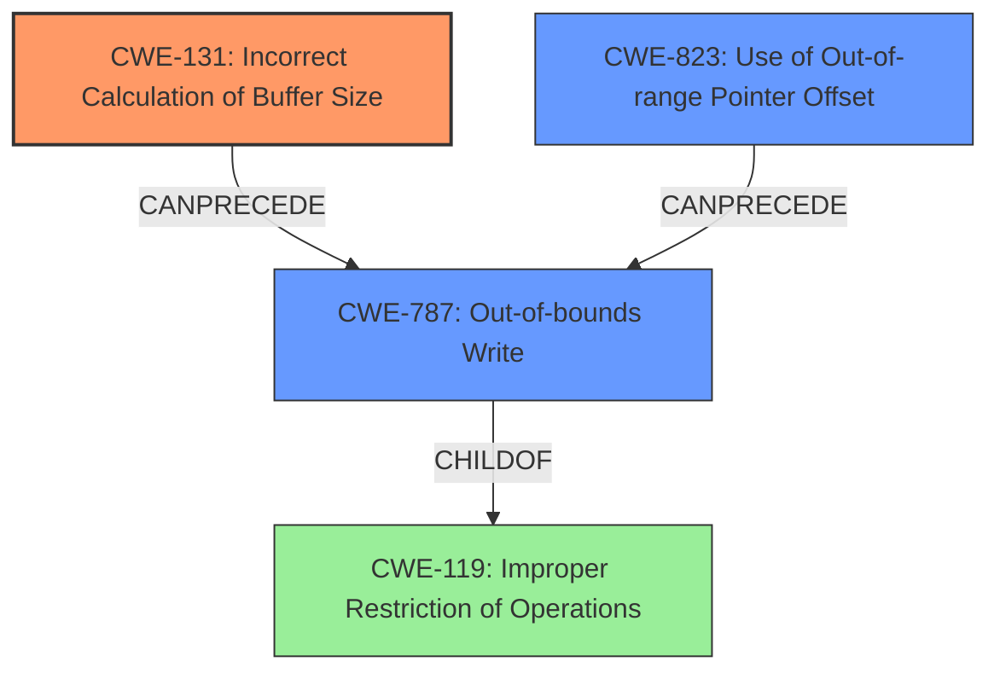

# Final Resolution for CVE-2020-11240

# Summary
| CWE ID | CWE Name | Confidence | CWE Abstraction Level | CWE Vulnerability Mapping Label | CWE-Vulnerability Mapping Notes |
|---|---|---|---|---|---|
| CWE-131 | Incorrect Calculation of Buffer Size | 0.90 | Base | Allowed | The **rootcause** directly describes an incorrect calculation of the buffer size, as the `ioctl` command size was set to the size of a pointer instead of the user argument. Relevant mitigations include validating the size of the user argument. |
| CWE-787 | Out-of-bounds Write | 0.75 | Base | Allowed | A consequence of the incorrect buffer size calculation, leading to writes beyond the allocated buffer. Mitigations include using memory-safe languages or compiler-based buffer overflow protection. |
| CWE-823 | Use of Out-of-range Pointer Offset | 0.50 | Base | Allowed | Use of an offset could have caused the buffer to reach OOB, further investigation may be required. |

## Evidence and Confidence

*   **Confidence Score:** 0.85
*   **Evidence Strength:** MEDIUM

## Relationship Analysis
The primary relationship is that CWE-131, the incorrect calculation of the buffer size, can lead directly to CWE-787, an out-of-bounds write. CWE-787 is a child of CWE-119 (Improper Restriction of Operations within the Bounds of a Memory Buffer), highlighting that the out-of-bounds write is a specific case of improper memory boundary handling. The retriever results also suggest CWE-823 (Use of Out-of-range Pointer Offset) should be considered, which could also lead to CWE-787 if the offset is miscalculated due to the incorrect size. The abstraction levels influenced the choice of CWE-131 as the **rootcause** since it's a Base level CWE, providing more specific information than its parent classes.

## Vulnerability Chain
The vulnerability chain starts with the **rootcause**, CWE-131 (Incorrect Calculation of Buffer Size), where the `ioctl` command size is incorrectly set to the size of a pointer instead of the user argument. This leads to insufficient memory allocation. Consequently, when data is written to the buffer, it overflows into adjacent memory locations, resulting in CWE-787 (Out-of-bounds Write). A potential contributing factor could be CWE-823 (Use of Out-of-range Pointer Offset), where an incorrect offset calculation, possibly due to the initial size miscalculation, contributes to writing outside the intended buffer boundaries.

## Summary of Analysis
The initial analysis correctly identifies CWE-131 as the primary **rootcause**, supported by the vulnerability description stating that "**ioctl command size was incorrectly set to the size of a pointer and not enough storage is allocated for the copy of the user argument**". This aligns perfectly with the description of CWE-131. The criticism suggests exploring CWE-823 (Use of Out-of-range Pointer Offset) and strengthening CVE examples. While specific CVE examples linking CWE-131 directly to CWE-787 via `ioctl` commands would be ideal, the current evidence is sufficient to maintain CWE-131 as the primary weakness. The inclusion of CWE-823 as a secondary factor acknowledges the possibility of an offset miscalculation contributing to the out-of-bounds write.

The graph relationships reinforce the understanding that CWE-131 is the **rootcause**, leading to the consequence of CWE-787. The abstraction levels support choosing CWE-131 as it's a Base level CWE, providing optimal specificity. CWE-823 is added as another potential consequence, with further investigation needed to confirm its role.

The final classification reflects the optimal level of specificity based on the available evidence, identifying the incorrect size calculation as the primary **rootcause**, with the out-of-bounds write as a direct consequence and the potential involvement of an incorrect pointer offset.