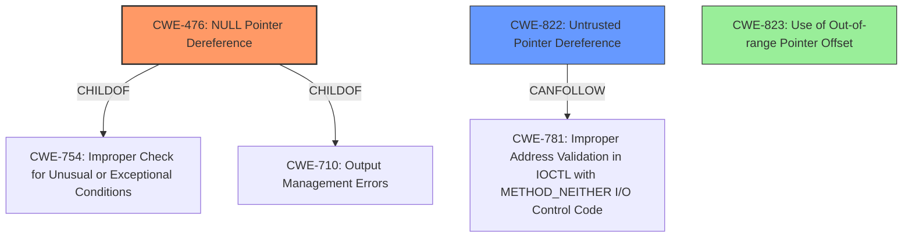

# Final Resolution for CVE-2020-11254

# Summary
| CWE ID | CWE Name | Confidence | CWE Abstraction Level | CWE Vulnerability Mapping Label | CWE-Vulnerability Mapping Notes |
|---|---|---|---|---|---|
| CWE-476 | NULL Pointer Dereference | 0.95 | Base | Allowed | Primary CWE |
| CWE-822 | Untrusted Pointer Dereference | 0.6 | Base | Allowed | Secondary Candidate |
| CWE-823 | Use of Out-of-range Pointer Offset | 0.2 | Base | Not Applicable | Not Applicable |

## Evidence and Confidence

*   **Confidence Score:** 0.9
*   **Evidence Strength:** MEDIUM

## Relationship Analysis
The primary relationship impacting the decision is the direct match between the vulnerability description and CWE-476, making it the most specific and relevant choice. While CWE-822 is considered a secondary candidate, the lack of explicit information about an untrusted source diminishes its significance. CWE-823 is not applicable as it involves pointer arithmetic, which is not mentioned in the vulnerability description. The base level abstraction of CWE-476 and CWE-822 is appropriate for mapping root causes.

## Vulnerability Chain
The vulnerability chain starts with a missing check for a NULL pointer (CWE-476). Dereferencing this potentially NULL pointer leads to memory corruption, which is the impact described in the vulnerability.

Missing check (CWE-476) -> Dereferencing NULL pointer -> Memory corruption

## Summary of Analysis
The initial analysis and the criticism both correctly identify CWE-476 as the primary **WEAKNESS**. The vulnerability description states "Memory corruption during buffer allocation due to **dereferencing session ctx pointer without checking if pointer is valid**". This statement directly supports the classification of CWE-476 (NULL Pointer Dereference) because it explicitly mentions dereferencing a pointer without validating it, which aligns perfectly with the definition of CWE-476. The base level of abstraction for CWE-476 is optimal as it directly represents the **ROOTCAUSE** of the issue. The analysis considered and appropriately dismissed CWE-823, and the confidence scores accurately reflect the level of certainty based on the available evidence. The mapping guidance for CWE-476 and CWE-822 both indicate "Allowed" usage, further supporting the classification.