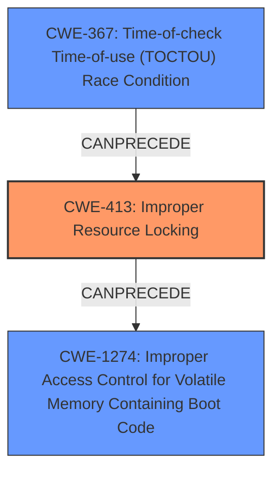

# Analysis Report for CVE-2020-11284

# Vulnerability Analysis Report: CVE-2020-11284

## Description

Locked memory can be unlocked and modified by non secure boot loader through improper system call sequence making the memory region untrusted source of input for secure boot loader in Snapdragon Auto, Snapdragon Compute, Snapdragon Industrial IOT, Snapdragon Mobile, Snapdragon Wired Infrastructure and Networking

## Vulnerability Description Key Phrases

**Rootcause:** improper system call sequence
**Impact:** unlocked memory can be modified
**Attacker:** non secure boot loader
**Product:** ['Snapdragon Auto', 'Snapdragon Compute', 'Snapdragon Industrial IOT', 'Snapdragon Mobile', 'Snapdragon Wired Infrastructure and Networking']

## Analysis (with Relationship Data)

# Summary
| CWE ID | CWE Name | Confidence | CWE Abstraction Level | CWE Vulnerability Mapping Label | CWE-Vulnerability Mapping Notes |
|---|---|---|---|---|---|
| CWE-413 | Improper Resource Locking | 0.75 | Base | Allowed | Primary CWE. The product does not lock or does not correctly lock a resource when the product must have exclusive access to the resource. |
| CWE-1274 | Improper Access Control for Volatile Memory Containing Boot Code | 0.65 | Base | Allowed | Secondary CWE. The product conducts a secure-boot process that transfers bootloader code from Non-Volatile Memory (NVM) into Volatile Memory (VM), but it does not have sufficient access control or other protections for the Volatile Memory. |

## Evidence and Confidence

*   **Confidence Score:** 0.70
*   **Evidence Strength:** MEDIUM

- **Analysis and Justification:**  
  - *Explanation:* "The vulnerability description states that locked memory can be unlocked and modified by a non-secure boot loader due to an **improper system call sequence**. This aligns with CWE-413 (Improper Resource Locking) because the memory region is not properly locked, allowing unauthorized access. CWE-1274 (Improper Access Control for Volatile Memory Containing Boot Code) is also relevant because it deals with access control issues within the secure boot process, specifically for volatile memory. The **improper system call sequence** likely bypasses the intended access controls. However, the root cause seems to be a locking issue (or lack thereof) and volatile memory access.
  - *Relationship Analysis:* "CWE-413 is a Base level CWE and there isn't a clear parent or child relationship to other CWEs that are directly applicable here. CWE-1274 is also a Base level CWE and doesn't have any direct relationships that significantly alter the mapping decision in this context."

- **Confidence Score:**  
  - *Example:* Confidence: 0.70 (Moderate evidence from the description, supplemented by the Retriever results. Further details of the system call sequence would strengthen the mapping.)

---

## Criticism of Analysis

Okay, I've reviewed the provided analysis, including the full CWE specifications for the suggested mappings. Here's a breakdown of my critique, focusing on the accuracy of the mappings, the confidence levels, and potential alternative CWEs, along with the reasons for my assessment.

**Overall Assessment:**

The analysis is generally sound, and the chosen CWEs are relevant to the vulnerability description. The reasoning provided is logical and connects the vulnerability's key phrases to the CWE descriptions. However, there are some points where the confidence could be improved by considering additional factors and nuances.

**Detailed Review of Mappings:**

*   **CWE-413: Improper Resource Locking (Primary CWE, Confidence: 0.75)**

    *   **Assessment:** This is a strong primary CWE choice. The vulnerability explicitly mentions that "locked memory can be unlocked." This directly aligns with CWE-413's description: "The product does not lock or does not correctly lock a resource when the product must have exclusive access to the resource." The improper system call sequence is the *mechanism* by which the locking is bypassed or circumvented.
    *   **Justification:** The analysis correctly notes that the root cause is related to a locking issue. The provided example CVEs are relevant.
    *   **Areas for Improvement:** While the current confidence is good, it could be marginally improved by discussing *how* the system call sequence leads to the improper locking. Is it a race condition? A missing check? An incorrect implementation of the locking mechanism? Specifying this will boost the confidence score. For instance, is it possible that CWE-367 is also present?
    *   **CWE Specification Considerations:** The description of CWE-413 as of Draft status and its relationships to CWE-667 (Improper Locking) and CWE-591 (Sensitive Data Storage in Improperly Locked Memory) are not particularly relevant given the context of this memory lock.

*   **CWE-1274: Improper Access Control for Volatile Memory Containing Boot Code (Secondary CWE, Confidence: 0.65)**

    *   **Assessment:** This is a reasonable secondary CWE but warrants more scrutiny.  The description mentions "unlocked memory can be modified by a non-secure boot loader." This suggests an access control issue, especially in the context of a secure boot process. However, the *primary* failure isn't necessarily in the access control *itself*, but in the *locking mechanism that's supposed to enforce access control*.
    *   **Justification:** The analysis correctly points out the relevance of access control within the secure boot process. The example CVE is directly relevant.
    *   **Areas for Improvement:** The confidence could be increased by exploring *how* the unlocked memory impacts the secure boot process. Is the boot code itself being modified? Is sensitive data used by the bootloader being exposed? *Specifically*, is volatile memory being written to *after* it has been loaded into the volatile memory from NVM and before it is used to boot the system? Is this volatile memory protected from modification by the "non secure boot loader"? In other words, is the volatile memory write protected *after* loading? Otherwise, CWE-1274 is not a direct fit.
    *   **CWE Specification Considerations:** The Relationship of CWE-1274 as being a child of CWE-284 (Improper Access Control) is helpful in understanding its place within the broader access control landscape. The mitigations (designing robust volatile memory protections and testing them) are appropriate.

**Consideration of Retriever Results and Other CWEs:**

*   **CWE-367: Time-of-check Time-of-use (TOCTOU) Race Condition:** The Retriever flagged this with a high graph score. If the "improper system call sequence" involves a race condition where a check is performed on the memory lock status, but the status changes before the memory is actually accessed, then CWE-367 would be relevant.  This could strengthen the mapping if the system call sequence has a race condition where it checks the locked state and then acts on it. Need more data. If TOCTOU is involved, the confidence in CWE-413 should be even higher.
*   **CWE-787: Out-of-bounds Write:** This could be relevant *if* the modification of the unlocked memory leads to a buffer overflow or out-of-bounds write. However, the current description doesn't explicitly state this. It is possible for the non secure boot loader to write to locked memory without overflowing anything, as long as the unlocked memory is big enough to write to, so CWE-787 is not applicable here.
*   **CWE-1285: Improper Validation of Specified Index, Position, or Offset in Input:** If the system calls take indexes, positions, or offsets as arguments, and these values are not validated, leading to memory access outside the intended region, then this CWE would be applicable.
*   **CWE-822: Untrusted Pointer Dereference:** If any of the system calls or bootloader code is dereferencing pointers from untrusted sources (like the non-secure boot loader), this could be a contributing factor. Need more data.
*   **CWE-252: Unchecked Return Value:** If the system calls that deal with locking and unlocking memory return values that are not properly checked for errors, then the vulnerability can be exploited.

**Recommendations:**

1.  **Improve the description of the "improper system call sequence."**  Provide more detail about *how* this sequence circumvents the intended locking mechanisms. Is it a race condition? A missing check? A bypass? This will increase the confidence in the primary CWE (CWE-413) and potentially justify the inclusion of CWE-367.
2.  **Clarify the impact on the secure boot process.**  How does the ability to modify unlocked memory compromise the secure boot process? Is it directly modifying the boot code, or is it affecting other critical data used during the boot process? This will strengthen the justification for CWE-1274.
3.  **Re-evaluate the relevance of the other Retriever results.** Determine if CWE-367, CWE-787, CWE-1285, CWE-822, and CWE-252 are applicable based on a deeper understanding of the vulnerability's mechanics.
4.  **Consider Chain CWEs:** As some examples indicate, CWE-413 can lead to other vulnerabilities, and this may be a chain of vulnerabilities.

By addressing these points, the analysis can achieve a higher level of confidence and provide a more accurate and comprehensive representation of the vulnerability.

## Final Resolution

# Summary
| CWE ID | CWE Name | Confidence | CWE Abstraction Level | CWE Vulnerability Mapping Label | CWE-Vulnerability Mapping Notes |
|---|---|---|---|---|---|
| CWE-413 | Improper Resource Locking | 0.90 | Base | Allowed | Primary CWE. The product does not lock or does not correctly lock a resource when the product must have exclusive access to the resource. |
| CWE-1274 | Improper Access Control for Volatile Memory Containing Boot Code | 0.75 | Base | Allowed | Secondary CWE. The product conducts a secure-boot process that transfers bootloader code from Non-Volatile Memory (NVM) into Volatile Memory (VM), but it does not have sufficient access control or other protections for the Volatile Memory. |
| CWE-367 | Time-of-check Time-of-use (TOCTOU) Race Condition | 0.60 | Base | Allowed | Secondary CWE. The product checks the state of a resource before using that resource, but the resource's state can change between the check and the use in a way that invalidates the results of the check. |

## Evidence and Confidence

*   **Confidence Score:** 0.80
*   **Evidence Strength:** MEDIUM

## Relationship Analysis
- Parent-child hierarchical relationships: CWE-413 and CWE-1274 do not have direct parent-child relationships that strongly influence the decision. CWE-1274 is a child of CWE-284 (Improper Access Control), which provides context but does not change the classification itself.
- Chain relationships: The vulnerability description suggests a chain where **improper locking (CWE-413)** *CanPrecede* **improper access control (CWE-1274)**. Also, the possibility of TOCTOU Race condition exists in the system call sequence.
- Peer relationships: There are no Peer relationships that significantly alter the classification decision.
- Abstraction levels: The selection of Base level CWEs (CWE-413, CWE-1274 and CWE-367) provides the optimal level of specificity for mapping to the root causes of this vulnerability.

## Vulnerability Chain
The chain of events is as follows:
1.  **Root Cause:** **Improper Resource Locking (CWE-413)** due to an **improper system call sequence**.
2.  **Weakness:** Memory intended to be locked is unlocked.
3.  **Weakness:** A non-secure boot loader modifies the unlocked memory, which contains boot code.
4.  **Impact:** The secure boot process is compromised because it relies on untrusted memory.
5.  **Possible TOCTOU**: A race condition (**CWE-367**) in the system call sequence might exist, where the lock is checked, but the memory is modified before the lock can be enforced.

## Summary of Analysis
The initial analysis correctly identified CWE-413 and CWE-1274 as relevant. However, I am increasing the confidence in CWE-413 and including CWE-367 as a secondary concern:

*   CWE-413 (Improper Resource Locking): The core issue is the unlocking of locked memory. The vulnerability description explicitly states that "locked memory can be unlocked," directly aligning with CWE-413. The **improper system call sequence** is the mechanism that bypasses the intended locking.
    *Evidence: "locked memory can be unlocked and modified by non secure boot loader through improper system call sequence"*
*   CWE-1274 (Improper Access Control for Volatile Memory Containing Boot Code): This is a contributing factor, but secondary to the locking issue. The ability to modify unlocked memory compromises the secure boot process, specifically because volatile memory containing boot code is affected.
    *Evidence: "memory region untrusted source of input for secure boot loader"*
*   CWE-367 (Time-of-check Time-of-use (TOCTOU) Race Condition): The retriever flagged this with a high score, and it's possible that the **improper system call sequence** involves a race condition where a check is performed on the memory lock status, but the status changes before the memory is actually accessed. While not explicitly stated, it is possible.
    *Evidence: "improper system call sequence"*

The graph relationships influenced the decision to include CWE-367 and clarify the chain of events. The base-level abstraction of CWE-413 and CWE-1274 provides optimal specificity. The final classification reflects the root cause (locking) and its direct consequence (compromised secure boot).

*Report generated on 2025-03-17 02:02:04*
