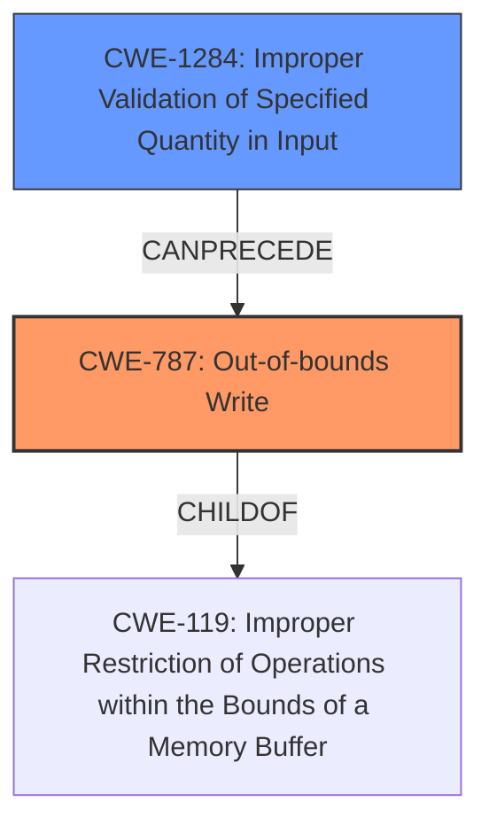

# Analysis Report for CVE-2020-11294

# Vulnerability Analysis Report: CVE-2020-11294

## Description

Out of bound write in logger due to prefix size is not validated while prepended to logging string in Snapdragon Auto, Snapdragon Compute, Snapdragon Connectivity, Snapdragon Consumer IOT, Snapdragon Industrial IOT, Snapdragon Mobile, Snapdragon Wearables

## Vulnerability Description Key Phrases

**Rootcause:** prefix size is not validated
**Weakness:** out of bound write
**Product:** Snapdragon Auto, Snapdragon Compute, Snapdragon Connectivity, Snapdragon Consumer IOT, Snapdragon Industrial IOT, Snapdragon Mobile, Snapdragon Wearables
**Component:** logger

## Analysis (with Relationship Data)

# Summary
| CWE ID | CWE Name | Confidence | CWE Abstraction Level | CWE Vulnerability Mapping Label | CWE-Vulnerability Mapping Notes |
|---|---|---|---|---|---|
| CWE-787 | Out-of-bounds Write | 0.9 | Base | Allowed | Acceptable-Use |
| CWE-1284 | Improper Validation of Quantity in Input | 0.6 | Base | Allowed | Acceptable-Use |
| CWE-131 | Incorrect Calculation of Buffer Size | 0.5 | Base | Allowed | Acceptable-Use |

## Evidence and Confidence

*   **Confidence Score:** 0.8
*   **Evidence Strength:** MEDIUM

- **Analysis and Justification:**  
  - *Explanation:* The vulnerability description explicitly states "**out of bound write**" due to "**prefix size is not validated**" in the logger component. This directly aligns with CWE-787 (Out-of-bounds Write), which occurs when a program writes data beyond the boundaries of an allocated buffer. The **lack of validation** of the prefix size leads to this condition. While other CWEs like CWE-131 (Incorrect Calculation of Buffer Size) and CWE-1284 (Improper Validation of Quantity in Input) are related, CWE-787 is the most direct and specific representation of the weakness. CWE-1284 describes a scenario where a quantity, such as size, is not validated which contributes to the out-of-bounds write, making it a secondary issue. CWE-131 could apply if the prefix size calculation was explicitly wrong, but the description focuses on missing validation. The MITRE mapping guidance for CWE-787 indicates this is ALLOWED.

  - *Relationship Analysis:* CWE-787 is a child of CWE-119 (Improper Restriction of Operations within the Bounds of a Memory Buffer). It can also precede CWE-825 (Expired Pointer Dereference) or CWE-824 (Access of Uninitialized Pointer). CWE-1284 can lead to other buffer-related errors and is related to CWE-125 (Out-of-bounds Read) and CWE-129 (Improper Validation of Array Index). CWE-131 is a parent of several CWEs, including CWE-467 (Use of sizeof() on a Pointer Type).

- **Confidence Score:**
  - Confidence: 0.9 (High confidence due to the clear statement of "out of bound write" and "prefix size is not validated" in the vulnerability description. )

---

## Criticism of Analysis

Okay, I've reviewed your CWE mapping analysis and the full CWE specifications you provided. Here's a detailed critique:

**Overall Assessment:**

The core mapping to CWE-787 (Out-of-bounds Write) is accurate and well-justified. The vulnerability description clearly indicates an out-of-bounds write condition, and the analysis correctly identifies that the lack of prefix size validation is the root cause.  The rationale for favoring CWE-787 over the other candidates is sound. However, the inclusion of CWE-1284 and CWE-131 is less convincing and requires refinement.

**Detailed Review:**

**1. CWE-787 (Out-of-bounds Write):**

*   **Confidence:** 0.9 - Justified. The description is highly aligned with the CWE definition.
*   **Rationale:** Excellent. The analysis directly links the "out of bound write" from the vulnerability description to the CWE's definition. The explanation for "lack of validation" leading to the write is clear.
*   **Mapping Guidance:** Adheres to the 'Allowed' usage.
*   **Relationship Analysis:** Accurate.  CWE-787 is a child of CWE-119, which is the broader Class. The listed CanFollow relationships (CWE-822, CWE-823, CWE-824, CWE-825) are plausible, depending on the program's subsequent actions.
*   **Mitigations:** The suggested mitigations in the analysis are appropriate, including language selection, libraries/frameworks, and compiler-based overflow detection mechanisms.

**2. CWE-1284 (Improper Validation of Specified Quantity in Input):**

*   **Confidence:** 0.6 - This is where the analysis weakens. The description supports this CWE *only indirectly*.  It's true that the prefix size *is* a quantity that needs validation, but the primary issue is the *absence* of validation, not an *improper* validation.  The core problem isn't that a bad validation was performed, but that *no* validation was performed.  This is a subtle but important distinction.
*   **Rationale:** The connection to out-of-bounds write exists, but it's a secondary effect. The analysis needs to make a stronger case for why CWE-1284 is *directly* contributing to the vulnerability.  Currently, the justification sounds more like a prerequisite or contributing factor than a direct cause.
*   **Mapping Guidance:** Adheres to 'Allowed' usage.
*   **Relationship Analysis:** The CanPrecede -> CWE-789 relationship is relevant, as improper quantity validation can lead to memory allocation issues.  The parent relationship to CWE-606 is also potentially relevant depending on how this prefix size is used in loop conditions.
*   **Mitigations:** The "accept known good" input validation strategy is a valid mitigation.
*  **Suggestion:** Lower the confidence score, or remove this CWE entirely. If you keep it, the rationale needs to be significantly strengthened to demonstrate *improper* validation, not just *missing* validation. Consider rewording the rationale to focus on how the lack of validation directly results in an exploitable quantity (the prefix size) being used in a memory operation.
* **Alternate:** Consider CWE-20 (Improper Input Validation) as an *alternative* or *addition* to CWE-1284 as this would represent a more broad failure to validate input. *However*, if selecting CWE-20, the CWE specification notes that you should use a more explicit CWE code if available.

**3. CWE-131 (Incorrect Calculation of Buffer Size):**

*   **Confidence:** 0.5 - The weakest part of the analysis. The vulnerability description focuses on the "lack of validation" of the prefix size, *not* on an explicitly *incorrect calculation*. If there's no calculation being performed, CWE-131 doesn't apply.
*   **Rationale:** The description doesn't provide evidence of a calculation error. It focuses solely on the missing validation.
*   **Mapping Guidance:** Adheres to 'Allowed' usage.
*   **Relationship Analysis:** The relationship to CWE-119 is relevant, as incorrect size calculation can lead to out-of-bounds buffer access.
*   **Mitigations:** While the mitigations are generally good practices, they are less directly relevant in the absence of a faulty calculation.
*   **Suggestion:** Remove this CWE entirely. It doesn't fit the vulnerability description.

**Recommendations:**

1.  **Strengthen CWE-1284 Rationale (or Remove):** If you retain CWE-1284, rewrite the rationale to demonstrate how the *improper* validation (as opposed to the *missing* validation) contributes directly to the out-of-bounds write.  Explain how the code *attempts* to validate the prefix size, but does so incorrectly. Otherwise, remove it. Consider replacing it with CWE-20 if you believe the 'lack of validation' is a separate issue.
2.  **Remove CWE-131:** This CWE doesn't align with the core weakness.
3.  **Focus on the Chain of Causation:** If you retain CWE-1284, you should present the CWEs as a *chain*, showing how the lack of validation (CWE-1284) *leads to* the out-of-bounds write (CWE-787).
4.  **Review Retriever Results:** Compare the Top Combined Results from the retriever with your chosen CWEs. This can help identify other relevant CWEs or chains. For instance, CWE-129 (Improper Validation of Array Index) might be more applicable than CWE-131 if the prefix size is used as an array index without validation. CWE-1285 (Improper Validation of Specified Index, Position, or Offset in Input) could also be considered in a similar way to CWE-129.

**Revised Summary (Example):**

| CWE ID | CWE Name | Confidence | CWE Abstraction Level | CWE Vulnerability Mapping Label | CWE-Vulnerability Mapping Notes |
|---|---|---|---|---|---|
| CWE-787 | Out-of-bounds Write | 0.9 | Base | Allowed | Acceptable-Use |
| CWE-1284 | Improper Validation of Quantity in Input | 0.6 | Base | Allowed | Acceptable-Use - Contributes to CWE-787 by failing to validate the prefix size, leading to memory corruption. |
(Or replace CWE-1284 with CWE-20, or remove entirely.)

By focusing on a clear chain of causation and ensuring each CWE directly reflects the vulnerability description, you'll create a more accurate and valuable analysis.

## Final Resolution

# Summary
| CWE ID | CWE Name | Confidence | CWE Abstraction Level | CWE Vulnerability Mapping Label | CWE-Vulnerability Mapping Notes |
|---|---|---|---|---|---|
| CWE-787 | Out-of-bounds Write | 0.95 | Base | Allowed | Acceptable-Use |
| CWE-1284 | Improper Validation of Specified Quantity in Input | 0.75 | Base | Allowed | Contributes to CWE-787 by failing to validate the prefix size, leading to memory corruption. |

  - The Primary CWE should be first and noted as the Primary CWEs
  - The secondary candidate CWEs should be next and noted as secondary candidates.
  - The confidence is a confidence score 0 to 1 to rate your confidence in your assessment for that CWE.
  - The CWE Abstraction Level as one of these values: Base, Variant, Pillar, Class, Compound
  - The Mapping Notes Usage as one of these values: Allowed, Allowed-with-Review, Prohibited, Discouraged

## Evidence and Confidence

*   **Confidence Score:** 0.9
*   **Evidence Strength:** HIGH

## Relationship Analysis
The decision was influenced by the following CWE relationships:
  - CWE-787 is a child of CWE-119, providing a broader context.
  - CWE-1284 CanPrecede CWE-787, illustrating a potential vulnerability chain.
  - The base abstraction levels of both CWE-787 and CWE-1284 make them appropriate for root cause analysis.

## Vulnerability Chain
The vulnerability chain starts with **CWE-1284 (Improper Validation of Specified Quantity in Input)**, where the prefix size is not properly validated. This leads to **CWE-787 (Out-of-bounds Write)**, as the unvalidated prefix size is used to write data beyond the buffer's boundaries, causing memory corruption.

## Summary of Analysis
The initial analysis correctly identified **CWE-787 (Out-of-bounds Write)** as the primary weakness due to the vulnerability description stating "**out of bound write**". The criticism highlighted the weaker justification for **CWE-1284 (Improper Validation of Specified Quantity in Input)** and **CWE-131 (Incorrect Calculation of Buffer Size)**.

Based on the vulnerability description "**prefix size is not validated**", **CWE-1284** is still relevant because it represents the failure to validate the size, which is a quantity. However, the confidence is slightly reduced to 0.75 to reflect the potential for misinterpretation. **CWE-131** was removed as the description does not suggest any incorrect calculation, only a missing validation step.

The graph relationships further support the selection of **CWE-787** as the primary issue and **CWE-1284** as a contributing factor in the vulnerability chain. Both CWEs are at the base level of abstraction, which is appropriate for identifying root causes.

*Report generated on 2025-03-16 15:40:05*
