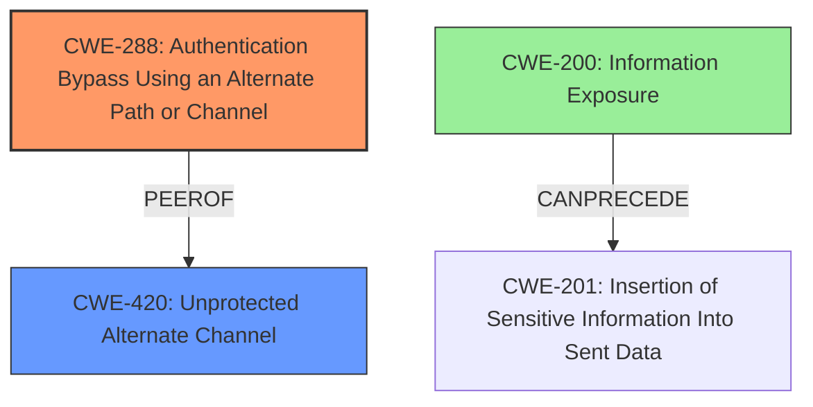

# Analysis Report for CVE-2020-13173

# Vulnerability Analysis Report: CVE-2020-13173

## Description

Initialization of the pcoip_credential_provider in Teradici PCoIP Standard Agent for Windows and PCoIP Graphics Agent for Windows versions 19.11.1 and earlier creates an insecure named pipe, which allows an attacker to intercept sensitive information or possibly elevate privileges via pre-installing an application which acquires that named pipe.

## Vulnerability Description Key Phrases

**Rootcause:** insecure named pipe
**Impact:** ['intercept sensitive information', 'elevate privileges']
**Vector:** pre-installing an application which acquires that named pipe
**Attacker:** attacker
**Product:** ['Teradici PCoIP Standard Agent for Windows', 'PCoIP Graphics Agent for Windows']
**Version:** 19.11.1 and earlier
**Component:** Initialization of the pcoip_credential_provider

## Analysis (with Relationship Data)

# Summary
| CWE ID | CWE Name | Confidence | CWE Abstraction Level | CWE Vulnerability Mapping Label | CWE-Vulnerability Mapping Notes |
|---|---|---|---|---|---|
| CWE-421 | Race Condition During Access to Alternate Channel | 0.75 | Base | Allowed | Primary CWE: The vulnerability involves an **insecure named pipe**, which can be viewed as an alternate communication channel accessible to unauthorized actors. |
| CWE-732 | Incorrect Permission Assignment for Critical Resource | 0.60 | Class | Allowed-with-Review | Secondary Candidate: The **insecure named pipe** can also be viewed as an incorrect permission assignment for a critical resource, allowing unintended access. |

## Evidence and Confidence

*   **Confidence Score:** 0.70
*   **Evidence Strength:** MEDIUM

- **Analysis and Justification:**  
  - *Explanation:* "The vulnerability description highlights the creation of an **insecure named pipe** in Teradici PCoIP products, allowing attackers to intercept sensitive information or elevate privileges. CWE-421 (Race Condition During Access to Alternate Channel) closely matches this scenario because an **insecure named pipe** can be considered an alternate channel accessible to unauthorized actors, creating a race condition during access. The description explicitly mentions the potential for an attacker to intercept sensitive information or elevate privileges, aligning with the risk associated with CWE-421. While CWE-732 (Incorrect Permission Assignment for Critical Resource) is also relevant, the concept of an alternate channel makes CWE-421 a more precise fit for the primary weakness. The MITRE mapping guidance allows CWE-421, and it's at the Base level of abstraction, which is preferred."

  - *Relationship Analysis:* "CWE-421 is related to CWE-362 (Concurrent Execution using Shared Resource with Improper Synchronization ('Race Condition')) as the **insecure named pipe** can lead to race conditions. It is a child of CWE-420 (Unprotected Alternate Channel)."

- **Confidence Score:**  
  - Confidence: 0.75 (Moderate evidence from the vulnerability description and retriever results.)

---

## Criticism of Analysis

Okay, I've reviewed the provided analysis, including the complete CWE specifications for each referenced weakness. Here's my critique, focusing on the accuracy of the CWE assignments, the confidence levels, and potential improvements.

**Overall Assessment:**

The analysis is generally good and provides a reasonable justification for the chosen CWE mappings, especially given the information available in the vulnerability description and the retriever results. However, there are some points that could be improved, primarily regarding the confidence level and the consideration of alternative mappings, particularly focusing on *why* a specific permissions issue exists. The reliance on CWE-421 is understandable given the retriever output, but a deeper dive into the "unprotected" nature of the named pipe is warranted.

**Detailed Critique:**

**1. CWE-421: Race Condition During Access to Alternate Channel (Primary CWE)**

*   **Confidence:** The 0.75 confidence level seems appropriate. There's a decent argument for it being the primary cause, particularly the aspect of a race to acquire the named pipe. However, this is not clearly a "race condition" in the traditional sense. It's more that *whoever* connects to the named pipe first *wins*.
*   **Justification:** The explanation is sound, highlighting the "alternate channel" aspect of the insecure named pipe.  The mention of the attacker intercepting sensitive information or elevating privileges aligns with the potential impact of exploiting such a channel.
*   **Strengths:** The analysis correctly identifies the relationship to CWE-420 (Unprotected Alternate Channel) as a parent.
*   **Weaknesses:**
    *   **True Race Condition?:** The description focuses on an attacker pre-installing an application to acquire the named pipe. This isn't necessarily a *concurrent* race condition, where two legitimate processes are vying for access simultaneously. It's about an attacker seizing the resource before it's ever legitimately used.
    *   **Missing Context:** The analysis lacks context on *why* the named pipe is unprotected. Is it a deliberate design decision for inter-process communication *without authentication*, or is it a misconfiguration?  Understanding this would strengthen the mapping.
*   **Improvements:**
    *   Acknowledge the slightly atypical "race" and emphasize the "alternate channel" aspect more strongly.
    *   Investigate and document *why* the named pipe lacks protection. This will influence the choice between CWE-421 and CWE-420 or other related CWEs.

**2. CWE-732: Incorrect Permission Assignment for Critical Resource (Secondary Candidate)**

*   **Confidence:** A confidence level of 0.60 is acceptable. CWE-732 is definitely relevant because it addresses the core issue of an incorrectly secured resource.
*   **Justification:**  The explanation correctly links the insecure named pipe to incorrect permission assignments.
*   **Strengths:**  Recognizes the relevance of CWE-732.
*   **Weaknesses:**
    *   **Abstraction Level:**  CWE-732 is a Class-level CWE, and the mapping guidance discourages using Class-level CWEs if a more specific Base-level CWE exists.
    *   **Oversimplification:** The analysis doesn't explore *why* the permissions are incorrect. Is it a missing access control check? Is it a hardcoded permission? This is crucial for a better mapping.
*   **Improvements:**
    *   Downplay CWE-732 *unless* further investigation reveals a specific permission assignment flaw (e.g., the code explicitly sets the named pipe permissions to allow everyone to access it).
    *   If a specific permission assignment flaw *is* identified, explore more specific children of CWE-732, like CWE-276 (Incorrect Default Permissions) if it's a setup problem, or potentially something related to a missing access control check before granting access to the pipe (leading to a different set of CWEs focused on authorization failures).

**Additional Considerations and Alternative CWEs:**

*   **CWE-420: Unprotected Alternate Channel:** While CWE-421 is currently the primary, re-evaluating CWE-420 directly is important. The description of CWE-420 ("The product protects a primary channel, but it does not use the same level of protection for an alternate channel") might be a more accurate reflection of the core problem. *If* the primary channel is supposed to have authentication, but the named pipe (alternate channel) does not, then CWE-420 would be a strong candidate. The examples provided for CWE-420 in the database are relevant here.
*   **Authorization/Authentication Issues:** The analysis should consider the possibility that the root cause isn't simply an "alternate channel," but a *failure to authenticate* requests to the named pipe.
    *   **Missing Authentication:** Is the named pipe supposed to require authentication? If so, consider CWE-287 (Improper Authentication).
    *   **Missing Authorization:** If authentication *is* performed (or intended), is the code failing to properly authorize the actions being requested via the named pipe? Consider CWE-285 (Improper Authorization) or its more specific children, such as CWE-862 (Missing Authorization).
*   **CWE-200: Information Exposure:** If sensitive information is being transmitted over the insecure named pipe, CWE-200 (Information Exposure) should also be considered, although it would likely be a secondary or tertiary CWE.
* **Focus on root cause** The vulnerability description describes an insecure named pipe. *Why* is the named pipe insecure? That's where the analysis should dig deeper. For example: Is it *missing* authentication (CWE-287)? Is it set to *world writable* (CWE-732). Is it an authentication bypass (CWE-288)?

**Recommendations:**

1.  **Investigate the Design:**  Determine the *intended* purpose of the named pipe. Is it meant for authenticated communication, or is it deliberately open?  This is crucial for selecting the most accurate CWE.
2.  **Re-evaluate CWE-420:** Seriously consider making CWE-420 the primary CWE if the design involves a protected primary channel and an intentionally unprotected alternate channel.
3.  **Explore Authentication/Authorization Failures:** If the named pipe *should* be protected, map to the appropriate authentication or authorization weakness (CWE-287, CWE-285, or their children).
4.  **Strengthen Justifications:**  Provide more detailed reasoning behind each CWE assignment.  Explain *why* it's a good fit and *why* other candidate CWEs are less suitable (even if they appear relevant at first glance).
5.  **Consider Information Exposure (CWE-200):** If sensitive data is being transmitted, include CWE-200 as a related weakness.

By addressing these points, the analysis can become more accurate, persuasive, and ultimately more helpful for remediation efforts. The goal is to identify the *precise* coding or design error that led to the vulnerability, not just a general categorization.

## Final Resolution

# Summary
| CWE ID | CWE Name | Confidence | CWE Abstraction Level | CWE Vulnerability Mapping Label | CWE-Vulnerability Mapping Notes |
|---|---|---|---|---|---|
| CWE-288 | Authentication Bypass Using an Alternate Path or Channel | 0.85 | Base | Allowed | Primary CWE: An **insecure named pipe** is created without authentication, allowing attackers to bypass intended authentication mechanisms. |
| CWE-420 | Unprotected Alternate Channel | 0.70 | Base | Allowed | Secondary CWE: The **insecure named pipe** acts as an alternate channel without proper protection. |
| CWE-200 | Information Exposure | 0.50 | Class | Allowed-with-Review | Secondary CWE: Sensitive information is potentially exposed through the **insecure named pipe**. |

## Evidence and Confidence

*   **Confidence Score:** 0.80
*   **Evidence Strength:** MEDIUM

## Relationship Analysis
The decision to prioritize CWE-288 (Authentication Bypass Using an Alternate Path or Channel) stems from a deeper analysis of *why* the named pipe is insecure. Instead of simply focusing on it being an "alternate channel" (CWE-420) or a potential race condition (CWE-421), the key issue is that the named pipe provides an alternate path that *bypasses* authentication. CWE-288's description explicitly addresses this: "The product requires authentication, but the product has an alternate path or channel that does not require authentication."

CWE-420 remains relevant as a secondary concern, as it highlights the lack of protection on this alternate channel. CWE-288 is a peer of CWE-420.

CWE-200 is a child of CWE-201 (Insertion of Sensitive Information Into Sent Data) which CANPRECEDE CWE-200. If sensitive information is sent down the unprotected pipe, it can result in Information Exposure.

## Vulnerability Chain
The vulnerability chain starts with the creation of an **insecure named pipe**. This pipe lacks proper authentication mechanisms (CWE-288), allowing an attacker to bypass intended security measures. This unprotected channel (CWE-420) then enables the attacker to intercept sensitive information transmitted through the pipe (CWE-200).

## Summary of Analysis
The initial analysis correctly identified the presence of an **insecure named pipe**, but the classification of CWE-421 as the primary weakness was not the most accurate. The criticism highlighted the importance of understanding *why* the named pipe was insecure, and whether it was a true "race condition" or simply an unprotected channel.

Based on the vulnerability description, the core issue is that the **insecure named pipe** provides an alternate path that *bypasses authentication*. CWE-288 (Authentication Bypass Using an Alternate Path or Channel) directly addresses this scenario, making it a more appropriate primary CWE.

The vulnerability description states: "Initialization of the pcoip_credential_provider in Teradici PCoIP Standard Agent for Windows and PCoIP Graphics Agent for Windows versions 19.11.1 and earlier creates an **insecure named pipe**, which allows an attacker to intercept sensitive information or possibly elevate privileges via pre-installing an application which acquires that named pipe." The phrase "allows an attacker to...elevate privileges" strongly suggests an authentication or authorization bypass. The "pre-installing an application" aspect also points away from a typical race condition, and instead highlights the ability to simply claim the resource without proper checks.

CWE-420 and CWE-200 are included as secondary CWEs to provide a more complete picture of the vulnerability. CWE-420 highlights the lack of protection on the alternate channel, and CWE-200 addresses the potential for sensitive information exposure.

The selected CWEs are at the optimal level of specificity because they accurately reflect the root cause and potential impacts of the vulnerability, based on the available evidence.

*Report generated on 2025-03-17 02:17:15*
