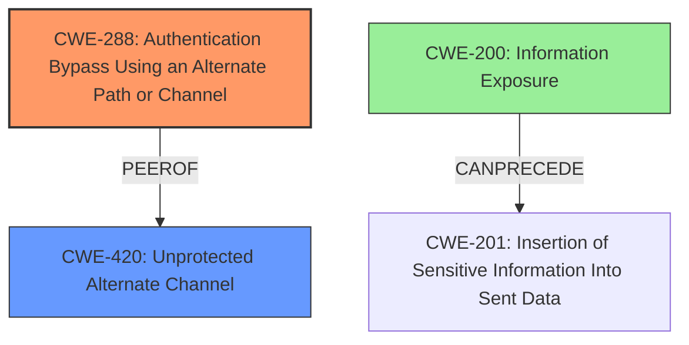

# Final Resolution for CVE-2020-13173

# Summary
| CWE ID | CWE Name | Confidence | CWE Abstraction Level | CWE Vulnerability Mapping Label | CWE-Vulnerability Mapping Notes |
|---|---|---|---|---|---|
| CWE-288 | Authentication Bypass Using an Alternate Path or Channel | 0.85 | Base | Allowed | Primary CWE: An **insecure named pipe** is created without authentication, allowing attackers to bypass intended authentication mechanisms. |
| CWE-420 | Unprotected Alternate Channel | 0.70 | Base | Allowed | Secondary CWE: The **insecure named pipe** acts as an alternate channel without proper protection. |
| CWE-200 | Information Exposure | 0.50 | Class | Allowed-with-Review | Secondary CWE: Sensitive information is potentially exposed through the **insecure named pipe**. |

## Evidence and Confidence

*   **Confidence Score:** 0.80
*   **Evidence Strength:** MEDIUM

## Relationship Analysis
The decision to prioritize CWE-288 (Authentication Bypass Using an Alternate Path or Channel) stems from a deeper analysis of *why* the named pipe is insecure. Instead of simply focusing on it being an "alternate channel" (CWE-420) or a potential race condition (CWE-421), the key issue is that the named pipe provides an alternate path that *bypasses* authentication. CWE-288's description explicitly addresses this: "The product requires authentication, but the product has an alternate path or channel that does not require authentication."

CWE-420 remains relevant as a secondary concern, as it highlights the lack of protection on this alternate channel. CWE-288 is a peer of CWE-420.

CWE-200 is a child of CWE-201 (Insertion of Sensitive Information Into Sent Data) which CANPRECEDE CWE-200. If sensitive information is sent down the unprotected pipe, it can result in Information Exposure.

## Vulnerability Chain
The vulnerability chain starts with the creation of an **insecure named pipe**. This pipe lacks proper authentication mechanisms (CWE-288), allowing an attacker to bypass intended security measures. This unprotected channel (CWE-420) then enables the attacker to intercept sensitive information transmitted through the pipe (CWE-200).

## Summary of Analysis
The initial analysis correctly identified the presence of an **insecure named pipe**, but the classification of CWE-421 as the primary weakness was not the most accurate. The criticism highlighted the importance of understanding *why* the named pipe was insecure, and whether it was a true "race condition" or simply an unprotected channel.

Based on the vulnerability description, the core issue is that the **insecure named pipe** provides an alternate path that *bypasses authentication*. CWE-288 (Authentication Bypass Using an Alternate Path or Channel) directly addresses this scenario, making it a more appropriate primary CWE.

The vulnerability description states: "Initialization of the pcoip_credential_provider in Teradici PCoIP Standard Agent for Windows and PCoIP Graphics Agent for Windows versions 19.11.1 and earlier creates an **insecure named pipe**, which allows an attacker to intercept sensitive information or possibly elevate privileges via pre-installing an application which acquires that named pipe." The phrase "allows an attacker to...elevate privileges" strongly suggests an authentication or authorization bypass. The "pre-installing an application" aspect also points away from a typical race condition, and instead highlights the ability to simply claim the resource without proper checks.

CWE-420 and CWE-200 are included as secondary CWEs to provide a more complete picture of the vulnerability. CWE-420 highlights the lack of protection on the alternate channel, and CWE-200 addresses the potential for sensitive information exposure.

The selected CWEs are at the optimal level of specificity because they accurately reflect the root cause and potential impacts of the vulnerability, based on the available evidence.