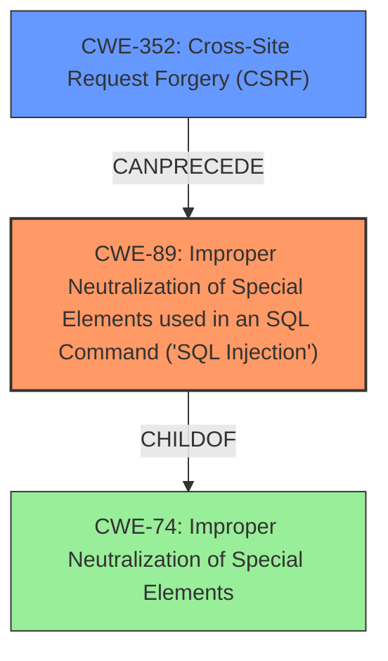

# Analysis Report for CVE-2020-13587

# Vulnerability Analysis Report: CVE-2020-13587

## Description

An exploitable SQL injection vulnerability exists in the forms_fields_rules/rules page of the Rukovoditel Project Management App 2.7.2. A specially crafted HTTP request can lead to SQL injection. An attacker can make an authenticated HTTP request to trigger this vulnerability, this can be done either with administrator credentials or through cross-site request forgery.

## Vulnerability Description Key Phrases

**Weakness:** SQL injection
**Vector:** specially crafted HTTP request
**Attacker:** attacker
**Product:** Rukovoditel Project Management App
**Version:** 2.7.2
**Component:** forms_fields_rules/rules page

## Analysis (with Relationship Data)

# Summary
| CWE ID | CWE Name | Confidence | CWE Abstraction Level | CWE Vulnerability Mapping Label | CWE-Vulnerability Mapping Notes |
|---|---|---|---|---|---|
| CWE-89 | Improper Neutralization of Special Elements used in an SQL Command ('SQL Injection') | 1.0 | Base | Allowed | Primary CWE |
| CWE-352 | Cross-Site Request Forgery (CSRF) | 0.4 | Compound | Allowed | Secondary Candidate |

## Evidence and Confidence

*   **Confidence Score:** 0.95
*   **Evidence Strength:** HIGH

- **Analysis and Justification:**  
  - *Explanation:* The vulnerability is a classic **SQL Injection** (CWE-89) located in the `forms_fields_rules/rules` page. The root cause is the lack of sanitization of the `id` parameter, which is then directly used in an SQL query. The provided content summary explicitly states that the unsanitized `id` parameter leads to **SQL injection**. The high similarity score (0.74) and the fact that CWE-89 is the Primary CWE Match for similar CVE descriptions further supports this classification. The attack vector involves crafting an HTTP POST request with a malicious SQL payload in the `id` parameter. This matches the description of CWE-89, where externally influenced input is used to construct an SQL command without proper neutralization. The MITRE mapping guidance for CWE-89 indicates that it is ALLOWED for this type of vulnerability, reinforcing the selection.
  
  - *Relationship Analysis:* The retriever results list relevant CWEs and their relationship to **SQL Injection**. While other CWEs such as CWE-79 (Cross-site Scripting) and CWE-78 (OS Command Injection) are listed, they do not accurately reflect the nature of this vulnerability, which is specifically related to the construction of SQL queries. Although CWE-74 (Improper Neutralization of Special Elements) is a parent of CWE-89, it is too high-level and discouraged by MITRE. The description and content summary provide sufficient evidence to classify this as CWE-89.

- **Confidence Score:**
  - Confidence: 1.0 (High confidence due to direct evidence from technical description, CVE reference materials, and mapping guidance)

---

- **Analysis and Justification:**
  - *Explanation:* The vulnerability description mentions that the attack can be triggered via cross-site request forgery, indicating a potential secondary weakness. Cross-Site Request Forgery (CSRF), identified as CWE-352, can allow an attacker to perform unauthorized actions on behalf of another user. In this case, an attacker might leverage CSRF to exploit the **SQL injection** vulnerability if the user has appropriate privileges. While the primary vulnerability is the SQL injection, the possibility of leveraging CSRF to trigger it warrants consideration. MITRE mapping guidance for CWE-352 allows this usage.
  - *Relationship Analysis:* CWE-352 is a compound element that involves a combination of context and actions. The vulnerability description mentions that the attack can be triggered through cross-site request forgery.

- **Confidence Score:**
  - Confidence: 0.4 (Low confidence because CSRF is only a possible attack vector, not the root cause)

## Criticism of Analysis

Okay, here's a review of the provided analysis, considering the full CWE specifications and focusing on the mapping guidance and potential mitigations.

**Overall Assessment**

The analysis is generally well-reasoned and accurate, especially regarding the primary CWE-89 mapping. The confidence levels are appropriately assigned. The inclusion of CWE-352 as a secondary candidate is also valid, given the information provided, but the low confidence reflects the supporting role accurately.

**Detailed Review**

**1. CWE-89: Improper Neutralization of Special Elements used in an SQL Command ('SQL Injection')**

*   **Confidence:** The analysis correctly identifies CWE-89 as the primary weakness. The justification is strong, pointing to:
    *   Direct evidence in the content summary ("unsanitized `id` parameter leads to SQL injection").
    *   High similarity scores from the retrievers.
    *   Attack vector involving a crafted HTTP POST request with a malicious SQL payload.
    *   MITRE mapping guidance allowing CWE-89 for this vulnerability type.
*   **CWE Specification Alignment:** The analysis adheres to the CWE-89 specification. The description provided in the spec directly matches the vulnerability. The lack of sanitization of an externally influenced input parameter (`id`) directly used in an SQL query is a textbook example of CWE-89.
*   **Mitigation Considerations:**  The analysis indirectly mentions mitigation by highlighting the root cause (lack of sanitization). Reviewing CWE-89's mitigation guidance suggests specific actions:
    *   **Using vetted libraries/frameworks (Mitigation 1):** This is highly relevant. Suggesting the use of parameterized queries provided by frameworks that prevent SQL injection.
    *   **Parameterization (Mitigation 2):**  This is the most important and direct mitigation.  The analysis could explicitly state the need to use prepared statements, parameterized queries, or stored procedures to separate data and code.
    *   **Least Privilege (Mitigation 3):** The analysis should explicitly mention the importance of following the principle of least privilege when creating user accounts to a SQL database.
*   **Suggested Improvement:** Include explicit recommendations aligned with the provided Potential Mitigations, specifically emphasizing parameterization (prepared statements) and the principle of least privilege.

**2. CWE-352: Cross-Site Request Forgery (CSRF)**

*   **Confidence:** The analysis assigns a low confidence score (0.4) to CWE-352, which is justified. CSRF is presented as a *possible* attack vector, not a fundamental cause of the SQL injection.
*   **CWE Specification Alignment:**  The analysis correctly notes that CSRF could be used to *trigger* the SQL injection.  The attacker needs to be authenticated (or leverage CSRF) to exploit the SQL injection. This aligns with the "trick a client into making an unintentional request" aspect of CWE-352.
*   **CWE-346 Implication:** As CWE-352 Requires CWE-346, there is an indirect verification of the need for Origin Validation Error.
*   **Mitigation Considerations:** The analysis could have referred to the relevant mitigation strategies for CWE-352, if the low confidence score was not in effect:
    *   **Anti-CSRF Tokens (Mitigation 3):** Generating a unique nonce for each form and verifying it upon receipt. If the application lacks CSRF protection, it's vulnerable, even if SQL injection is the primary weakness being exploited. This can be a possible mitigation technique for the application.
    *   **Libraries and Frameworks (Mitigation 1):** Using frameworks that offer built-in CSRF protection.
*   **Suggested Improvement:** The relationship between XSS and CSRF is also something to consider. The analysis mentions it but it could explore that direction further. However, given the already low score, this recommendation is less crucial.

**General Suggestions:**

*   **Prioritize Root Causes:** The analysis does a good job of focusing on the root cause (SQL injection).
*   **Complete the Chain:** While not always necessary, consider exploring potential attack chains. For example, if an attacker *could* use CSRF to trigger the SQL injection, would the SQL injection then lead to other vulnerabilities (e.g., privilege escalation, remote code execution)? This can help prioritize remediation efforts.
*   **Mitigation Specificity:** When suggesting mitigations, try to be as specific as possible (e.g., "Use parameterized queries with the `PreparedStatement` class in Java" instead of just "Use parameterized queries").
*   **Dynamic Analysis Considerations:** The analysis is largely based on static analysis. Consider what dynamic analysis (e.g., fuzzing, penetration testing) might reveal. Would it uncover additional weaknesses, or confirm the existing assessment?

**Conclusion**

The review is accurate and well-supported by the provided information. The suggested improvements focus on providing more actionable mitigation guidance by explicitly linking the identified weaknesses to specific countermeasures from the CWE specifications. The analysis correctly prioritizes CWE-89 as the primary weakness and appropriately assesses the potential, but less direct, role of CWE-352. Overall the analysis meets the requirements and contains no major errors.

## Final Resolution

# Summary

| CWE ID | CWE Name | Confidence | CWE Abstraction Level | CWE Vulnerability Mapping Label | CWE-Vulnerability Mapping Notes |
|---|---|---|---|---|---|
| CWE-89 | Improper Neutralization of Special Elements used in an SQL Command ('SQL Injection') | 1.0 | Base | Allowed | Primary CWE |
| CWE-352 | Cross-Site Request Forgery (CSRF) | 0.4 | Compound | Allowed | Secondary Candidate |

## Evidence and Confidence

*   **Confidence Score:** 0.95
*   **Evidence Strength:** HIGH

## Relationship Analysis
The primary relationship is that CWE-352 (Cross-Site Request Forgery) can *precede* CWE-89 (**SQL Injection**). While CWE-74 (Improper Neutralization of Special Elements) is a parent of CWE-89, using CWE-74 would be too high-level and less specific. The selection of CWE-89 is based on its base-level abstraction and direct mapping to the **SQL Injection** vulnerability described. The relationship analysis confirms that CSRF can be a prerequisite for exploiting the **SQL Injection**, but it's not the root cause.

## Vulnerability Chain
The vulnerability chain starts with the lack of proper input validation, leading to **SQL Injection** (CWE-89). Cross-Site Request Forgery (CWE-352) can be a prerequisite, where an attacker tricks a user into making a request that exploits the **SQL Injection** vulnerability. The final impact is unauthorized data access/modification due to the successful **SQL Injection**.

## Summary of Analysis
The initial analysis and criticism accurately identified CWE-89 as the primary weakness because the vulnerability description explicitly states that the unsanitized `id` parameter leads to **SQL Injection**: "A specially crafted HTTP request can lead to **SQL injection**." The high similarity score and the fact that CWE-89 is the Primary CWE Match for similar CVE descriptions further supports this classification. The graph relationships highlight that CSRF can be a preceding step in exploiting the **SQL Injection**, but it is not the root cause. Selecting CWE-89 provides the optimal level of specificity as it directly addresses the root cause of the vulnerability. The mitigation guidance emphasizes parameterization (prepared statements) and the principle of least privilege.

*Report generated on 2025-03-16 16:41:35*
