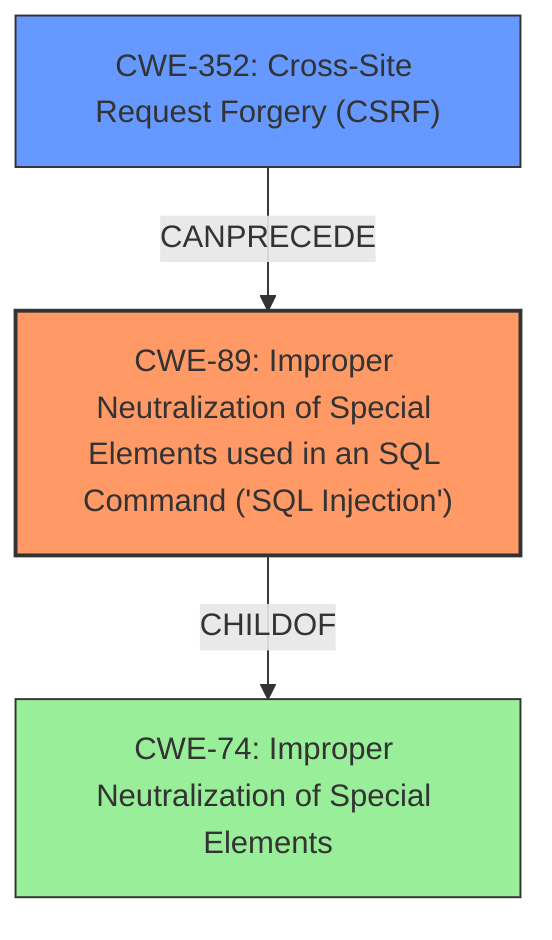

# Final Resolution for CVE-2020-13587

# Summary

| CWE ID | CWE Name | Confidence | CWE Abstraction Level | CWE Vulnerability Mapping Label | CWE-Vulnerability Mapping Notes |
|---|---|---|---|---|---|
| CWE-89 | Improper Neutralization of Special Elements used in an SQL Command ('SQL Injection') | 1.0 | Base | Allowed | Primary CWE |
| CWE-352 | Cross-Site Request Forgery (CSRF) | 0.4 | Compound | Allowed | Secondary Candidate |

## Evidence and Confidence

*   **Confidence Score:** 0.95
*   **Evidence Strength:** HIGH

## Relationship Analysis
The primary relationship is that CWE-352 (Cross-Site Request Forgery) can *precede* CWE-89 (**SQL Injection**). While CWE-74 (Improper Neutralization of Special Elements) is a parent of CWE-89, using CWE-74 would be too high-level and less specific. The selection of CWE-89 is based on its base-level abstraction and direct mapping to the **SQL Injection** vulnerability described. The relationship analysis confirms that CSRF can be a prerequisite for exploiting the **SQL Injection**, but it's not the root cause.

## Vulnerability Chain
The vulnerability chain starts with the lack of proper input validation, leading to **SQL Injection** (CWE-89). Cross-Site Request Forgery (CWE-352) can be a prerequisite, where an attacker tricks a user into making a request that exploits the **SQL Injection** vulnerability. The final impact is unauthorized data access/modification due to the successful **SQL Injection**.

## Summary of Analysis
The initial analysis and criticism accurately identified CWE-89 as the primary weakness because the vulnerability description explicitly states that the unsanitized `id` parameter leads to **SQL Injection**: "A specially crafted HTTP request can lead to **SQL injection**." The high similarity score and the fact that CWE-89 is the Primary CWE Match for similar CVE descriptions further supports this classification. The graph relationships highlight that CSRF can be a preceding step in exploiting the **SQL Injection**, but it is not the root cause. Selecting CWE-89 provides the optimal level of specificity as it directly addresses the root cause of the vulnerability. The mitigation guidance emphasizes parameterization (prepared statements) and the principle of least privilege.