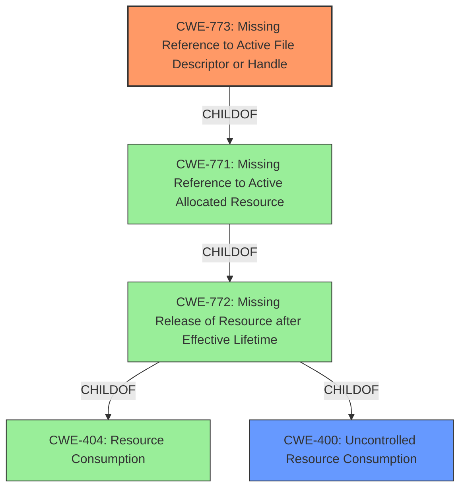

# Final Resolution for CVE-2020-14340

# Summary
| CWE ID | CWE Name | Confidence | CWE Abstraction Level | CWE Vulnerability Mapping Label | CWE-Vulnerability Mapping Notes |
|---|---|---|---|---|---|
| CWE-773 | Missing Reference to Active File Descriptor or Handle | 0.95 | Variant | Allowed | Primary CWE. The NIO Selector file handles are allocated but references are not properly maintained, preventing garbage collection and causing descriptor leaks. |
| CWE-400 | Uncontrolled Resource Consumption | 0.60 | Class | Discouraged | Secondary Candidate. While the *impact* is DoS due to resource exhaustion, CWE-400 is a discouraged CWE with more precise child CWEs available. |

## Evidence and Confidence

*   **Confidence Score:** 0.95
*   **Evidence Strength:** HIGH

## Relationship Analysis
The primary CWE, CWE-773, is a Variant of CWE-771 (Missing Reference to Active Allocated Resource), which in turn is a child of CWE-772 (Missing Release of Resource after Effective Lifetime). CWE-772 is a child of CWE-404 (Resource Consumption). The secondary CWE, CWE-400 (Uncontrolled Resource Consumption), is a Class and parent of CWE-772.

## Vulnerability Chain
The vulnerability chain starts with a **missing reference to an active file descriptor** (CWE-773). This leads to the file descriptor not being released after its effective lifetime, contributing to **uncontrolled resource consumption** (CWE-400), which ultimately causes a denial-of-service (DoS).

## Summary of Analysis
The initial analysis and criticism both converge on CWE-773 as the primary **root cause** due to a file descriptor leak. The vulnerability description explicitly states "file descriptor leak caused by growing amounts of NIO Selector file handles between garbage collection cycles." This directly implies that references to the file handles are not being properly maintained, leading to the leak. The criticism suggests considering mitigations, explicit connection of concepts, and related CWEs.

The graph relationships highlight that CWE-773 is a specific variant of more general resource management issues. While CWE-400 (Uncontrolled Resource Consumption) represents the eventual impact, it's a discouraged CWE and too high-level to accurately describe the **root cause**. The analysis also considered CWE-775 (Missing Release of File Descriptor or Handle after Effective Lifetime) but decided it was not as good of a fit as it is the *missing reference* that is preventing the release.

The decision to prioritize CWE-773 is based on its specificity (Variant level) and direct relevance to the vulnerability description, which explicitly mentions the lack of proper reference maintenance. This aligns with the MITRE mapping guidance favoring more specific CWEs at the Base or Variant level when available. I am choosing the summary table in the criticism as it takes into account some of the suggestions made.