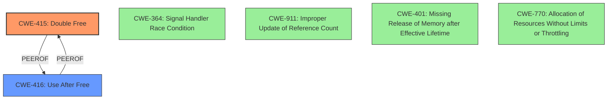

# Analysis Report for CVE-2020-14354

# Vulnerability Analysis Report: CVE-2020-14354

## Description

A possible use-after-free and double-free in c-ares lib version 1.16.0 if ares_destroy() is called prior to ares_getaddrinfo() completing. This flaw possibly allows an attacker to crash the service that uses c-ares lib. The highest threat from this vulnerability is to this service availability.

## Vulnerability Description Key Phrases

**Rootcause:** use-after-free and double-free
**Impact:** crash the service
**Attacker:** attacker
**Product:** c-ares lib
**Version:** 1.16.0

## Analysis (with Relationship Data)

# Summary
| CWE ID | CWE Name | Confidence | CWE Abstraction Level | CWE Vulnerability Mapping Label | CWE-Vulnerability Mapping Notes |
|---|---|---|---|---|---|
| CWE-415 | Double Free | 0.95 | Variant | Allowed | Primary CWE |
| CWE-416 | Use After Free | 0.95 | Variant | Allowed | Secondary CWE |

## Evidence and Confidence

*   **Confidence Score:** 0.95
*   **Evidence Strength:** HIGH

- **Analysis and Justification:**  
  - *Explanation:* The vulnerability description explicitly states "**use-after-free and double-free**" conditions in c-ares lib version 1.16.0. The CVE reference summary confirms that the root cause of the vulnerability is a use-after-free in the `ares_getaddrinfo()` function and a potential double-free condition in the `end_hquery` function. CWE-415 (Double Free) and CWE-416 (Use After Free) are both Variant level CWEs, which are preferred. The retriever results also indicate these as the top candidates. CWE-415 has the highest combined score of 0.8090 and CWE-416 has a score of 0.6748. Both are ALLOWED for use. The description aligns precisely with the definitions of these CWEs, where memory is freed twice (CWE-415) or accessed after being freed (CWE-416). The impact is a crash of the service.
  
  - *Relationship Analysis:* CWE-415 (Double Free) and CWE-416 (Use After Free) are often related, as a use-after-free can sometimes lead to a double-free if the freed memory is reallocated and then freed again. There are no direct relationships between them in the CWE graph, but they are often found together in real-world vulnerabilities.

- **Confidence Score:**  
  - Confidence: 0.95 (High confidence due to direct evidence in the vulnerability description and CVE details.)

## Criticism of Analysis

Okay, here's a review of the provided analysis, incorporating the full CWE specifications.

**Overall Assessment:**

The analysis is generally very good.  The core CWE mappings to CWE-415 (Double Free) and CWE-416 (Use After Free) are accurate and well-justified. The confidence level of 0.95 is appropriate given the explicit mention of these conditions in the vulnerability description and corroborating evidence from CVE details. The analysis also incorporates the retriever results, and correctly prioritizes the Variant-level CWEs.

**Detailed Critique:**

1.  **CWE-415: Double Free**

    *   **Mapping Accuracy:**  Excellent.  The description of the vulnerability clearly aligns with the definition of CWE-415: "The product calls `free()` twice on the same memory address, potentially leading to modification of unexpected memory locations."  The analysis also correctly identifies that the `end_hquery` function could be called twice, leading to this condition.
    *   **Abstraction Level:** Correctly identified as "Variant," which is preferred.
    *   **Justification:** The justification is thorough and clearly explains why this CWE is appropriate.
    *   **Relationships:** The analysis correctly notes that CWE-415 is a peer of CWE-416, even though there's no direct relationship in the graph. It is also good to mention possible causes, such as race conditions and error conditions.
    *   **Mitigations:** The provided analysis doesn't explicitly include mitigations, but it would be worthwhile to mention some of the mitigations from the CWE specification in the analysis, even if only briefly.  For example:
        *   "Potential mitigations include using languages with automatic memory management, ensuring each allocation is freed only once, and using static analysis tools to detect double frees."
        *   "Setting pointers to NULL after freeing them can help prevent double frees, although this isn't always sufficient in complex code."
    *   **Observed Examples:** The analysis correctly lists CVE-2020-14354 itself as one of the top 25 examples of CWE-415.

2.  **CWE-416: Use After Free**

    *   **Mapping Accuracy:** Excellent. The vulnerability description and CVE details describe accessing freed memory in the `host_callback` function, which perfectly matches the definition of CWE-416: "The product reuses or references memory after it has been freed."
    *   **Abstraction Level:** Correctly identified as "Variant," which is preferred.
    *   **Justification:** The justification is thorough.
    *   **Relationships:** Again, the analysis correctly notes the relationship with CWE-415.
    *   **Mitigations:** Similar to CWE-415, adding a mention of potential mitigations would improve the analysis. Examples:
        *   "Potential mitigations include using languages with automatic memory management and setting pointers to NULL after they are freed."
    *   **Observed Examples:** The analysis should also list CVE-2020-14354 as an example of CWE-416.

3.  **Retriever Results:**

    *   The analysis appropriately considers the retriever results, using them to support the selection of CWE-415 and CWE-416. It also recognizes that Variant CWEs are preferred.
    *   It's worth noting the presence of other CWEs in the retriever results, and briefly explaining why they *aren't* the primary mappings, even if they have high scores. This shows that the analysis considered alternatives.  For example:
        *   "While CWE-364 (Signal Handler Race Condition) has a high score, the vulnerability is more directly related to memory management errors, rather than race conditions in signal handlers.  The issue is triggered by the timing of `ares_destroy()` relative to `ares_getaddrinfo()`, not specifically by signal handling."
        *   "CWE-911 (Improper Update of Reference Count) could be argued, but the core issue is not a failure to update a reference count, but the double-free/use-after-free that results from incorrect timing of function calls."
        *   "CWE-401 (Missing Release of Memory after Effective Lifetime) is relevant and it could also lead to exhaustion of memory. But the primary concern here is the corruption of memory due to double free and use-after-free. The missing release of memory after lifetime causes a memory leak, which is not the primary concern here."
        *    "CWE-770 (Allocation of Resources Without Limits or Throttling) is not relevant as there are no limits on allocation mentioned."

4.  **General Comments and Suggestions:**

    *   **Root Cause vs. Consequence:**  The analysis clearly identifies the root causes (double free, use-after-free).  It's important to maintain this distinction.
    *   **Clarity and Conciseness:** The analysis is generally clear and concise.
    *   **Relationships and Chains:** Although not strictly required, it might be beneficial to briefly discuss how these vulnerabilities could be part of a longer exploit chain. For example, a use-after-free could potentially be leveraged for code execution if an attacker can control the contents of the freed memory after it's reallocated.

**Revised Summary Table (Incorporating Suggestions):**

| CWE ID | CWE Name | Confidence | CWE Abstraction Level | CWE Vulnerability Mapping Label | CWE-Vulnerability Mapping Notes |
|---|---|---|---|---|---|
| CWE-415 | Double Free | 0.95 | Variant | Allowed | Primary CWE. The `end_hquery` function could be called twice. Mitigations include automatic memory management, ensuring single `free()`, and static analysis.  |
| CWE-416 | Use After Free | 0.95 | Variant | Allowed | Secondary CWE. The `host_callback` function might access freed memory. Mitigations include automatic memory management and setting pointers to NULL after `free()`. |

**In Summary:**

This is a strong and well-reasoned analysis. The recommended changes primarily involve adding a brief discussion of potential mitigations and justifying the exclusion of other plausible CWEs from the retriever results. These additions would make the analysis even more comprehensive and robust.

## Final Resolution

# Summary
| CWE ID | CWE Name | Confidence | CWE Abstraction Level | CWE Vulnerability Mapping Label | CWE-Vulnerability Mapping Notes |
|---|---|---|---|---|---|
| CWE-415 | Double Free | 0.95 | Variant | Allowed | **Primary CWE**. The `end_hquery` function could be called twice. Mitigations include automatic memory management, ensuring single `free()`, and static analysis.  |
| CWE-416 | Use After Free | 0.95 | Variant | Allowed | **Secondary CWE**. The `host_callback` function might access freed memory. Mitigations include automatic memory management and setting pointers to NULL after `free()`. |

## Evidence and Confidence

*   **Confidence Score:** 0.95
*   **Evidence Strength:** HIGH

## Relationship Analysis
The primary relationships impacting the decision are the peer relationship between CWE-415 (**Double Free**) and CWE-416 (**Use After Free**), and their shared context within memory management vulnerabilities. While no direct hierarchical or chain relationships are present, their co-occurrence in the vulnerability description indicates a strong association. The Variant abstraction level of both CWEs also influenced the selection, providing optimal specificity.

## Vulnerability Chain
The vulnerability chain starts with a timing issue when `ares_destroy()` is called before `ares_getaddrinfo()` completes. This leads to:
1.  Memory being freed prematurely.
2.  Subsequent access to this freed memory (CWE-416: **Use After Free**).
3.  A potential second attempt to free the same memory (CWE-415: **Double Free**).
The ultimate impact is a crash of the service using the c-ares library.

## Summary of Analysis
The initial analysis and criticism both strongly support the classification of CWE-415 (**Double Free**) and CWE-416 (**Use After Free**). The vulnerability description explicitly mentions both conditions, and the CVE details confirm the presence of a use-after-free in the `ares_getaddrinfo()` function and a potential double-free in the `end_hquery` function.

The decision is primarily based on the direct evidence found in the vulnerability description: "A possible **use-after-free and double-free** in c-ares lib version 1.16.0 if ares_destroy() is called prior to ares_getaddrinfo() completing."

The graph relationships, while not directly hierarchical or chained, reinforce the likelihood of both CWEs being present due to their peer relationship in memory management contexts.

The selected CWEs are at the optimal level of specificity (Variant) as recommended by the CWE mapping guidance. Alternative CWEs, such as CWE-364 (**Signal Handler Race Condition**), CWE-911 (**Improper Update of Reference Count**), CWE-401 (**Missing Release of Memory after Effective Lifetime**) and CWE-770 (**Allocation of Resources Without Limits or Throttling**), were considered but deemed less directly relevant to the core issue of memory being freed and then accessed/freed again.

*Report generated on 2025-03-16 15:40:43*
