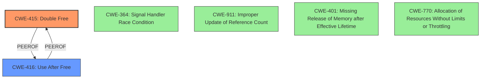

# Final Resolution for CVE-2020-14354

# Summary
| CWE ID | CWE Name | Confidence | CWE Abstraction Level | CWE Vulnerability Mapping Label | CWE-Vulnerability Mapping Notes |
|---|---|---|---|---|---|
| CWE-415 | Double Free | 0.95 | Variant | Allowed | **Primary CWE**. The `end_hquery` function could be called twice. Mitigations include automatic memory management, ensuring single `free()`, and static analysis.  |
| CWE-416 | Use After Free | 0.95 | Variant | Allowed | **Secondary CWE**. The `host_callback` function might access freed memory. Mitigations include automatic memory management and setting pointers to NULL after `free()`. |

## Evidence and Confidence

*   **Confidence Score:** 0.95
*   **Evidence Strength:** HIGH

## Relationship Analysis
The primary relationships impacting the decision are the peer relationship between CWE-415 (**Double Free**) and CWE-416 (**Use After Free**), and their shared context within memory management vulnerabilities. While no direct hierarchical or chain relationships are present, their co-occurrence in the vulnerability description indicates a strong association. The Variant abstraction level of both CWEs also influenced the selection, providing optimal specificity.

## Vulnerability Chain
The vulnerability chain starts with a timing issue when `ares_destroy()` is called before `ares_getaddrinfo()` completes. This leads to:
1.  Memory being freed prematurely.
2.  Subsequent access to this freed memory (CWE-416: **Use After Free**).
3.  A potential second attempt to free the same memory (CWE-415: **Double Free**).
The ultimate impact is a crash of the service using the c-ares library.

## Summary of Analysis
The initial analysis and criticism both strongly support the classification of CWE-415 (**Double Free**) and CWE-416 (**Use After Free**). The vulnerability description explicitly mentions both conditions, and the CVE details confirm the presence of a use-after-free in the `ares_getaddrinfo()` function and a potential double-free in the `end_hquery` function.

The decision is primarily based on the direct evidence found in the vulnerability description: "A possible **use-after-free and double-free** in c-ares lib version 1.16.0 if ares_destroy() is called prior to ares_getaddrinfo() completing."

The graph relationships, while not directly hierarchical or chained, reinforce the likelihood of both CWEs being present due to their peer relationship in memory management contexts.

The selected CWEs are at the optimal level of specificity (Variant) as recommended by the CWE mapping guidance. Alternative CWEs, such as CWE-364 (**Signal Handler Race Condition**), CWE-911 (**Improper Update of Reference Count**), CWE-401 (**Missing Release of Memory after Effective Lifetime**) and CWE-770 (**Allocation of Resources Without Limits or Throttling**), were considered but deemed less directly relevant to the core issue of memory being freed and then accessed/freed again.