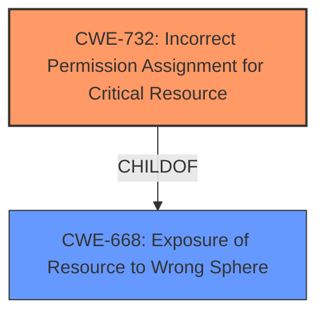

# Analysis Report for CVE-2020-16247

# Vulnerability Analysis Report: CVE-2020-16247

## Description

Philips Clinical Collaboration Platform, Versions 12.2.1 and prior. The product exposes a resource to the wrong control sphere, providing unintended actors with inappropriate access to the resource.

## Vulnerability Description Key Phrases

**Impact:** provide unintended actors with inappropriate access to the resource
**Product:** Philips Clinical Collaboration Platform
**Version:** Versions 12.2.1 and prior

## Analysis (with Relationship Data)

# Summary
| CWE ID | CWE Name | Confidence | CWE Abstraction Level | CWE Vulnerability Mapping Label | CWE-Vulnerability Mapping Notes |
|---|---|---|---|---|---|
| CWE-668 | Exposure of Resource to Wrong Sphere | 0.75 | Class | Primary | Discouraged |

## Evidence and Confidence

*   **Confidence Score:** 0.75
*   **Evidence Strength:** MEDIUM

- **Analysis and Justification:**  
  - *Explanation:* The vulnerability description explicitly states that "The product exposes a resource to the wrong control sphere, providing unintended actors with inappropriate access to the resource." This aligns directly with the definition of CWE-668: "The product exposes a resource to the wrong control sphere, providing unintended actors with inappropriate access to the resource." The CVE Reference Links Content Summary further reinforces this by stating that the **root cause** is that "The product exposes a resource to the wrong control sphere, providing unintended actors with inappropriate access to the resource." While CWE-668 is a high-level class, and discouraged, I am selecting it because the description does not provide enough information to select a more specific Base or Variant CWE.
  
  - *Relationship Analysis:* No direct relationships found.

- **Confidence Score:**  
  - Confidence: 0.75 (Medium evidence from technical description and CVE reference materials. Lowered confidence because the description is very general).

## Criticism of Analysis

Okay, here's a detailed review of the provided CWE analysis, considering the full CWE specifications:

**Overall Assessment:**

The analysis correctly identifies CWE-668 as a *potential* mapping. The reasoning for selecting CWE-668, despite it being discouraged, is also sound *given the limited information*.  However, the key to a strong CWE analysis is to push beyond the general and attempt to identify the *specific* mechanism causing the exposure.  The current confidence of 0.75 is reasonable, but can be improved with more information.  The review below will focus on how to potentially identify a more specific CWE.

**Detailed Review:**

| CWE ID  | CWE Name  | Confidence | Critique  | Recommendation |
|----------------|---------------------------------------------------|-------------|-------------------------------------------------------------------------------------------------------------------------------------------------------------------------------------------------------------------------------------------------------------------------------------------------------------------------------------------------------------------------------------------------------------------------------------------------------------------------------------------------------------------------------------------------------------------------------------------------------------------------------------------------------------------------------------------------------------------------------------------------------------------------------------------------------------------------------------------------------------------------------------------------------------------------------------------------------------------------------------------------------------------------------------------------------------------------------------------------------|------------------------------------------------------------------------------------------------------------------------------------------------------------------------------------------------------------------------------------------------------------------------------------------------------------------------------------------------------------------------------------------------------------------------------------------------------------------------------------------------------------------------------------------------------------------------------------------------------------------------------------------------------------------------------------------------------------------------|
| CWE-668 | Exposure of Resource to Wrong Sphere | 0.75 |  While technically correct given the vague description, it's crucial to recognize that CWE-668's mapping guidance explicitly *discourages* its use. The rationale mentions this and acknowledges the lack of info.  The goal is to find the underlying cause of the "wrong control sphere" exposure.  The analysis should have considered potential child elements of CWE-668 to see if a more specific CWE could be identified. The root cause is stated as the product exposing a resource to the wrong control sphere - this is a restatement of the vulnerability not a cause. The impact includes modification of data or DoS which can be a guide to find the appropriate CWE. Access is local, meaning it is likely a misconfiguration or permission issue. |   **Investigate further.**  Given the local access vector and potential for data modification/DoS, consider the following:   *   **CWE-732 (Incorrect Permission Assignment for Critical Resource):** This is a strong contender. The local access requirement and the potential for data modification/DoS suggest that the resource is likely a file, directory, or other system object with overly permissive permissions.  The description even includes the example of a misconfigured cloud storage account with broad access.  *   **CWE-552 (Files or Directories Accessible to External Parties):** If the resource is a file or directory that *shouldn't* be under the server's root (e.g., accidentally included in the deployed application), this might be a better fit.  Requires determining if the files *should* even be in that directory.  *   **CWE-285 (Improper Authorization):**  Is the system *checking* permissions at all? Is there an authorization bypass that allows access?  This is a broader authorization issue rather than a simple permission problem. This is a less likely case given local access is required.  *   **CWE-426/427/428 (Untrusted Search Path/Uncontrolled Search Path Element/Unquoted Search Path or Element):** Could an attacker, with local access, influence which resources are loaded or used by the platform? This is less likely to be the primary vulnerability based on the description, but worth investigating.   *   **Review CVSS vector:** The AV:L (attack vector local) should give clues to the CWE - look for CWEs with local privilege escalation. |

**Review of Ranked CWEs:**
These are the top ranked CWEs to consider, to replace/refine the selection of CWE-668.

| CWE ID | CWE Name | Critique | Recommendation |
|---|---|---|---|
| 708 | Incorrect Ownership Assignment | The description does not mention anything related to ownership, so this is not likely to be correct | Reject. |
| 497 | Exposure of Sensitive System Information to an Unauthorized Control Sphere | This is too broad of a description for the issue. The issue is not sensitive system information, but rather access to a protected resource. | Reject. |
| 201 | Insertion of Sensitive Information Into Sent Data | This is too broad of a description for the issue. The issue is not sensitive data in messages, but rather access to a protected resource | Reject. |
| 99 | Improper Control of Resource Identifiers ('Resource Injection') | There's no indication of resource identifiers being directly controlled by the attacker in the description, making this mapping less likely.  Requires more information. | Possibly, but requires more information to determine if an attacker is able to specify a resource identifier that is outside the intended sphere of control.  |
| 732 | Incorrect Permission Assignment for Critical Resource | As mentioned above, this is a promising candidate that warrants further investigation.  | Investigate further. |
| 706 | Use of Incorrectly-Resolved Name or Reference | This could be related to CWE-99 if an attacker can control a name/reference that resolves to a different resource. Requires more information. | Requires more information to determine if an attacker is able to cause the application to use an incorrectly resolved reference. |
| 668 | Exposure of Resource to Wrong Sphere | As mentioned before, this is a starting point, but needs refinement. | Replace with more specific CWE, if possible. |
| 200 | Exposure of Sensitive Information to an Unauthorized Actor |  Too broad, and the vulnerability doesn't necessarily involve exposure of sensitive *information*. It's about gaining access to a resource, which may or may not contain sensitive data. | Reject, too broad. |
| 400 | Uncontrolled Resource Consumption |  While DoS is mentioned as an *impact*, the root cause isn't necessarily about uncontrolled resource consumption. It's more about gaining unauthorized access, which *then* allows a DoS.  | Reject, this is an impact not the cause. |
| 843 | Access of Resource Using Incompatible Type ('Type Confusion') | No indication of type confusion. | Reject. |

**Revised Recommendations:**

1.  **Gather More Information:**  The most important step.  Try to understand:
    *   What *specific* resource is being exposed? A file? A directory? A configuration setting? A database endpoint?
    *   How is it being exposed? Is it a misconfiguration? A lack of access controls? A path traversal issue?
    *   How is the local access achieved? Is it through a vulnerable web interface? By directly modifying files on the system?
2.  **Prioritize CWE-732 Investigation:**  Focus on whether incorrect permission assignment is the root cause.  Specifically, look for misconfigured file/directory permissions or database access rights.
3.  **Consider CWE-552:** If the resource is a file/directory, is it located in a place where it *shouldn't* be?
4.  **Consider Authorization Bypasses (CWE-285 Descendants):**  Is the system failing to *check* authorization before granting access? This would be *more* than just a simple permission problem.
5.  **If the root cause cannot be determined, then using CWE-668 would be appropriate.**

By following these steps, the analysis can move beyond the general "wrong control sphere" and identify the *precise* flaw that attackers can exploit.

## Final Resolution

# Summary

| CWE ID | CWE Name | Confidence | CWE Abstraction Level | CWE Vulnerability Mapping Label | CWE-Vulnerability Mapping Notes |
|---|---|---|---|---|---|
| CWE-732 | Incorrect Permission Assignment for Critical Resource | 0.8 | Class | Primary CWE | Allowed-with-Review |
| CWE-668 | Exposure of Resource to Wrong Sphere | 0.5 | Class | Secondary Candidate | Discouraged |

## Evidence and Confidence

*   **Confidence Score:** 0.8
*   **Evidence Strength:** MEDIUM

## Relationship Analysis
The initial analysis selected CWE-668 (**CWE-668: Exposure of Resource to Wrong Sphere**) as the primary **WEAKNESS**. While technically correct, it is a high-level class. The criticism suggested investigating more specific CWEs, particularly CWE-732 (**CWE-732: Incorrect Permission Assignment for Critical Resource**), given the local access vector and potential for data modification/DoS. The relationship analysis focuses on moving from a general class to a more specific class that reflects the underlying cause.

## Vulnerability Chain
The vulnerability chain starts with the **ROOTCAUSE** of incorrect permission assignment (CWE-732). This leads to the exposure of a resource to the wrong control sphere (CWE-668), ultimately allowing unintended actors to access and potentially modify data or cause a denial-of-service.

## Summary of Analysis
The initial analysis correctly identified CWE-668, but the criticism highlighted the need for a more specific classification. The vulnerability description, "The product exposes a resource to the wrong control sphere, providing unintended actors with inappropriate access to the resource," is quite general.

The criticism suggested investigating CWE-732 (**CWE-732: Incorrect Permission Assignment for Critical Resource**) as a more specific candidate. The recommendation was based on the potential for data modification or DoS, coupled with local access. This suggests a misconfiguration or permission issue, which aligns well with CWE-732. The fact that access is local is an important piece of information that makes CWE-732 a better fit than other CWEs that relate to a broader authorization bypass.

Given the information, CWE-732 is a more precise classification than CWE-668. The assessment is based on the understanding that incorrect permission assignments are the **ROOTCAUSE** of the resource exposure. I am retaining CWE-668 as a secondary candidate since it reflects the immediate consequence of the **WEAKNESS**, but CWE-732 represents the underlying **ROOTCAUSE**.

*Report generated on 2025-03-16 22:44:22*
