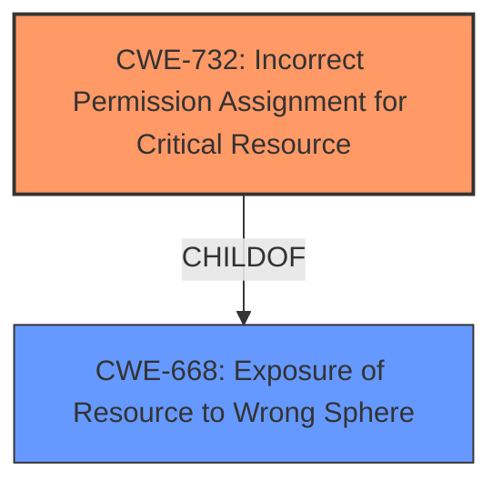

# Final Resolution for CVE-2020-16247

# Summary

| CWE ID | CWE Name | Confidence | CWE Abstraction Level | CWE Vulnerability Mapping Label | CWE-Vulnerability Mapping Notes |
|---|---|---|---|---|---|
| CWE-732 | Incorrect Permission Assignment for Critical Resource | 0.8 | Class | Primary CWE | Allowed-with-Review |
| CWE-668 | Exposure of Resource to Wrong Sphere | 0.5 | Class | Secondary Candidate | Discouraged |

## Evidence and Confidence

*   **Confidence Score:** 0.8
*   **Evidence Strength:** MEDIUM

## Relationship Analysis
The initial analysis selected CWE-668 (**CWE-668: Exposure of Resource to Wrong Sphere**) as the primary **WEAKNESS**. While technically correct, it is a high-level class. The criticism suggested investigating more specific CWEs, particularly CWE-732 (**CWE-732: Incorrect Permission Assignment for Critical Resource**), given the local access vector and potential for data modification/DoS. The relationship analysis focuses on moving from a general class to a more specific class that reflects the underlying cause.

## Vulnerability Chain
The vulnerability chain starts with the **ROOTCAUSE** of incorrect permission assignment (CWE-732). This leads to the exposure of a resource to the wrong control sphere (CWE-668), ultimately allowing unintended actors to access and potentially modify data or cause a denial-of-service.

## Summary of Analysis
The initial analysis correctly identified CWE-668, but the criticism highlighted the need for a more specific classification. The vulnerability description, "The product exposes a resource to the wrong control sphere, providing unintended actors with inappropriate access to the resource," is quite general.

The criticism suggested investigating CWE-732 (**CWE-732: Incorrect Permission Assignment for Critical Resource**) as a more specific candidate. The recommendation was based on the potential for data modification or DoS, coupled with local access. This suggests a misconfiguration or permission issue, which aligns well with CWE-732. The fact that access is local is an important piece of information that makes CWE-732 a better fit than other CWEs that relate to a broader authorization bypass.

Given the information, CWE-732 is a more precise classification than CWE-668. The assessment is based on the understanding that incorrect permission assignments are the **ROOTCAUSE** of the resource exposure. I am retaining CWE-668 as a secondary candidate since it reflects the immediate consequence of the **WEAKNESS**, but CWE-732 represents the underlying **ROOTCAUSE**.