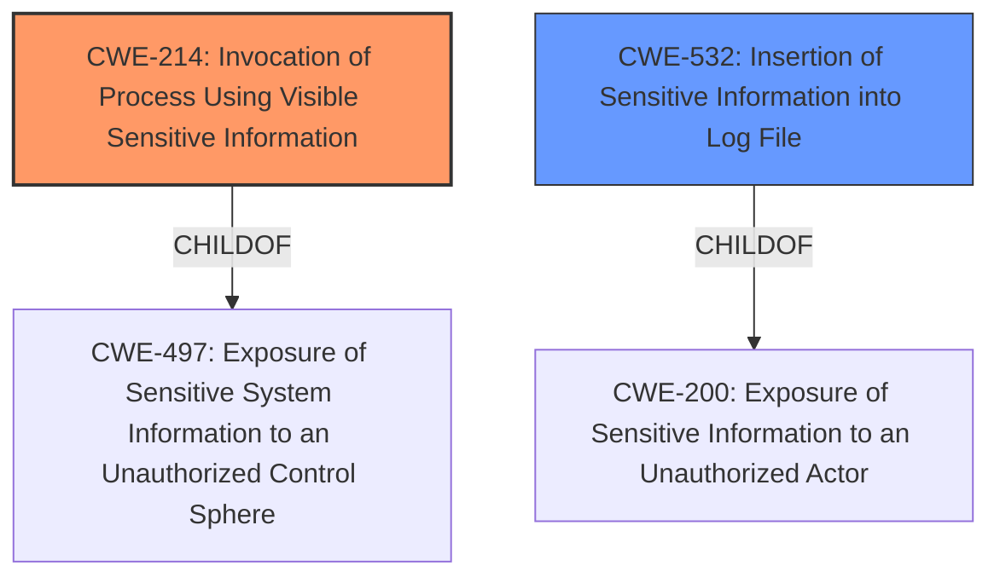

# Analysis Report for CVE-2020-1753

# Vulnerability Analysis Report: CVE-2020-1753

## Description

A security flaw was found in Ansible Engine, all Ansible 2.7.x versions prior to 2.7.17, all Ansible 2.8.x versions prior to 2.8.11 and all Ansible 2.9.x versions prior to 2.9.7, when managing kubernetes using the k8s module. Sensitive parameters such as passwords and tokens are passed to kubectl from the command line, not using an environment variable or an input configuration file. This will disclose passwords and tokens from process list and no_log directive from debug module would not have any effect making these secrets being disclosed on stdout and log files.

## Vulnerability Description Key Phrases

**Impact:** disclose passwords and tokens
**Product:** Ansible Engine
**Version:** all Ansible 2.7.x versions prior to 2.7.17, all Ansible 2.8.x versions prior to 2.8.11 and all Ansible 2.9.x versions prior to 2.9.7
**Component:** k8s module

## Analysis (with Relationship Data)

# Summary
| CWE ID | CWE Name | Confidence | CWE Abstraction Level | CWE Vulnerability Mapping Label | CWE-Vulnerability Mapping Notes |
|---|---|---|---|---|---|
| CWE-214 | Invocation of Process Using Visible Sensitive Information | 0.95 | Base | Primary | Allowed |
| CWE-532 | Insertion of Sensitive Information into Log File | 0.85 | Base | Secondary | Allowed |

## Evidence and Confidence

*   **Confidence Score:** 0.90
*   **Evidence Strength:** HIGH

- **Analysis and Justification:**  
  - *Explanation:* "The vulnerability lies in how Ansible passes sensitive parameters to `kubectl`. Instead of using secure methods like environment variables or input configuration files, it passes passwords and tokens directly on the command line. This makes the sensitive information visible in process listings. This aligns perfectly with CWE-214 [Invocation of Process Using Visible Sensitive Information], which describes a process being invoked with sensitive command-line arguments visible to other processes. Additionally, the vulnerability description and CVE summary specifically mention the exposure of credentials through the process list, reinforcing this mapping. The MITRE mapping guidance for CWE-214 indicates this is ALLOWED."
  
  - *Relationship Analysis:* "CWE-214 is a base level CWE and a child of CWE-497 [Exposure of Sensitive System Information to an Unauthorized Control Sphere]. While CWE-497 is a parent, CWE-214 is more specific to the vulnerability. CWE-214 is PEEROF itself."

- **Analysis and Justification:**  
  - *Explanation:* "The vulnerability also leads to sensitive information being written to log files. The `no_log` directive in Ansible's debug module is ineffective in preventing this because the sensitive parameters are passed to `kubectl` as command-line arguments. This aligns with CWE-532 [Insertion of Sensitive Information into Log File], which describes a product writing sensitive information to a log file. The CVE summary explicitly mentions the disclosure of secrets in log files. The MITRE mapping guidance for CWE-532 indicates this is ALLOWED."

  - *Relationship Analysis:* "CWE-532 is a base level CWE and a child of CWE-200 [Exposure of Sensitive Information to an Unauthorized Actor]. While CWE-200 is a parent, CWE-532 is more specific to the vulnerability."

- **Confidence Score:**
  - Confidence for CWE-214: 0.95 (Strong evidence from the vulnerability description and CVE reference materials)
  - Confidence for CWE-532: 0.85 (Strong evidence from the vulnerability description and CVE reference materials)

---

## Criticism of Analysis

Okay, here's a detailed review of the provided CWE analysis, considering the full CWE specifications:

**Overall Assessment:**

The analysis is generally well-reasoned and provides a good justification for the selected CWEs. The confidence scores are appropriate, and the evidence strength is correctly identified as high.  The analysis correctly identifies the key aspects of the vulnerability and how they relate to the chosen CWEs. The explanations are clear and easy to follow.

**Specific Comments and Recommendations:**

*   **CWE-214: Invocation of Process Using Visible Sensitive Information:**
    *   **Accuracy:** The mapping to CWE-214 is highly accurate and well-justified. The vulnerability's description aligns perfectly with the core concept of CWE-214. The inclusion of the MITRE mapping guidance (ALLOWED) is appropriate.
    *   **Justification:** The justification is comprehensive, covering the vulnerability's root cause and the specific examples provided in the vulnerability description.
    *   **Relationships:** The relationship analysis is correct. CWE-214 is a specific instance of the more general CWE-497 (Exposure of Sensitive System Information). The analysis correctly prioritizes CWE-214 due to its greater specificity.
    *   **Mitigations:** The provided mitigations for CWE-214 are relevant, focusing on avoiding the exposure of sensitive data through command-line arguments and environment variables. Switching to input configuration files or environment variables directly addresses the core weakness.
    *   **Overall Assessment:** Excellent mapping and justification.

*   **CWE-532: Insertion of Sensitive Information into Log File:**
    *   **Accuracy:** The mapping to CWE-532 is also accurate and well-justified. The analysis acknowledges the ineffectiveness of `no_log` in preventing the information from reaching the log files due to its presence in the `kubectl` command line.
    *   **Justification:** The explanation effectively highlights the direct insertion of sensitive information into the log file due to the command-line arguments.
    *   **Relationships:** The relationship analysis is correct, with CWE-532 being a specific instance of CWE-200 (Exposure of Sensitive Information).
    *   **Mitigations:** The mitigations mentioned for CWE-532 are highly relevant: avoiding logging secrets, removing debug logs before production, and protecting log files.
    *   **Overall Assessment:** Accurate mapping and justification.

**Considerations and Potential Alternative Mappings from the Retriever Results:**

The Retriever Results section provided some potentially relevant CWEs. Let's examine why they were not selected and if they warrant consideration.

*   **CWE-306: Missing Authentication for Critical Function:** This is NOT relevant here. While unauthorized access is a *consequence* of exposing credentials, the *root cause* is the improper handling of those credentials, not the absence of authentication mechanisms. The 'kubectl' command itself *requires* valid credentials, but the exposure of those credentials negates that requirement.

*   **CWE-201: Insertion of Sensitive Information Into Sent Data:** This *could* be considered, but it's less direct than CWE-214 and CWE-532. Data (credentials) *are* being sent to `kubectl`, but the *primary issue* is the visibility of that data and its logging, not merely its transmission.  CWE-201 is more applicable when the recipient is unauthorized.

*   **CWE-212: Improper Removal of Sensitive Information Before Storage or Transfer:** Similar to CWE-201, this is less direct. The vulnerability isn't fundamentally about *removing* information but about *preventing its exposure in the first place*.

*   **CWE-319: Cleartext Transmission of Sensitive Information:** This is not applicable, as the vulnerability does not deal with transmitting the data over the network in cleartext.
*   **CWE-22: Improper Limitation of a Pathname to a Restricted Directory ('Path Traversal'):** This is not relevant as there is no path traversal vulnerability here.

*   **CWE-497: Exposure of Sensitive System Information to an Unauthorized Control Sphere:**  While technically a parent of CWE-214, it is less specific. CWE-214 more precisely describes the flaw.

*   **CWE-522: Insufficiently Protected Credentials:** This is a *class* level CWE and therefore is less specific than CWE-214 and CWE-532.

*   **CWE-285: Improper Authorization:** This is NOT relevant here. While unauthorized access is a *consequence* of exposing credentials, the *root cause* is the improper handling of those credentials, not the absence of authorization mechanisms. The 'kubectl' command itself *requires* valid credentials, but the exposure of those credentials negates that requirement.

**Recommendations for Improvement (Minor):**

*   In the justification sections, explicitly state *why* other plausible CWEs were *not* chosen, even if briefly. This demonstrates a thorough understanding and consideration of alternatives.
*   While the confidence scores are high, briefly mentioning any potential edge cases or situations where the mapping might be less precise could further strengthen the analysis.

**Conclusion:**

The analysis is excellent. The selection of CWE-214 and CWE-532 is accurate and well-justified. The analysis demonstrates a solid understanding of the vulnerability and the relevant CWE specifications. The minor recommendations above are for improvement and completeness, but the core analysis is robust.

## Final Resolution

# Summary
| CWE ID | CWE Name | Confidence | CWE Abstraction Level | CWE Vulnerability Mapping Label | CWE-Vulnerability Mapping Notes |
|---|---|---|---|---|---|
| CWE-214 | Invocation of Process Using Visible Sensitive Information | 0.95 | Base | Primary | Allowed |
| CWE-532 | Insertion of Sensitive Information into Log File | 0.85 | Base | Secondary | Allowed |

## Evidence and Confidence

*   **Confidence Score:** 0.95
*   **Evidence Strength:** HIGH

## Relationship Analysis
The primary weakness is **CWE-214** [Invocation of Process Using Visible Sensitive Information], which directly addresses the passing of sensitive parameters via the command line. **CWE-532** [Insertion of Sensitive Information into Log File] is a secondary issue, representing the logging of these exposed parameters. Both are base-level CWEs, offering suitable specificity. **CWE-214** is a child of **CWE-497** [Exposure of Sensitive System Information to an Unauthorized Control Sphere], but **CWE-214** is more specific. **CWE-532** is a child of **CWE-200** [Exposure of Sensitive Information to an Unauthorized Actor], but, again, **CWE-532** offers better specificity.

## Vulnerability Chain
The vulnerability chain starts with the **ROOTCAUSE** of passing sensitive parameters on the command line (**CWE-214**). This leads to the exposure of these parameters in process listings and subsequently to their inclusion in log files (**CWE-532**). The chain highlights a failure to properly protect sensitive data during both process invocation and logging.

## Summary of Analysis
The initial analysis and criticism are well-aligned, and the selection of **CWE-214** [Invocation of Process Using Visible Sensitive Information] and **CWE-532** [Insertion of Sensitive Information into Log File] is appropriate. The evidence from the vulnerability description supports this. The graph relationships confirm that these CWEs are at the right level of specificity, being base-level CWEs that directly address the identified weaknesses. As the original analysis stated: "The vulnerability lies in how Ansible passes sensitive parameters to `kubectl`. Instead of using secure methods like environment variables or input configuration files, it passes passwords and tokens directly on the command line. This makes the sensitive information visible in process listings. This aligns perfectly with **CWE-214** [Invocation of Process Using Visible Sensitive Information]." The additional analysis included in the criticism, "Data (credentials) *are* being sent to `kubectl`, but the *primary issue* is the visibility of that data and its logging, not merely its transmission", reinforces the selection. This confirms that the chosen CWEs are at the optimal level of specificity.

*Report generated on 2025-03-17 02:15:02*
