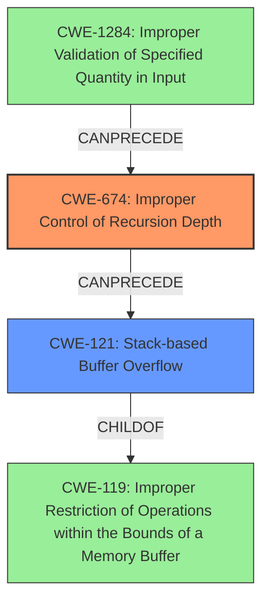

# Final Resolution for CVE-2020-18392

# Summary
| CWE ID | CWE Name | Confidence | CWE Abstraction Level | CWE Vulnerability Mapping Label | CWE-Vulnerability Mapping Notes |
|---|---|---|---|---|---|
| CWE-674 | Improper Control of Recursion Depth | 0.9 | Class | Primary | Allowed-with-Review |
| CWE-121 | Stack-based Buffer Overflow | 0.7 | Variant | Secondary | Allowed |

## Evidence and Confidence

*   **Confidence Score:** 0.85
*   **Evidence Strength:** HIGH

## Relationship Analysis
The primary relationship considered was the potential chain where **uncontrolled recursion** (CWE-674) leads to resource exhaustion, resulting in a **stack overflow**, and subsequently, a **stack-based buffer overflow** (CWE-121). CWE-121 is a `Variant` of CWE-119 (Improper Restriction of Operations within the Bounds of a Memory Buffer), suggesting that the buffer overflow is a consequence of the initial uncontrolled recursion. The abstraction levels influenced the decision to keep CWE-674 as the primary, as it represents the broader class of **improper recursion control**, while CWE-121 pinpoints a specific manifestation of that issue.

## Vulnerability Chain
The vulnerability chain starts with a crafted file with deeply nested arrays. This leads to **uncontrolled recursion** in the `parse_array` and `parse_value` functions (**CWE-674**), which results in excessive stack usage and stack exhaustion. The `mjs_mk_string` function is then called, attempting to allocate a large string on the stack, leading to a **stack-based buffer overflow** (**CWE-121**) due to excessive recursion depth. The ultimate impact is a Denial of Service (DoS).

## Summary of Analysis
The initial analysis correctly identified **CWE-674 (Improper Control of Recursion Depth)** and **CWE-121 (Stack-based Buffer Overflow)**. The criticism provided valuable suggestions, especially concerning the potential for a more specific child CWE of CWE-674. However, without more concrete evidence pointing towards **CWE-1322 (Insufficiently Protected Main Program or Thread Stack)**, sticking with CWE-674 is the most appropriate decision.

The analysis is heavily based on the provided evidence, particularly the vulnerability description stating a **stack overflow** in `parse_array` and the ASAN output indicating the overflow happening in `__asan_memcpy` called by `mjs_mk_string`.

The relationship analysis reinforced the understanding that CWE-674 is the root cause, with CWE-121 being a consequence. The abstraction levels further solidified this decision, as CWE-674 is a Class and CWE-121 is a Variant.

The selection of CWEs reflects the optimal level of specificity based on the available evidence. While other CWEs like **CWE-770 (Allocation of Resources Without Limits or Throttling)** and **CWE-789 (Memory Allocation with Excessive Size Value)** were considered, they are less directly supported by the provided evidence. The possibility of **CWE-1284 (Improper Validation of Specified Quantity in Input)** being relevant was also explored, but that would be a prerequisite to CWE-674, not a direct replacement.

Ultimately, the combination of direct evidence, relationship analysis, and consideration of abstraction levels supports the classification of **CWE-674** as the primary **weakness**, with **CWE-121** as a secondary contributing factor.