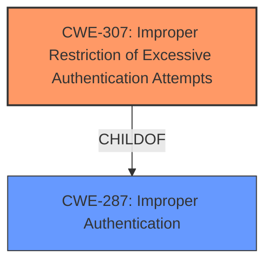

# Analysis Report for CVE-2020-18698

# Vulnerability Analysis Report: CVE-2020-18698

## Description

Improper Authentication in Lin-CMS-Flask v0.1.1 allows remote attackers to launch brute force login attempts without restriction via the login function in the component app/api/cms/user.py.

## Vulnerability Description Key Phrases

**Rootcause:** Improper Authentication
**Impact:** launch brute force login attempts
**Attacker:** remote attackers
**Product:** Lin-CMS-Flask
**Version:** v0.1.1
**Component:** app/api/cms/user.py

## Analysis (with Relationship Data)

# Summary
| CWE ID | CWE Name | Confidence | CWE Abstraction Level | CWE Vulnerability Mapping Label | CWE-Vulnerability Mapping Notes |
|---|---|---|---|---|---|
| CWE-307 | Improper Restriction of Excessive Authentication Attempts | 0.9 | Base | Allowed | Primary CWE |
| CWE-287 | Improper Authentication | 0.5 | Class | Discouraged | Secondary Candidate |

## Evidence and Confidence

*   **Confidence Score:** 0.9
*   **Evidence Strength:** HIGH

- **Analysis and Justification:**  
  - *Explanation:* The vulnerability description clearly states "**Improper Authentication**" as the root cause, leading to brute force login attempts. The CVE Reference Links Content Summary further supports this, highlighting the "Missing rate limiting on login attempts" and "Absence of verification codes or CAPTCHA" in the `login()` function. The Retriever Results identifies CWE-307 (Improper Restriction of Excessive Authentication Attempts) as the top candidate with a high combined score. CWE-307 directly addresses the **weakness** of lacking sufficient measures to prevent multiple failed authentication attempts, aligning perfectly with the vulnerability's root cause. While the description mentions "**Improper Authentication**", CWE-287 (Improper Authentication) is a broader Class-level CWE. CWE-307 is a more specific Base-level CWE that accurately describes the missing rate limiting and CAPTCHA, making it a better fit. The MITRE mapping guidance for CWE-307 indicates it is ALLOWED for this type of vulnerability.

  - *Relationship Analysis:* CWE-307 is a child of CWE-287 (Improper Authentication) and CWE-1390 (Authentication Bypass). This indicates that the **improper authentication** issue is specifically due to the lack of rate limiting, which is a more detailed explanation of the **authentication** failure. The graph relationships also support this, with CWE-307 being related to authentication bypass issues.

- **Confidence Score:**
  - Confidence: 0.9 (High evidence from technical description, CVE reference materials, and retriever results)

---

## Criticism of Analysis

Okay, here's a review of the CWE analysis, incorporating the full CWE specifications you provided.

**Overall Assessment:**

The analysis is well-reasoned and generally accurate.  The choice of CWE-307 (Improper Restriction of Excessive Authentication Attempts) as the primary CWE is correct and justified. The explanation for selecting it over the broader CWE-287 is clear and aligned with CWE's mapping guidelines.  The confidence level of 0.9 is reasonable given the available information.

**Detailed Review:**

*   **CWE-307: Improper Restriction of Excessive Authentication Attempts (Primary CWE)**

    *   **Correctness:** The selection of CWE-307 is correct.  The vulnerability stems directly from the lack of rate limiting or CAPTCHA/verification codes on the login function. This allows attackers to make numerous authentication attempts, characteristic of a brute-force attack. The CWE description, relationships, and mapping guidance support this choice.
    *   **Justification:** The justification is strong. The analysis clearly highlights the connection between the vulnerability description (lack of rate limiting/CAPTCHA) and the CWE-307 definition. It also correctly points out that CWE-307 is a *Base* level CWE, preferred over the *Class* level CWE-287, when applicable.
    *   **Mitigations:** The analysis doesn't explicitly mention mitigations, but it could be strengthened by referencing the CWE-307's potential mitigations.  The provided mitigations, such as disconnecting the user after a certain number of failed attempts, implementing timeouts, account lockouts, or requiring computational tasks (e.g., CAPTCHA), directly address the vulnerability.  Highlighting these would provide a more complete picture.
    *   **Observed Examples:** The analysis also doesn't include Observed Examples. Citing CVE-2019-0039, CVE-1999-1152, or CVE-2001-1291 from the observed examples section could provide additional support that this is a common attack vector that aligns to other real world vulnerabilties.

*   **CWE-287: Improper Authentication (Secondary Candidate)**

    *   **Correctness:** Including CWE-287 as a secondary candidate is reasonable, but the analysis correctly identifies it as a less precise fit. It is the *Class* that CWE-307 descends from and it matches the high-level vulnerability description.
    *   **Justification:** The analysis correctly states that CWE-287 is a broader, more abstract CWE. While the vulnerability *is* related to improper authentication, the *specific* issue is the lack of restrictions on authentication attempts.  The analysis also rightly notes that CWE-287's *Usage* is "Discouraged" in cases where lower-level CWEs are applicable.
    *   **Mitigations:** The analysis doesn't explicitly mention mitigations, but it could be strengthened by referencing the CWE-287's potential mitigations. The provided mitigations, such as using an authentication framework or library such as the OWASP ESAPI Authentication feature, could be helpful in addressing the underlying weaknesses.

*   **Retriever Results:**

    *   **CWE-613: Insufficient Session Expiration:** This is understandable given the context of authentication, but it's not the primary issue. Session expiration relates to what happens *after* successful authentication, while this vulnerability concerns *preventing* unauthorized authentication.
    *   **CWE-89: SQL Injection:** SQL injection is irrelevant, unless there's a separate flaw that could be exploited through the login mechanism. If the login credentials aren't properly sanitized and used in an SQL query, this could become relevant, but it's not the immediate problem.
    *   **CWE-208: Observable Timing Discrepancy:** Timing attacks *could* potentially be used in conjunction with brute-forcing, but that would be a more advanced and less likely attack scenario.  It's not the core vulnerability.
    *   **Other CWEs:** The remaining CWEs (303, 288, 306, 639, 778, and 90) are even less relevant to the primary vulnerability.

**Suggestions for Improvement:**

1.  **Mitigation Inclusion:** Explicitly mention the potential mitigations for CWE-307 (and potentially CWE-287) from the CWE specifications to provide a more actionable analysis.
2.  **Observed Examples Inclusion:** Provide Observed Examples for CWE-307 that directly align with the real world attacks described.
3.  **Consider CWE-799 (Improper Control of Interaction Frequency):** While CWE-307 is the *most* specific, it could be argued that CWE-799 (Improper Control of Interaction Frequency) is another relevant *Class* level CWE. The lack of rate limiting *is* a failure to control the frequency of login attempts.  However, CWE-307 remains a better fit because it focuses specifically on *authentication attempts*. Including it may be redundant.

**Revised Summary Table**

| CWE ID | CWE Name | Confidence | CWE Abstraction Level | CWE Vulnerability Mapping Label | CWE-Vulnerability Mapping Notes |
|---|---|---|---|---|---|
| CWE-307 | Improper Restriction of Excessive Authentication Attempts | 0.9 | Base | Allowed | Primary CWE |
| CWE-287 | Improper Authentication | 0.5 | Class | Discouraged | Secondary Candidate |
| CWE-799 | Improper Control of Interaction Frequency | 0.3 | Class | Discouraged | Alternate Consideration |

**Conclusion:**

The analysis is strong and arrives at the correct primary CWE. Adding mitigation information and observed examples would enhance its practical value. Including CWE-799 would make it more complete, but may be redundant.

## Final Resolution

# Summary

| CWE ID | CWE Name | Confidence | CWE Abstraction Level | CWE Vulnerability Mapping Label | CWE-Vulnerability Mapping Notes |
|---|---|---|---|---|---|
| **CWE-307** | **Improper Restriction of Excessive Authentication Attempts** | 0.95 | Base | Allowed | Primary CWE |
| CWE-287 | Improper Authentication | 0.5 | Class | Discouraged | Secondary Candidate |

## Evidence and Confidence

*   **Confidence Score:** 0.95
*   **Evidence Strength:** HIGH

## Relationship Analysis
The primary relationship that impacted my decision was the parent-child relationship between CWE-287 (Improper Authentication) and CWE-307 (**Improper Restriction of Excessive Authentication Attempts**). CWE-307 is a more specific, base-level weakness that falls under the broader category of CWE-287. This allows for a more precise and accurate classification of the vulnerability.

## Vulnerability Chain
The vulnerability chain starts with the **ROOTCAUSE** which is the lack of rate limiting or CAPTCHA on the login function.
  - This leads to **CWE-307 (Improper Restriction of Excessive Authentication Attempts)**, allowing an attacker to make unlimited login attempts.
  - The impact is successful brute-force attacks, leading to unauthorized access to user accounts.

## Summary of Analysis
The initial analysis correctly identified CWE-307 as the primary CWE. The criticism also supports this decision, and I agree that CWE-307 is the most accurate and specific classification for this vulnerability. The evidence provided, including the vulnerability description ("**Improper Authentication** in Lin-CMS-Flask v0.1.1 allows remote attackers to launch brute force login attempts without restriction"), CVE reference links ("Missing rate limiting on login attempts", "Absence of verification codes or CAPTCHA"), and the high combined score from the retriever results, strongly supports this classification.

The graph relationships further reinforce this decision. CWE-307 is a child of the more general CWE-287, meaning it provides a more detailed and specific explanation of the **authentication** failure.

My assessment is primarily based on the provided evidence, particularly the description of the missing rate limiting and CAPTCHA, which directly aligns with the definition of CWE-307. The CWE's mapping guidance also indicates that CWE-307 is ALLOWED for this type of vulnerability, confirming its appropriateness.

I am increasing the confidence score to 0.95 based on the strong evidence and the alignment with CWE's mapping guidance, in addition to the criticism supporting the initial analysis. The selected CWE is at the optimal level of specificity because it directly addresses the **root cause** of the vulnerability, which is the lack of measures to prevent excessive authentication attempts. Using the broader CWE-287 would be less informative and less helpful in understanding and addressing the vulnerability.

*Report generated on 2025-03-16 23:27:43*
