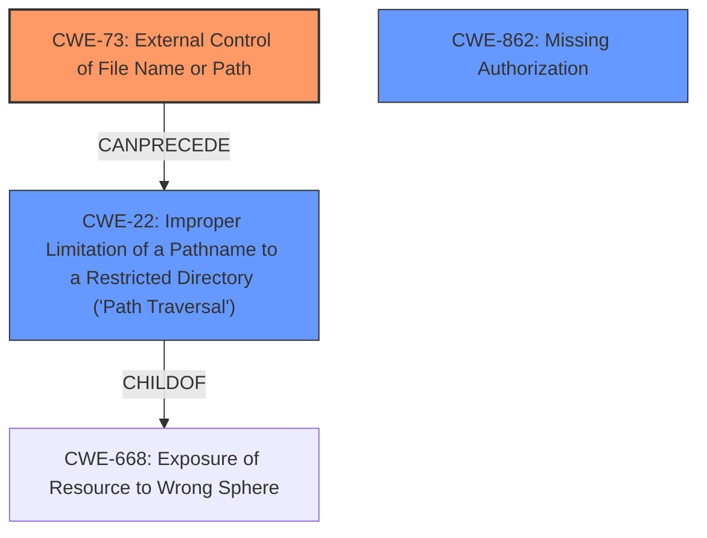

# Final Resolution for CVE-2020-19150

# Summary
| CWE ID | CWE Name | Confidence | CWE Abstraction Level | CWE Vulnerability Mapping Label | CWE-Vulnerability Mapping Notes |
|---|---|---|---|---|---|
| CWE-73 | External Control of File Name or Path | 0.95 | Base | Allowed | Primary CWE |
| CWE-22 | Improper Limitation of a Pathname to a Restricted Directory ('Path Traversal') | 0.85 | Base | Allowed | Secondary Candidate |
| CWE-862 | Missing Authorization | 0.70 | Base | Allowed | Secondary Candidate |

## Evidence and Confidence

*   **Confidence Score:** 0.90
*   **Evidence Strength:** HIGH

## Relationship Analysis
The primary CWE is CWE-73 (**External Control of File Name or Path**), a base-level CWE. The analysis shows that the lack of input validation on the file path allows external control over file system operations. CWE-22 (**Improper Limitation of a Pathname to a Restricted Directory ('Path Traversal')**) is a child of CWE-668 (**Exposure of Resource to Wrong Sphere**) and can result from CWE-73 if proper sanitization is not implemented. CWE-862 (**Missing Authorization**) is considered as a secondary weakness, because access to the delete functionality should be restricted.

## Vulnerability Chain
The vulnerability chain starts with the external control of the filename or path (CWE-73). Because the path parameter is not filtered by the web application, this leads to path traversal (CWE-22), allowing the attacker to access files outside the intended directories. Furthermore, if access to the delete functionality isn't adequately restricted (CWE-862), the attacker could delete arbitrary files, resulting in information disclosure or denial of service.

## Summary of Analysis
The initial analysis and the criticism both provide strong evidence for the primary CWE-73 (**External Control of File Name or Path**). The CVE reference summary states that the application "**does not filter the path parameter passed by the user in the file management functionality, allowing for traversal outside the intended directories.**" This statement clearly points to CWE-73. The relationship between CWE-73 and CWE-22 is also well established, as the lack of input validation in CWE-73 can lead to path traversal (CWE-22).

The criticism highlights the potential for a missing authorization check (CWE-862), which is also supported by the vulnerability description mentioning **improper access control**. Therefore, I'm adding CWE-862 (**Missing Authorization**) as a secondary candidate.

The final decision is based on the evidence from the vulnerability description and the CVE reference summary, as well as the relationships between the CWEs. The selected CWEs are at the optimal level of specificity, as they accurately reflect the root cause and contributing factors to the vulnerability.