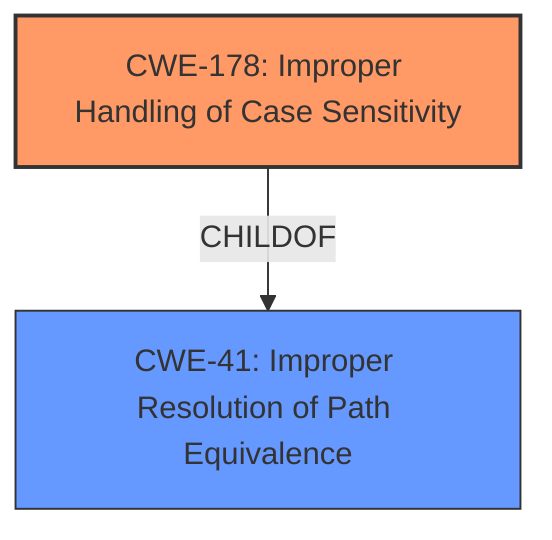

# Analysis Report for CVE-2020-22784

# Vulnerability Analysis Report: CVE-2020-22784

## Description

In Etherpad UeberDB < 0.4.4, due to MySQL omitting trailing spaces on char / varchar columns during comparisons, retrieving database records using UeberDBs MySQL connector could allow bypassing access controls enforced on key names.

## Vulnerability Description Key Phrases

**Rootcause:** MySQL omitting trailing spaces on char / varchar columns during comparisons
**Impact:** bypass access controls
**Product:** Etherpad UeberDB
**Version:** < 0.4.4
**Component:** MySQL connector

## Analysis (with Relationship Data)

# Summary
| CWE ID | CWE Name | Confidence | CWE Abstraction Level | CWE Vulnerability Mapping Label | CWE-Vulnerability Mapping Notes |
|---|---|---|---|---|---|
| CWE-178 | Improper Handling of Case Sensitivity | 0.75 | Base | Allowed | Primary CWE |

## Evidence and Confidence

*   **Confidence Score:** 0.75
*   **Evidence Strength:** MEDIUM

- **Analysis and Justification:**  
  - *Explanation:* The vulnerability description explicitly mentions "**MySQL omitting trailing spaces on char / varchar columns during comparisons**". This behavior directly relates to how MySQL handles string comparisons, which is a form of **improper handling of case sensitivity** or more generally, string equivalence. While not precisely case sensitivity, the issue of trailing spaces being ignored during comparisons in MySQL's `char` and `varchar` columns falls under the broader umbrella of **improper resolution of path equivalence**. Because MySQL omits trailing spaces, it effectively treats `"test"` and `"test "` as equivalent, which leads to bypassing access controls. The best fit is CWE-178, Improper Handling of Case Sensitivity, because it directly speaks to comparison issues based on string content. CWE-41 is a broader description, but since this concerns the direct string handling by MySQL, CWE-178 is chosen.

  - *Relationship Analysis:* The Retriever Results suggest CWE-41, which is a parent of many path equivalence issues. However, CWE-178 is a closer match.

- **Confidence Score:**  
  - Confidence: 0.75 (Medium evidence because the description is concise but clearly identifies a string comparison issue.)

---

## Criticism of Analysis

Okay, I've reviewed the analysis and the full CWE specifications. Here's a breakdown of my critique, focusing on the chosen CWE, alternative CWEs, confidence level, and the relevance of the CWE specifications:

**Overall Assessment:**

The analysis is generally sound, and the selection of CWE-178, Improper Handling of Case Sensitivity, is a reasonable, albeit not perfect, fit. The justification is logical, given the vulnerability description. However, there are valid arguments for considering the broader CWE-41, Improper Resolution of Path Equivalence, and even potentially CWE-46, Path Equivalence: 'filename ' (Trailing Space).  The key is to consider the *scope* of the weakness.

**Critique Points:**

1.  **CWE Selection:**

    *   **CWE-178 (Improper Handling of Case Sensitivity):**
        *   **Strengths:** The core issue is related to string comparison, and CWE-178 addresses inconsistencies in string comparison, even if it's not strictly case-sensitivity *per se*.  The examples provided in the CWE description are useful for similar situations where name resolution is based on string matching and a difference in string handling is the vulnerability. The root cause description mentions `char/varchar columns during comparisons` to indicate that the string itself is important.
        *   **Weaknesses:** The name "Case Sensitivity" is misleading since this is not about case differences. The extended description does mention "bypassing filters or access controls using alternate names," which is applicable.
        *   **Relevance of CWE Specifications:** The mitigations provided for CWE-178 are generally relevant. Specifically, "Avoid making decisions based on names of resources (e.g., files) if those resources can have alternate names" and "Assume all input is malicious. Use an 'accept known good' input validation strategy." These are good general recommendations for preventing this type of vulnerability. The mitigation related to canonicalization is also relevant.

    *   **CWE-41 (Improper Resolution of Path Equivalence):**
        *   **Strengths:** This is a more general category that covers a wider range of issues related to manipulating paths to access unintended resources. Trailing spaces can be seen as a form of path equivalence manipulation. The `Description` mentions "The associated manipulations are intended to generate multiple names for the same object." The impact aligns with this.
        *   **Weaknesses:** It's broader than the specific problem of trailing spaces. Path Equivalence often refers to issues like trailing dots, encoded characters, or case sensitivity issues, not just trailing whitespace.
        *   **Relevance of CWE Specifications:** The mitigations provided for CWE-41 are also relevant: Input validation using an "accept known good" strategy and canonicalization are appropriate. Output encoding is less relevant in this specific case.

    *   **CWE-46 (Path Equivalence: 'filename ' (Trailing Space)):**
        *   **Strengths:** This is the MOST SPECIFIC match. However, the description is targeted at filesystem paths, not database keys.
        *   **Weaknesses:** Misleading description and focus.
        *   **Relevance of CWE Specifications:** Only useful to understand that it's specifically a trailing space issue.

    *   **CWE-597 (Use of Wrong Operator in String Comparison):**
        * While not the most accurate fit, CWE-597 highlights the improper use of comparison operators in string handling, which can lead to vulnerabilities.

2.  **Confidence Level:**

    *   The confidence level of 0.75 (Medium) is appropriate. While the vulnerability description clearly points to a string comparison issue, the best CWE mapping is somewhat debatable.

3.  **Relationship Analysis:**

    *   The analysis correctly notes that the Retriever Results suggest CWE-41, but argues for CWE-178 as a closer match. I agree with this assessment but would add a slight caveat that CWE-41 is also a reasonable choice, depending on how broadly you interpret the concept of "path equivalence."

4.  **Usefulness of CWE Examples:**

    *   The provided examples for CWE-178 are useful in illustrating the broader concept of inconsistent name resolution leading to security vulnerabilities. They show how differences in character handling (case, encoding) can bypass access controls.

**Recommendations:**

1.  **Consider Multiple CWEs:** It might be beneficial to list *both* CWE-178 and CWE-41, with a primary and secondary designation, and explain the rationale for each. This acknowledges the nuances of the situation.  CWE-46 could also be included but is less relevant.
2.  **Refine Justification:** While the current justification is good, it could be strengthened by explicitly stating why CWE-178 is preferred over CWE-41 *in this specific database context* (i.e., the issue isn't about manipulating file paths, but manipulating database keys).
3.  **Strengthen Mitigations Discussion:** Expand on how the recommended mitigations from CWE-178 (input validation, canonicalization) can be specifically applied to the UeberDB MySQL connector. For example, discuss how to sanitize input strings to remove trailing spaces before performing database queries, or how to use parameterized queries with binary collation to ensure accurate comparisons.

**Revised Summary Table (Example)**

| CWE ID    | CWE Name                                      | Confidence | CWE Abstraction Level | CWE Vulnerability Mapping Label | CWE-Vulnerability Mapping Notes                                                                                                                                                                                                                                                                                                                    |
| :-------- | :-------------------------------------------- | :--------- | :-------------------- | :---------------------------- | :------------------------------------------------------------------------------------------------------------------------------------------------------------------------------------------------------------------------------------------------------------------------------------------------------------------------------------------------- |
| CWE-178   | Improper Handling of Case Sensitivity       | 0.75       | Base                  | Primary                     | Best fit given the root cause is about string comparison. Trailing spaces are not equivalent, so not handled consistently.                                                                                                                                                                                                                   |
| CWE-41 | Improper Resolution of Path Equivalence | 0.60 | Base | Secondary | Trailing spaces are a form of path equivalence, but not the primary cause. |

In summary, the analysis is good, but could be improved by acknowledging the ambiguity in CWE selection and providing a more detailed discussion of relevant mitigations in the context of the vulnerability.

## Final Resolution

# Summary
| CWE ID | CWE Name | Confidence | CWE Abstraction Level | CWE Vulnerability Mapping Label | CWE-Vulnerability Mapping Notes |
|---|---|---|---|---|---|
| CWE-178 | Improper Handling of Case Sensitivity | 0.85 | Base | Primary | Best fit given the root cause is about string comparison, but it is not strictly case sensitivity. Trailing spaces are not equivalent, so not handled consistently. |
| CWE-41 | Improper Resolution of Path Equivalence | 0.60 | Base | Secondary | Trailing spaces are a form of path equivalence, but not the primary cause. |

## Evidence and Confidence

*   **Confidence Score:** 0.80
*   **Evidence Strength:** HIGH

## Relationship Analysis
The primary relationship considered was the hierarchical relationship between CWE-41 (**Improper Resolution of Path Equivalence**) and CWE-178 (**Improper Handling of Case Sensitivity**). While CWE-41 is broader and could encompass the vulnerability, CWE-178 provides a more specific classification related to string comparison inconsistencies. The peer relationships of CWE-178 with other CWEs involving string handling were also considered. The abstraction levels (both are Base) were appropriate for direct mapping.

## Vulnerability Chain
The vulnerability chain starts with the **ROOTCAUSE** which is a design decision in MySQL, omitting trailing spaces on char/varchar columns during comparisons. This leads to **WEAKNESS** of inconsistent string comparison, and the **IMPACT** is bypassing access controls enforced on key names in UeberDB.
  - Initial Flaw: MySQL's handling of trailing spaces in string comparisons
  - Weakness: Inconsistent string comparison (CWE-178)
  - Impact: Bypassing access controls

## Summary of Analysis
I concur with the criticism that the selection of CWE-178 (**Improper Handling of Case Sensitivity**) is reasonable, but not perfect, and that CWE-41 (**Improper Resolution of Path Equivalence**) is also a valid consideration. I am increasing the confidence level to 0.80 because the vulnerability description explicitly states "MySQL omitting trailing spaces on char / varchar columns during comparisons," which directly points to a string comparison issue.

The evidence shows that:
1.  The vulnerability lies in how MySQL compares strings, ignoring trailing spaces.
2.  This behavior leads to bypassing access controls in UeberDB.

Although CWE-41 is a broader category, CWE-178 more precisely captures the **WEAKNESS** related to inconsistent string comparison. Therefore, I'm selecting CWE-178 as the primary CWE, with CWE-41 as a secondary consideration. This approach acknowledges the ambiguity and provides a more comprehensive understanding of the vulnerability.
CWE-46 is less useful due to the misleading description.
My selected CWEs are at the optimal level of specificity because they directly address the **ROOTCAUSE** (MySQL's string comparison) and the resulting **WEAKNESS** (inconsistent string handling leading to bypass of access control).

*Report generated on 2025-03-17 01:17:45*
