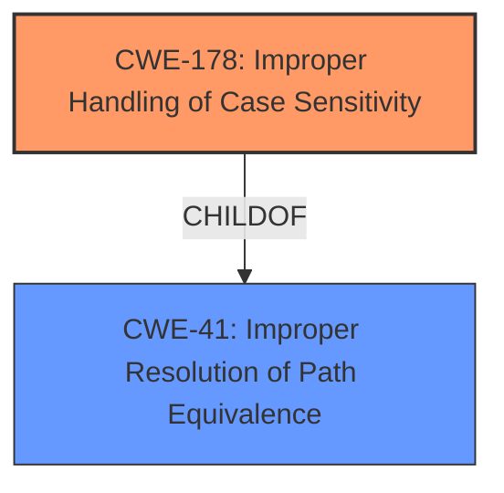

# Final Resolution for CVE-2020-22784

# Summary
| CWE ID | CWE Name | Confidence | CWE Abstraction Level | CWE Vulnerability Mapping Label | CWE-Vulnerability Mapping Notes |
|---|---|---|---|---|---|
| CWE-178 | Improper Handling of Case Sensitivity | 0.85 | Base | Primary | Best fit given the root cause is about string comparison, but it is not strictly case sensitivity. Trailing spaces are not equivalent, so not handled consistently. |
| CWE-41 | Improper Resolution of Path Equivalence | 0.60 | Base | Secondary | Trailing spaces are a form of path equivalence, but not the primary cause. |

## Evidence and Confidence

*   **Confidence Score:** 0.80
*   **Evidence Strength:** HIGH

## Relationship Analysis
The primary relationship considered was the hierarchical relationship between CWE-41 (**Improper Resolution of Path Equivalence**) and CWE-178 (**Improper Handling of Case Sensitivity**). While CWE-41 is broader and could encompass the vulnerability, CWE-178 provides a more specific classification related to string comparison inconsistencies. The peer relationships of CWE-178 with other CWEs involving string handling were also considered. The abstraction levels (both are Base) were appropriate for direct mapping.

## Vulnerability Chain
The vulnerability chain starts with the **ROOTCAUSE** which is a design decision in MySQL, omitting trailing spaces on char/varchar columns during comparisons. This leads to **WEAKNESS** of inconsistent string comparison, and the **IMPACT** is bypassing access controls enforced on key names in UeberDB.
  - Initial Flaw: MySQL's handling of trailing spaces in string comparisons
  - Weakness: Inconsistent string comparison (CWE-178)
  - Impact: Bypassing access controls

## Summary of Analysis
I concur with the criticism that the selection of CWE-178 (**Improper Handling of Case Sensitivity**) is reasonable, but not perfect, and that CWE-41 (**Improper Resolution of Path Equivalence**) is also a valid consideration. I am increasing the confidence level to 0.80 because the vulnerability description explicitly states "MySQL omitting trailing spaces on char / varchar columns during comparisons," which directly points to a string comparison issue.

The evidence shows that:
1.  The vulnerability lies in how MySQL compares strings, ignoring trailing spaces.
2.  This behavior leads to bypassing access controls in UeberDB.

Although CWE-41 is a broader category, CWE-178 more precisely captures the **WEAKNESS** related to inconsistent string comparison. Therefore, I'm selecting CWE-178 as the primary CWE, with CWE-41 as a secondary consideration. This approach acknowledges the ambiguity and provides a more comprehensive understanding of the vulnerability.
CWE-46 is less useful due to the misleading description.
My selected CWEs are at the optimal level of specificity because they directly address the **ROOTCAUSE** (MySQL's string comparison) and the resulting **WEAKNESS** (inconsistent string handling leading to bypass of access control).