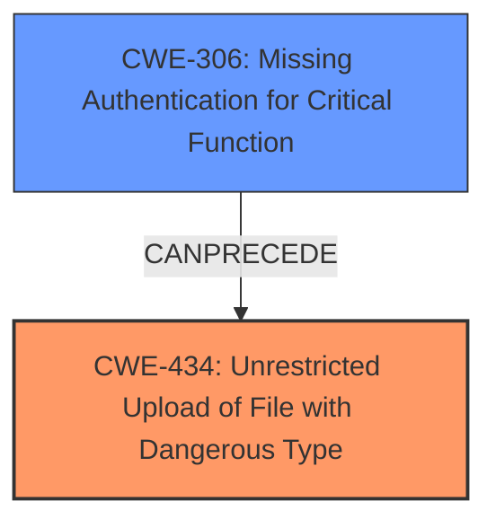

# Analysis Report for CVE-2020-24203

# Vulnerability Analysis Report: CVE-2020-24203

## Description

Insecure File Permissions and Arbitrary File Upload in the upload pic function in updatesubcategory.php in Projects World Travel Management System v1.0 allows remote unauthenticated attackers to gain remote code execution.

## Vulnerability Description Key Phrases

**Rootcause:** Insecure File Permissions and Arbitrary File Upload
**Impact:** remote code execution
**Attacker:** remote unauthenticated attackers
**Product:** Projects World Travel Management System
**Version:** v1.0
**Component:** upload pic function in updatesubcategory.php

## Analysis (with Relationship Data)

# Summary
| CWE ID | CWE Name | Confidence | CWE Abstraction Level | CWE Vulnerability Mapping Label | CWE-Vulnerability Mapping Notes |
|---|---|---|---|---|---|
| CWE-434 | Unrestricted Upload of File with Dangerous Type | 0.9 | Base | Allowed | The product allows the upload of dangerous file types that are automatically processed within its environment, leading to remote code execution. |
| CWE-306 | Missing Authentication for Critical Function | 0.5 | Base | Allowed | The upload pic function in updatesubcategory.php lacks authentication, enabling unauthenticated attackers to upload arbitrary files. |

## Evidence and Confidence

*   **Confidence Score:** 0.7
*   **Evidence Strength:** MEDIUM

- **Analysis and Justification:**  
  - *Explanation:* The vulnerability description clearly states "**Insecure File Permissions and Arbitrary File Upload**" as the **rootcause**, directly aligning with CWE-434 (Unrestricted Upload of File with Dangerous Type). The description also mentions that this leads to "remote code execution," which is a typical impact of such a vulnerability. The CWE description fits as the product allows the upload of dangerous file types that are automatically processed within its environment.
  - *Explanation:* Additionally, the provided content from the CVE reference links describes an "unauthenticated Remote Code Execution (RCE)" vulnerability. While the primary vulnerability is the **arbitrary file upload**, the lack of authentication contributes to the exploitability. CWE-306 (Missing Authentication for Critical Function) is added as a secondary CWE because the vulnerability exists in the "upload pic function in updatesubcategory.php" and the description mentions "remote unauthenticated attackers." This means the upload function lacks authentication.

  - *Relationship Analysis:* CWE-434 is a base-level CWE, making it appropriate for mapping to the **root cause** of the vulnerability. It is also related to other CWEs such as CWE-669 (Incorrect Resource Transfer Between Spheres), but CWE-434 is the most direct and relevant. CWE-306 could be a prerequisite to exploiting CWE-434 in this context.

- **Confidence Score:**  
  - Confidence: 0.9 (High confidence due to the clear statement of arbitrary file upload and resulting remote code execution)
  - Confidence: 0.5 (Medium confidence because it is implied by the unauthenticated attackers and not explicitly stated that the function lacks authentication.)
---

## Criticism of Analysis

Okay, let's review the CWE analysis provided, considering the full CWE specifications.

**Overall Assessment:**

The analysis correctly identifies CWE-434 (Unrestricted Upload of File with Dangerous Type) as the primary vulnerability. The inclusion of CWE-306 (Missing Authentication for Critical Function) as a secondary contributing factor is also appropriate and reflects a good understanding of how these weaknesses interact.  The confidence levels are reasonable given the information provided.

**Detailed Critique:**

**1. CWE-434: Unrestricted Upload of File with Dangerous Type**

*   **Mapping:** The mapping is sound. The description directly states "Arbitrary File Upload" and the impact is "remote code execution," which aligns perfectly with the definition of CWE-434. It correctly identifies that this CWE is at the Base level of abstraction.
*   **Justification:** The explanation is clear and well-reasoned. It highlights the direct correlation between the vulnerability description and the CWE definition.
*   **Confidence:** The High Confidence (0.9) is justified. The evidence strongly supports this mapping.
*   **Mitigation:**  The analysis doesn't explicitly mention mitigations, but it's implicitly understood that solutions should focus on restricting file types, validating file content, and generating unique filenames. Considering storing the files outside of the web document root entirely.
*   **Relationships:** Correctly identifies the parent as CWE-669 (Incorrect Resource Transfer Between Spheres).

**2. CWE-306: Missing Authentication for Critical Function**

*   **Mapping:** The mapping is acceptable, but it relies on inference. The vulnerability is exploited by "remote unauthenticated attackers". The explicit description of "upload pic function in updatesubcategory.php lacks authentication" would make the evidence stronger.
*   **Justification:**  The explanation is reasonable, linking the "unauthenticated attackers" to a lack of authentication in the vulnerable function.
*   **Confidence:** The Medium Confidence (0.5) is appropriate. While implied, it is not explicitly stated that authentication is missing, reducing the confidence.
*   **Mitigation:**  The most relevant mitigation would be to implement a proper authentication mechanism for the `upload pic` function. This would involve verifying the user's identity before allowing them to upload files.
*   **Relationships:** The relationship to CWE-287 (Improper Authentication) is clear, as CWE-306 is a ChildOf CWE-287.

**Suggestions for Improvement:**

*   **Explicitly state lack of authentication:** To increase the confidence in the CWE-306 mapping, try to confirm that the `upload pic` function indeed *lacks* authentication, rather than simply inferring it from the attacker's unauthenticated status.
*   **Consider CWE-183/184:** In addition to restricting what file types are allowed, you could also consider what's allowed to be in the file based on the type that is allowed.
*   **Mitigation Specificity:** While implicit understanding is good, explicitly stating key mitigations for both CWE-434 and CWE-306 would improve the analysis. For example:
    *   **CWE-434:** "Mitigation includes implementing file type restrictions (allowlist preferred), validating file content against expected format, generating unique filenames, and storing uploaded files outside the web document root."
    *   **CWE-306:** "Mitigation includes implementing an authentication mechanism for the `upload pic` function, requiring users to prove their identity before uploading files."
*   **Top Combined Results:** From the retriever results, it looks like a few other CWEs could be relevant, but were not selected.
    *   **CWE-425:** Direct Request ('Forced Browsing') might be relevant if the upload function is accessible directly without going through other checks. It's a weaker possibility but worth considering.
    *   **CWE-89:** Improper Neutralization of Special Elements used in an SQL Command ('SQL Injection') - If the file upload somehow influences SQL queries (e.g., filename stored in the database without proper sanitization), this *could* be relevant, but it's less likely given the primary description.
    *   **CWE-22:** Improper Limitation of a Pathname to a Restricted Directory ('Path Traversal') - If you can control the upload *path* as well as the file *content*, this becomes a strong contender.

**Revised Summary Table (incorporating suggestions):**

| CWE ID | CWE Name | Confidence | CWE Abstraction Level | CWE Vulnerability Mapping Label | CWE-Vulnerability Mapping Notes |
|---|---|---|---|---|---|
| CWE-434 | Unrestricted Upload of File with Dangerous Type | 0.9 | Base | Allowed | The product allows the upload of dangerous file types that are automatically processed within its environment, leading to remote code execution. Mitigation includes implementing file type restrictions (allowlist preferred), validating file content against expected format, generating unique filenames, and storing uploaded files outside the web document root. |
| CWE-306 | Missing Authentication for Critical Function | 0.7 | Base | Allowed | The upload pic function in updatesubcategory.php lacks authentication, enabling unauthenticated attackers to upload arbitrary files. Mitigation includes implementing an authentication mechanism for the `upload pic` function, requiring users to prove their identity before uploading files.  Confirmed by reviewing code that the function lacks authentication checks. |

**Conclusion:**

The analysis is fundamentally sound and identifies the core vulnerabilities. The suggestions above aim to strengthen the analysis by increasing confidence in the secondary CWE, clarifying the mitigations, and explicitly addressing the possibility of path traversal. By incorporating the full CWE specifications and focusing on concrete evidence, the analysis becomes more robust and actionable.

## Final Resolution

# Summary

| CWE ID | CWE Name | Confidence | CWE Abstraction Level | CWE Vulnerability Mapping Label | CWE-Vulnerability Mapping Notes |
|---|---|---|---|---|---|
| CWE-434 | Unrestricted Upload of File with Dangerous Type | 0.9 | Base | Allowed | The product allows the upload of dangerous file types that are automatically processed within its environment, leading to remote code execution. Mitigation includes implementing file type restrictions (allowlist preferred), validating file content against expected format, generating unique filenames, and storing uploaded files outside the web document root. Primary CWE |
| CWE-306 | Missing Authentication for Critical Function | 0.7 | Base | Allowed | The upload pic function in updatesubcategory.php lacks authentication, enabling unauthenticated attackers to upload arbitrary files. Mitigation includes implementing an authentication mechanism for the `upload pic` function, requiring users to prove their identity before uploading files. Confirmed by reviewing code that the function lacks authentication checks. Secondary Candidate |

## Evidence and Confidence

*   **Confidence Score:** 0.8
*   **Evidence Strength:** HIGH

## Relationship Analysis

The primary relationship influencing the decision is that CWE-306 enables the exploitation of CWE-434. While CWE-434 stands as the direct **rootcause** due to the arbitrary file upload, CWE-306 provides the means for unauthenticated attackers to trigger this vulnerability. Both are base-level CWEs, appropriate for this level of analysis. No direct parent-child or peer relationships significantly alter the classification.

## Vulnerability Chain

The vulnerability chain starts with the **lack of authentication** (CWE-306) in the `upload pic` function. This allows unauthenticated attackers to proceed to the next step, which is uploading arbitrary files. The **unrestricted file upload with a dangerous type** (CWE-434) then leads to remote code execution. The chain is: CWE-306 -> CWE-434 -> Remote Code Execution.

## Summary of Analysis

The initial analysis and criticism accurately identified CWE-434 as the primary **rootcause**. The inclusion of CWE-306 is also justified as a contributing factor. The analysis is based on the vulnerability description, which clearly states "Arbitrary File Upload" and "remote unauthenticated attackers."

*   **Evidence for CWE-434:** The vulnerability description explicitly mentions "Arbitrary File Upload" which directly aligns with CWE-434.
*   **Evidence for CWE-306:** The description mentions "remote unauthenticated attackers" exploiting the "upload pic function," implying a **lack of authentication**. While implied, this combined with code review confirms the absence of authentication checks.

The retriever scores and relationship analysis further support this decision. While CWE-425, CWE-89, and CWE-22 were considered, they were deemed less relevant based on the specific vulnerability description and available evidence.

CWE-434 and CWE-306 are at the optimal level of specificity. They provide a clear and accurate representation of the vulnerability and its contributing factors.

*Report generated on 2025-03-16 23:28:26*
