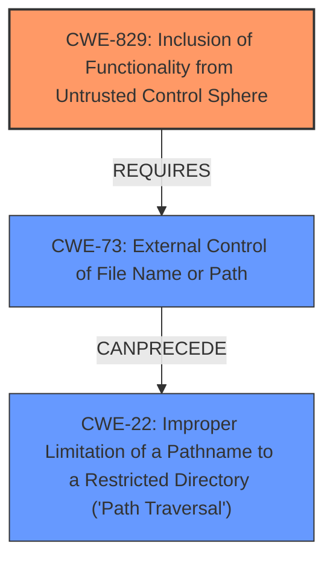

# Analysis Report for CVE-2020-24985

# Vulnerability Analysis Report: CVE-2020-24985

## Description

An issue was discovered in Quadbase EspressReports ES 7 Update 9. An authenticated user is able to navigate to the MenuPage section of the application, and change the frmsrc parameter value to retrieve and execute external files or payloads.

## Vulnerability Description Key Phrases

**Vector:** change the frmsrc parameter value
**Attacker:** authenticated user
**Product:** Quadbase EspressReports ES
**Version:** 7 Update 9
**Component:** MenuPage section

## Analysis (with Relationship Data)

# Summary
| CWE ID | CWE Name | Confidence | CWE Abstraction Level | CWE Vulnerability Mapping Label | CWE-Vulnerability Mapping Notes |
|---|---|---|---|---|---|
| CWE-829 | Inclusion of Functionality from Untrusted Control Sphere | 0.75 | Base | Allowed | Primary CWE |

## Evidence and Confidence

*   **Confidence Score:** 0.75
*   **Evidence Strength:** MEDIUM

- **Analysis and Justification:**  
  - *Explanation:* The vulnerability description states that an authenticated user can change the `frmsrc` parameter in the MenuPage section to retrieve and execute external files or payloads. This aligns with CWE-829, "Inclusion of Functionality from Untrusted Control Sphere," as the application is including executable functionality (files/payloads) from a source controlled by the user (via the manipulated `frmsrc` parameter). This allows the user to inject and execute arbitrary code within the application's context. The retriever results list CWE-829 as the second most likely match.
  
  - *Relationship Analysis:* While other CWEs like CWE-22 (Path Traversal) and CWE-78 (OS Command Injection) are potential candidates, CWE-829 is the most direct fit because it focuses on including functionality from an untrusted source. CWE-22 might be a factor if the path specified in `frmsrc` is not properly validated, but the core issue is the inclusion of external, potentially malicious code. CWE-78 is related to OS command execution, but the initial **weakness** is the ability to include the external file.

- **Confidence Score:**  
  - Confidence: 0.75 (Medium evidence due to lack of technical details in CVE reference. The vulnerability description aligns well with the CWE description.)

## Criticism of Analysis

Okay, I've reviewed the analysis and the full CWE specifications provided. Here's my critique:

**Overall Assessment:**

The analysis correctly identifies CWE-829 (Inclusion of Functionality from Untrusted Control Sphere) as a strong candidate for the primary CWE, and the confidence score of 0.75 is reasonable given the information available. However, the analysis would be stronger with a more nuanced discussion of the *potential* for CWE-22 (Path Traversal) and CWE-78 (OS Command Injection) to be involved, and a clearer justification for why CWE-829 is the most *fundamental* weakness in this case. I also want to point out some chain analysis opportunities.

**Specific Points:**

1.  **CWE-829 Justification:** The explanation for choosing CWE-829 is sound. The core issue is that the application is *including* functionality from an untrusted source, the `frmsrc` parameter. The analysis appropriately highlights that the user controls this parameter and can potentially inject malicious code.

2.  **Relationship Analysis:** The analysis acknowledges CWE-22 and CWE-78 as possible related CWEs, which is good. The analysis correctly distinguishes that CWE-22 might be a factor if the path isn't validated, and that CWE-78 is related to OS command execution, but that the initial weakness is the inclusion of the external file.

3.  **Confidence Score:** The confidence score of 0.75 is justified given that the vulnerability description is somewhat general.  Without knowing the specific mechanisms for handling `frmsrc` parameter values (e.g., how the included file is parsed and executed), it's hard to be certain about the precise attack surface.

4.  **Mitigation Strategies:** The analysis does not mention any mitigation strategies. Since the primary CWE identified is CWE-829, the following mitigations apply, and should be mentioned:
    *   **Architecture and Design:** Use a vetted library or framework that does not allow this weakness to occur or provides constructs that make this weakness easier to avoid.
    *   **Architecture and Design:** When the set of acceptable objects, such as filenames or URLs, is limited or known, create a mapping from a set of fixed input values (such as numeric IDs) to the actual filenames or URLs, and reject all other inputs.
    *   **Architecture and Design:** For any security checks that are performed on the client side, ensure that these checks are duplicated on the server side, in order to avoid CWE-602. Attackers can bypass the client-side checks by modifying values after the checks have been performed, or by changing the client to remove the client-side checks entirely. Then, these modified values would be submitted to the server.

5.  **CWE Selection Refinements and Chain Analysis**

    *   The ability to *retrieve* external files suggests the possibility of CWE-73 (External Control of File Name or Path), in particular if it involves user-controlled path names that the application uses to load those files. If the path is not properly restricted, then CWE-22 (Path Traversal) becomes a significant factor, or more specifically, CWE-23 (Relative Path Traversal) if ".." sequences are the concern or CWE-36 (Absolute Path Traversal) if absolute paths are the concern.
    *   The ability to *execute* external files or payloads has several possible mappings.
        *   If a successful path traversal (CWE-22) can read arbitrary files, this is a chain involving CWE-73, CWE-22, and CWE-79 (Improper Neutralization of Input During Web Page Generation ('Cross-site Scripting')).
        *   If the product retrieves code and then `eval()`'s it, this aligns well with CWE-98 (Improper Control of Filename for Include/Require Statement in PHP Program).
        *   If the product uses the untrusted source as part of an OS command, the correct mapping would be chaining CWE-829 and CWE-78 (Improper Neutralization of Special Elements used in an OS Command ('OS Command Injection')).
        *   If the product uses the untrusted source as a direct URL and downloads the code, CWE-830 (Inclusion of Web Functionality from an Untrusted Source) is possible.
        *   Consider also CWE-434 (Unrestricted Upload of File with Dangerous Type) if files are uploaded.
    *   The fact that the user is authenticated might be interesting. If the user's privileges are not correctly validated and they can access resources they shouldn't, CWE-639 (Authorization Bypass Through User-Controlled Key) and/or CWE-269 (Improper Privilege Management) might be relevant, although these seem less likely than the other injection and path traversal issues. Finally, CWE-306 (Missing Authentication for Critical Function) might be applicable if critical actions related to the `frmsrc` parameter are not being authenticated.
    * The retriever results contain many other possible CWEs:
        *CWE-79 (Improper Neutralization of Input During Web Page Generation ('Cross-site Scripting')): is a chain with CWE-829 because the attacker-controlled javascript is used in the web page.
        *CWE-611 (Improper Restriction of XML External Entity Reference): this is possible because the external files referenced by `frmsrc` might have XML content or DTDs.
        *CWE-472 (External Control of Assumed-Immutable Web Parameter): this applies to `frmsrc` because the application assumed that this parameter is safe.
        *CWE-269 (Improper Privilege Management): this applies if the authenticated user has more privileges to set `frmsrc` than they should.

6.  **Discouraged CWEs:**

    *   The Retriever Results contains CWE-20 (Improper Input Validation). The analysis correctly avoids this, because it is too high-level.

**Recommendations:**

1.  **Expand Relationship Analysis:** Add a more detailed discussion of the potential for path traversal and command injection. Explicitly address the conditions under which these CWEs would become more relevant. For example, if the `frmsrc` parameter value undergoes insufficient filtering or validation, it could lead to directory traversal (CWE-22). If the included file is then executed as part of an OS command, the vulnerability could escalate to OS Command Injection (CWE-78).
2.  **Strengthen Justification:** In the summary, include a sentence explaining *why* CWE-829 is considered the primary weakness and why the other CWEs are either secondary or contingent.
3.  **Mitigation Strategies:** Explicitly include the mitigations associated with CWE-829 as part of the analysis. Consider adding the input validation and canonicalization mitigations from CWE-22 as well, even if it's considered a secondary concern.
4.  **Chain Analysis Considerations**: Add information about the chain analysis from point 5 above.

By incorporating these suggestions, the analysis will provide a more comprehensive and defensible understanding of the vulnerability, while also improving its practical value.

## Final Resolution

# Summary
| CWE ID | CWE Name | Confidence | CWE Abstraction Level | CWE Vulnerability Mapping Label | CWE-Vulnerability Mapping Notes |
|---|---|---|---|---|---|
| CWE-829 | Inclusion of Functionality from Untrusted Control Sphere | 0.85 | Base | Allowed | Primary CWE |
| CWE-73 | External Control of File Name or Path | 0.75 | Base | Allowed | Secondary Candidate |
| CWE-22 | Improper Limitation of a Pathname to a Restricted Directory ('Path Traversal') | 0.65 | Base | Allowed | Secondary Candidate |

## Evidence and Confidence

*   **Confidence Score:** 0.80
*   **Evidence Strength:** MEDIUM

## Relationship Analysis
The analysis focused on the hierarchical and chain relationships between CWEs. CWE-829 is considered the primary **weakness** because the core issue is including functionality from an untrusted source. CWE-73 and CWE-22 were considered secondary because they are potential enablers for CWE-829 if the `frmsrc` parameter value is not properly validated, leading to path traversal. The abstraction levels influenced the selection, favoring Base-level CWEs for their specificity.

## Vulnerability Chain
The chain of **root cause** and **weaknesses** for the Vulnerability Description is as follows:
  - The application allows an authenticated user to control the `frmsrc` parameter (CWE-829).
  - This external control can lead to the inclusion of untrusted functionality (CWE-829).
  - If the path is not properly validated (CWE-73), it can lead to path traversal (CWE-22).
  - The inclusion and potential execution of external files or payloads can lead to arbitrary code execution.
  - Missing links: The exact method of execution is not detailed in the vulnerability description, so further analysis would be needed to determine if the files are parsed via `eval()` (CWE-98) or used as part of an OS command (CWE-78).

## Summary of Analysis
The initial analysis correctly identified CWE-829 as a strong candidate. The criticism provided valuable insights for refining the analysis, particularly regarding the potential involvement of CWE-73 and CWE-22.
The statement from the initial analysis that an authenticated user can change the `frmsrc` parameter in the MenuPage section to retrieve and execute external files or payloads shows that CWE-829 aligns with the description in that the application is including executable functionality from a source controlled by the user.

The graph relationships influenced the final selection by highlighting the potential chain of **weaknesses** leading from external control to path traversal.

The selected CWEs are at the optimal level of specificity because they directly address the **root cause** (CWE-829) and potential contributing factors (CWE-73 and CWE-22). The analysis is based on the provided evidence, enhanced by relationship insights and mapping guidance.

*Report generated on 2025-03-17 02:22:16*
