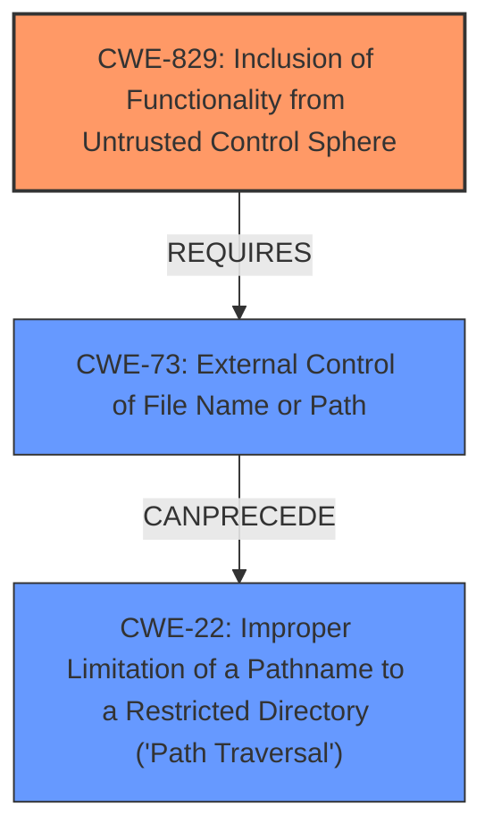

# Final Resolution for CVE-2020-24985

# Summary
| CWE ID | CWE Name | Confidence | CWE Abstraction Level | CWE Vulnerability Mapping Label | CWE-Vulnerability Mapping Notes |
|---|---|---|---|---|---|
| CWE-829 | Inclusion of Functionality from Untrusted Control Sphere | 0.85 | Base | Allowed | Primary CWE |
| CWE-73 | External Control of File Name or Path | 0.75 | Base | Allowed | Secondary Candidate |
| CWE-22 | Improper Limitation of a Pathname to a Restricted Directory ('Path Traversal') | 0.65 | Base | Allowed | Secondary Candidate |

## Evidence and Confidence

*   **Confidence Score:** 0.80
*   **Evidence Strength:** MEDIUM

## Relationship Analysis
The analysis focused on the hierarchical and chain relationships between CWEs. CWE-829 is considered the primary **weakness** because the core issue is including functionality from an untrusted source. CWE-73 and CWE-22 were considered secondary because they are potential enablers for CWE-829 if the `frmsrc` parameter value is not properly validated, leading to path traversal. The abstraction levels influenced the selection, favoring Base-level CWEs for their specificity.

## Vulnerability Chain
The chain of **root cause** and **weaknesses** for the Vulnerability Description is as follows:
  - The application allows an authenticated user to control the `frmsrc` parameter (CWE-829).
  - This external control can lead to the inclusion of untrusted functionality (CWE-829).
  - If the path is not properly validated (CWE-73), it can lead to path traversal (CWE-22).
  - The inclusion and potential execution of external files or payloads can lead to arbitrary code execution.
  - Missing links: The exact method of execution is not detailed in the vulnerability description, so further analysis would be needed to determine if the files are parsed via `eval()` (CWE-98) or used as part of an OS command (CWE-78).

## Summary of Analysis
The initial analysis correctly identified CWE-829 as a strong candidate. The criticism provided valuable insights for refining the analysis, particularly regarding the potential involvement of CWE-73 and CWE-22.
The statement from the initial analysis that an authenticated user can change the `frmsrc` parameter in the MenuPage section to retrieve and execute external files or payloads shows that CWE-829 aligns with the description in that the application is including executable functionality from a source controlled by the user.

The graph relationships influenced the final selection by highlighting the potential chain of **weaknesses** leading from external control to path traversal.

The selected CWEs are at the optimal level of specificity because they directly address the **root cause** (CWE-829) and potential contributing factors (CWE-73 and CWE-22). The analysis is based on the provided evidence, enhanced by relationship insights and mapping guidance.