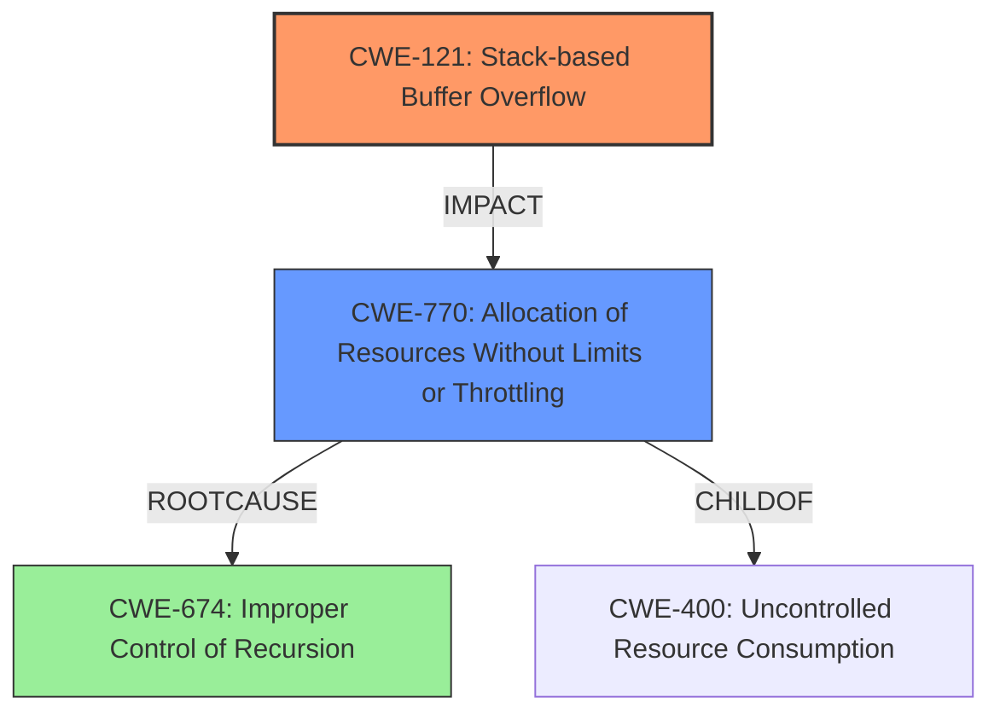

# Final Resolution for CVE-2020-24994

# Summary
| CWE ID | CWE Name | Confidence | CWE Abstraction Level | CWE Vulnerability Mapping Label | CWE-Vulnerability Mapping Notes |
|---|---|---|---|---|---|
| CWE-121 | Stack-based Buffer Overflow | 0.95 | Variant | Primary | The vulnerability is specifically a **stack overflow** in the `parse_tag` function due to deeply nested tags leading to excessive recursion. Each nested tag results in a new function call, consuming stack memory for local variables, parameters, and return addresses. Excessive nesting fills the stack, causing an overflow. |
| CWE-770 | Allocation of Resources Without Limits or Throttling | 0.75 | Base | Secondary | The `parse_tag` function is recursively called without any limits in the amount of resources (stack frames) it can allocate. This directly contributes to the stack exhaustion. |
| CWE-674 | Improper Control of Recursion | 0.60 | Class | Contributing | The excessive recursion in `parse_tag` leading to the **stack overflow** indicates an improper control of recursion. |

## Evidence and Confidence

*   **Confidence Score:** 0.95
*   **Evidence Strength:** HIGH

## Relationship Analysis
The primary CWE is CWE-121 (Variant), representing the direct impact of the vulnerability. CWE-770 (Base) is a child of CWE-400 (Class), representing resource exhaustion, and is related to the uncontrolled allocation of stack frames during recursion. CWE-674 (Class) is related to the lack of control over recursion depth, contributing to the exhaustion of stack resources. The relationships show a progression from uncontrolled resource allocation and recursion to the final impact of a **stack overflow**.

## Vulnerability Chain
The vulnerability chain starts with CWE-674 (**Improper Control of Recursion**), leading to CWE-770 (**Allocation of Resources Without Limits or Throttling**) as stack frames are allocated without bounds. This ultimately results in CWE-121 (**Stack-based Buffer Overflow**).

## Summary of Analysis
The initial analysis correctly identified CWE-121 as the primary weakness due to the explicit mention of "stack overflow" in the vulnerability description. The criticism's suggestion to include CWE-770 is valid because the unlimited allocation of stack frames directly contributes to the overflow. The final assessment incorporates this suggestion, making CWE-770 a secondary CWE and CWE-674 a contributing factor.

The selection of CWEs reflects the optimal level of specificity. CWE-121 is a Variant that directly describes the overflow type. CWE-770 is a Base-level CWE and is an appropriate abstraction for the root cause of the resource allocation issue. CWE-674 is a Class level CWE that is related to the unbounded recursion.

The evidence from the vulnerability description supports this classification: "Stack overflow in the `parse_tag` function in libass/ass_parse.c in libass before 0.15.0 allows remote attackers to cause a denial of service or remote code execution via a crafted file."
The phrase "**stack overflow**" directly maps to CWE-121. The cause, deeply nested tags leading to excessive recursion, supports the inclusion of CWE-770 and CWE-674.