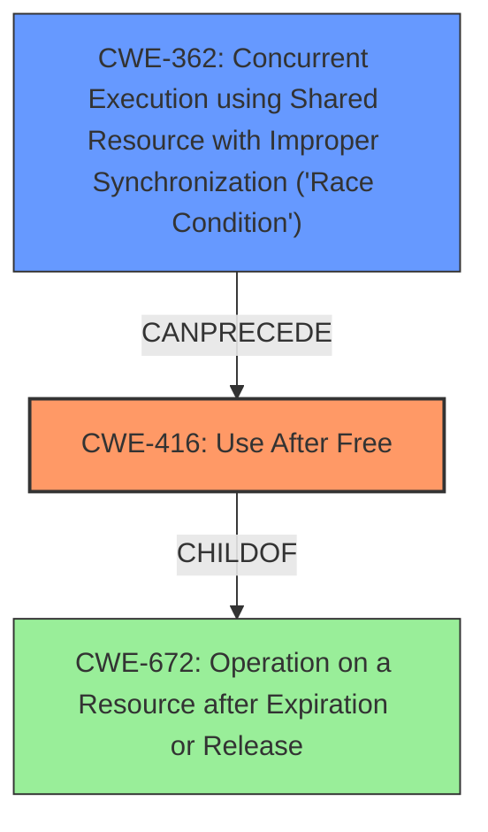

# Analysis Report for CVE-2020-25668

# Vulnerability Analysis Report: CVE-2020-25668

## Description

A flaw was found in Linux Kernel because access to the global variable fg_console is not properly synchronized leading to a use after free in con_font_op.

## Vulnerability Description Key Phrases

**Rootcause:** access to the global variable fg_console is not properly synchronized
**Impact:** use after free
**Product:** Linux Kernel
**Component:** con_font_op

## Analysis (with Relationship Data)

# Summary
| CWE ID | CWE Name | Confidence | CWE Abstraction Level | CWE Vulnerability Mapping Label | CWE-Vulnerability Mapping Notes |
|---|---|---|---|---|---|
| CWE-416 | Use After Free | 0.9 | Variant | Allowed | Primary CWE |
| CWE-362 | Concurrent Execution using Shared Resource with Improper Synchronization ('Race Condition') | 0.7 | Class | Allowed-with-Review | Secondary Candidate |

## Evidence and Confidence

*   **Confidence Score:** 0.8
*   **Evidence Strength:** HIGH

- **Analysis and Justification:**  
  - *Explanation:* The vulnerability description clearly states a **use-after-free** condition occurs in the Linux kernel. The root cause is **improper synchronization** of access to the `fg_console` global variable. The `con_font_op` function attempts to access memory that has already been freed due to a race condition. This aligns perfectly with CWE-416 (Use After Free), which occurs when a program reuses or references memory after it has been freed. The CVE Reference Links Content Summary confirms the use-after-free read in the `con_font_op` function when it attempts to access a now freed `vc` pointer. The content summary details how the `fg_console` variable is changed concurrently with operations on the console font, which triggers the vulnerability. CWE-416 is a Variant level CWE, which is a preferred level of abstraction. The MITRE mapping guidance for CWE-416 indicates that it is ALLOWED.

  - *Relationship Analysis:* CWE-416 (Use After Free) is a variant of CWE-672 (Operation on a Resource after Expiration or Release). The race condition described in the vulnerability could be a contributing factor to the use-after-free, making CWE-362 (Concurrent Execution using Shared Resource with Improper Synchronization ('Race Condition')) a related weakness. The content summary describes how the `fg_console` variable is changed concurrently with operations on the console font, confirming that there is a race condition.

- **Confidence Score:**  
  - Confidence: 0.9 (High evidence from technical description, CVE reference materials, and retriever results)

---
- **Analysis and Justification:**  
  - *Explanation:* The vulnerability is triggered by **improper synchronization** in a concurrent environment. The vulnerability occurs because **access to the global variable fg_console is not properly synchronized**. This aligns with CWE-362 (Concurrent Execution using Shared Resource with Improper Synchronization ('Race Condition')). The CVE Reference Links Content Summary confirms that the root cause of vulnerability is a race condition. Specifically, the race condition exists in the Linux kernel's virtual terminal (vt) driver, related to the global variable `fg_console` and access to `vc_cons[fg_console]`. While CWE-362 is a Class-level CWE, which is a less preferred level of abstraction than Base or Variant, it is a suitable secondary candidate given the clear presence of a race condition contributing to the primary weakness. The MITRE mapping guidance for CWE-362 indicates that it is Allowed-with-Review, which is appropriate given that it is a class-level CWE.

  - *Relationship Analysis:* CWE-362 is a Class level CWE. Its children include CWE-364 (Signal Handler Race Condition). The graph relationships show that CWE-362 can precede CWE-416 (Use After Free).

- **Confidence Score:**  
  - Confidence: 0.7 (High evidence from technical description, CVE reference materials, and retriever results)

## Criticism of Analysis

Okay, here's a review of the analysis, considering the full CWE specifications:

**Overall Assessment:**

The analysis is very good. The primary CWE mapping (CWE-416) is accurate, and the secondary mapping (CWE-362) is also reasonable and well-justified. The confidence scores are appropriate. The inclusion of relationships between the CWEs and real-world examples of similar vulnerabilities is helpful.

**Detailed Review:**

**1. CWE-416: Use After Free**

*   **Strengths:**
    *   The justification is clear and directly supported by the vulnerability description and CVE reference links content summary.
    *   The abstraction level (Variant) is ideal.
    *   The analysis correctly identifies that the vulnerability occurs when `con_font_op` attempts to access a freed `vc` pointer because `fg_console` was changed concurrently.
    *   The MITRE mapping guidance is correctly considered.
    *   The relationship to CWE-672 is noted.
*   **Potential Improvements:**
    *   While the analysis mentions setting pointers to NULL after freeing as a mitigation, it could also emphasize the limitations of this approach, as noted in the CWE description: "However, the utilization of multiple or complex data structures may lower the usefulness of this strategy."  This is particularly relevant in kernel code.

**2. CWE-362: Concurrent Execution using Shared Resource with Improper Synchronization ('Race Condition')**

*   **Strengths:**
    *   The analysis accurately identifies that the root cause involves a race condition where access to `fg_console` is not properly synchronized.
    *   The CVE Reference Links Content Summary provides strong evidence of a race condition.
    *   The analysis acknowledges the class-level abstraction and that it is a less preferred level of abstraction than Base or Variant, but states that it is a suitable *secondary* candidate.
    *   The MITRE mapping guidance is correctly considered.
    *   Relationship to CWE-416 is correctly described.

*   **Potential Improvements:**
    *   While correct, the analysis could explore potential *more specific* children of CWE-362 (e.g., those listed in the "ParentOf" section of CWE-362) to see if any provide a better fit.  For example, is this a *Time-of-Check Time-of-Use* (TOCTOU) condition (CWE-367)?  Is the access to the `fg_console` guarded by a locking mechanism that is improperly used (CWE-667)?  However, given the information provided in the analysis, there is not enough information to determine if the vulnerability is a better match for any of the children of CWE-362.
    *   The analysis correctly mentions that since access to the global variable `fg_console` is not properly synchronized, the mitigation for the race condition would be to "use synchronization primitives," however, the analysis could explain which synchronization primitive would be best, such as a mutex.
    *   The analysis mentions the attack surface, however, it does not mention how the attacker must have local user access to a virtual terminal (tty) device or have the `CAP_SYS_TTY_CONFIG` capability. This could be added to the Analysis and Justification of CWE-362.

**3. Retriever Results**

* The tool returned a list of potential CWEs, and the analysis accurately selected the best two from the list. It is important to note that CWE-416 was returned as the second potential CWE, which ultimately was correctly chosen as the primary CWE.

**4. General Comments:**

*   **Evidence Strength:** The assessment of "High" evidence strength is well-supported.
*   **Confidence Scores:** The confidence scores of 0.9 for CWE-416 and 0.7 for CWE-362 are justified.

**Suggestions for Improvement (Beyond the specific CWEs):**

*   **Expand on Mitigations:**  While mentioning mitigations is good, briefly expanding on them would be valuable.  For example, under CWE-362, you could mention specific synchronization primitives that could be used in the Linux kernel to protect `fg_console`. This demonstrates a deeper understanding of the practical implications.
*   **Consider Chaining:** The analysis briefly mentions chaining, but it could be slightly more explicit. For example: "The vulnerability is primarily a Use-After-Free (CWE-416), *caused by* a Race Condition (CWE-362)." This makes the relationship clearer.

**Revised Summary Table**

| CWE ID | CWE Name | Confidence | CWE Abstraction Level | CWE Vulnerability Mapping Label | CWE-Vulnerability Mapping Notes |
|---|---|---|---|---|---|
| CWE-416 | Use After Free | 0.9 | Variant | Allowed | Primary CWE |
| CWE-362 | Concurrent Execution using Shared Resource with Improper Synchronization ('Race Condition') | 0.7 | Class | Allowed-with-Review | Secondary Candidate - Contributes to CWE-416 |

**In Summary:**

This is a well-done analysis. The mappings are accurate, the justifications are strong, and the limitations are acknowledged. The suggestions above are primarily for making the analysis even more comprehensive and demonstrating a deeper understanding of the mitigations and relationships between the CWEs.

## Final Resolution

# Summary
| CWE ID | CWE Name | Confidence | CWE Abstraction Level | CWE Vulnerability Mapping Label | CWE-Vulnerability Mapping Notes |
|---|---|---|---|---|---|
| CWE-416 | Use After Free | 0.9 | Variant | Allowed | Primary CWE |
| CWE-362 | Concurrent Execution using Shared Resource with Improper Synchronization ('Race Condition') | 0.7 | Class | Allowed-with-Review | Secondary Candidate - Contributes to CWE-416 |

## Evidence and Confidence

*   **Confidence Score:** 0.9
*   **Evidence Strength:** HIGH

## Relationship Analysis
The primary weakness is **CWE-416 (Use After Free)**, a Variant. It accurately reflects the vulnerability where memory is accessed after being freed. **CWE-362 (Concurrent Execution using Shared Resource with Improper Synchronization ('Race Condition'))**, a Class, is the secondary weakness, representing the race condition that leads to the use-after-free. **CWE-362** can precede **CWE-416**, showing the race condition as a trigger. The abstraction levels are suitable, with **CWE-416** being a more specific Variant and **CWE-362** representing the broader class of concurrency issues. No peer relationships were more appropriate.

## Vulnerability Chain
The vulnerability chain starts with **CWE-362 (Concurrent Execution using Shared Resource with Improper Synchronization ('Race Condition'))**, where concurrent access to the `fg_console` variable is not properly synchronized. This leads to a state where the `vc` pointer is freed prematurely, and subsequently accessed by `con_font_op`, resulting in **CWE-416 (Use After Free)**. The root cause is the **improper synchronization**, and the impact is accessing freed memory.

## Summary of Analysis
The initial analysis and criticism both align well with the evidence provided in the vulnerability description and CVE reference materials. The primary weakness is correctly identified as **CWE-416 (Use After Free)**, supported by the statement: "access to the global variable fg_console is not properly synchronized leading to a **use after free** in con_font_op." The secondary weakness, **CWE-362 (Concurrent Execution using Shared Resource with Improper Synchronization ('Race Condition'))**, is also well-justified, as "access to the global variable fg_console is not properly synchronized" indicates a race condition.

The graph relationships confirm that **CWE-362** can indeed lead to **CWE-416**, establishing a clear vulnerability chain. The chosen CWEs are at the optimal level of specificity, with **CWE-416** being a Variant and directly reflecting the **use-after-free** condition, and **CWE-362** being a Class that explains the **improper synchronization** contributing to the vulnerability. I am confident in this classification because it accurately reflects both the root cause and the resulting vulnerability.

*Report generated on 2025-03-16 15:54:37*
