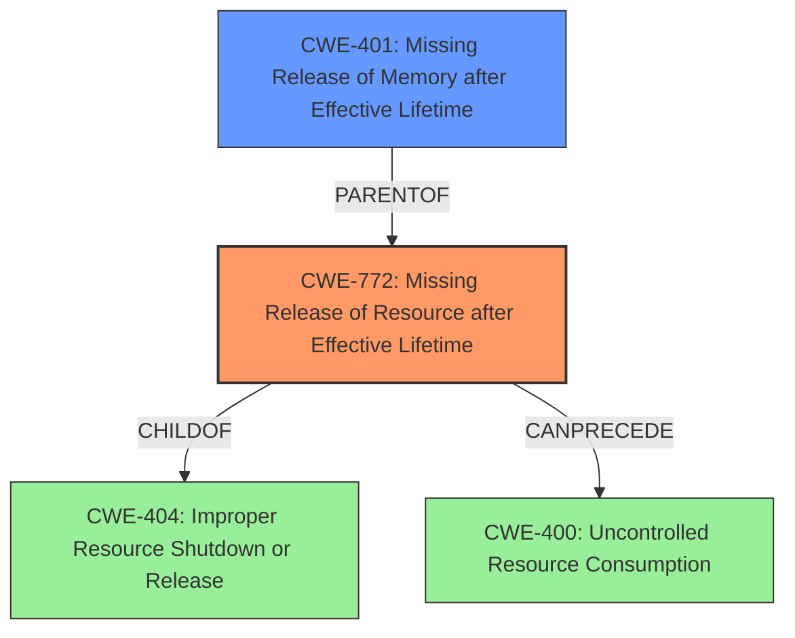

# Final Resolution for CVE-2020-25673

# Summary
| CWE ID | CWE Name | Confidence | CWE Abstraction Level | CWE Vulnerability Mapping Label | CWE-Vulnerability Mapping Notes |
|---|---|---|---|---|---|
| CWE-772 | Missing Release of Resource after Effective Lifetime | 0.85 | Base | Primary | Allowed |
| CWE-401 | Missing Release of Memory after Effective Lifetime | 0.75 | Variant | Secondary | Allowed |

## Evidence and Confidence

*   **Confidence Score:** 0.85
*   **Evidence Strength:** HIGH

## Relationship Analysis
The primary relationship influencing the decision is the parent-child relationship between CWE-404 (Improper Resource Shutdown or Release) and CWE-772. CWE-772 is a more specific case of CWE-404, making it a better fit. The chain relationship where CWE-772 can precede CWE-400 (Resource Exhaustion) is also relevant, as the **resource leak** can lead to resource exhaustion and denial of service.

## Vulnerability Chain
The vulnerability chain starts with the **failure to release resources** in `llcp_sock_connect()` (CWE-772). This **resource leak** leads to uncontrolled resource consumption and eventually a denial of service. The chain is:
1.  Missing Release of Resource after Effective Lifetime (**ROOTCAUSE**: CWE-772)
2.  Missing Release of Memory after Effective Lifetime (CWE-401)
3.  Uncontrolled Resource Consumption (CWE-400 - Consequence, not root cause)
4.  Denial of Service (Impact)

## Summary of Analysis
The initial analysis and criticism both agree on CWE-772 as the primary weakness. The vulnerability description states, "Repeated calls to `llcp_sock_connect()` with non-blocking sockets causes a **resource leak** leading to a denial of service." This clearly points to a missing release of resources.

The graph relationships support this decision: CWE-772 is more specific than its parent CWE-404, making it a better choice. Also, the fact that CWE-772 can precede CWE-400 (Resource Exhaustion) is relevant, as the **resource leak** can lead to resource exhaustion and denial of service.

CWE-772 is selected because it is at the optimal level of specificity (Base) and directly reflects the **root cause** of the vulnerability. CWE-401 is a secondary concern, as memory is a specific type of resource. The analysis also correctly excludes other CWEs, such as CWE-416 (Use After Free) and CWE-415 (Double Free), as the issue is not about freeing memory multiple times or using it after it has been freed.