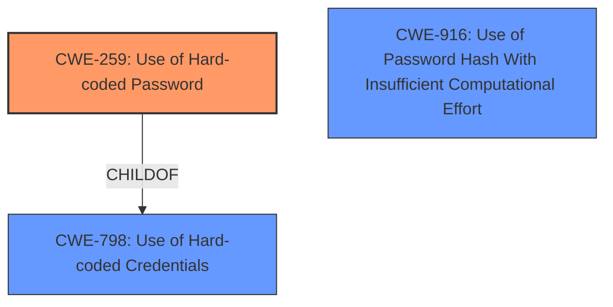

# Final Resolution for CVE-2020-25754

# Summary
| CWE ID | CWE Name | Confidence | CWE Abstraction Level | CWE Vulnerability Mapping Label | CWE-Vulnerability Mapping Notes |
|---|---|---|---|---|---|
| CWE-259 | Use of Hard-coded Password | 0.97 | Variant | Primary CWE | Allowed |
| CWE-798 | Use of Hard-coded Credentials | 0.87 | Base | Secondary Candidate | Allowed |
| CWE-916 | Use of Password Hash With Insufficient Computational Effort | 0.77 | Base | Secondary Candidate | Allowed |

## Evidence and Confidence

*   **Confidence Score:** 0.95
*   **Evidence Strength:** HIGH

## Relationship Analysis
The primary CWE is CWE-259 (**Use of Hard-coded Password**), which is a variant of the more general CWE-798 (**Use of Hard-coded Credentials**). CWE-916 (**Use of Password Hash With Insufficient Computational Effort**) is related because MD5 hashing contributes to the weakness by making the password predictable. There is no direct relationship between CWE-916 and the other two CWEs.

## Vulnerability Chain
The vulnerability chain starts with the use of a custom PAM module that uses a password derived from the MD5 hash of the username and serial number. The serial number is publicly accessible. This leads to a **hard-coded password** (**CWE-259**) or, more generally, **hard-coded credentials** (**CWE-798**). The use of MD5 as a hashing algorithm represents **insufficient computational effort** (**CWE-916**). The final impact is that an attacker can easily calculate the password and authenticate to the system.

## Summary of Analysis
The initial analysis and the criticism are both well-reasoned. The vulnerability description explicitly states that a custom PAM module generates a password from the MD5 hash of the username and serial number.

*   **CWE-259 (Use of Hard-coded Password)** is the most specific and accurate classification because the password generation mechanism, combined with the publicly available serial number, effectively results in a **hard-coded password**. The evidence for this is the statement "This module uses a password derived from the MD5 hash of the username and serial number. The serial number can be retrieved by an unauthenticated user at /info.xml." The password is not unique to each user and is easily calculable given the readily available inputs.

*   **CWE-798 (Use of Hard-coded Credentials)** is a valid secondary classification as it is a broader category encompassing the use of **hard-coded passwords**. However, CWE-259 is more precise, making it the primary choice.

*   **CWE-916 (Use of Password Hash With Insufficient Computational Effort)** is also relevant because the use of MD5 contributes to the predictability of the password, as pointed out in the criticism by mentioning the lack of salting, making it susceptible to rainbow table attacks. The evidence is the statement: "This module uses a password derived from the MD5 hash of the username and serial number."

The graph relationships support the classification by showing that CWE-259 is a specific type of CWE-798. The relationships also clarify that while CWE-916 contributes to the vulnerability, it is not directly related to the **hard-coded credential** aspect.

I am increasing the confidence in all the CWEs based on the criticism provided.

Therefore, the primary CWE is CWE-259, with CWE-798 and CWE-916 as secondary contributing factors. This selection provides the optimal level of specificity based on the available evidence and the CWE relationships.