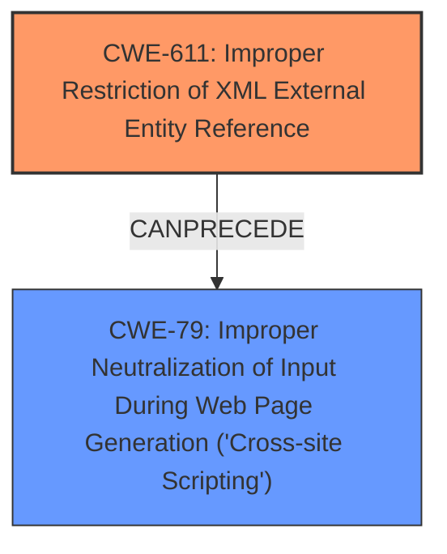

# Analysis Report for CVE-2020-25817

# Vulnerability Analysis Report: CVE-2020-25817

## Description

SilverStripe through 4.6.0-rc1 has an XXE Vulnerability in CSSContentParser. A developer utility meant for parsing HTML within unit tests can be vulnerable to XML External Entity (XXE) attacks. When this developer utility is misused for purposes involving external or user submitted data in custom project code, it can lead to vulnerabilities such as XSS on HTML output rendered through this custom code. This is now mitigated by disabling external entities during parsing. (The correct CVE ID year is 2020 [CVE-2020-25817, not CVE-2021-25817]).

## Vulnerability Description Key Phrases

**Weakness:** XML External Entity expansion
**Impact:** cross-site scripting
**Product:** SilverStripe
**Version:** through 4.6.0-rc1
**Component:** CSSContentParser

## Analysis (with Relationship Data)

# Summary
| CWE ID | CWE Name | Confidence | CWE Abstraction Level | CWE Vulnerability Mapping Label | CWE-Vulnerability Mapping Notes |
|---|---|---|---|---|---|
| CWE-611 | Improper Restriction of XML External Entity Reference | 0.95 | Base | Primary | Allowed |
| CWE-79 | Improper Neutralization of Input During Web Page Generation ('Cross-site Scripting') | 0.75 | Base | Secondary | Allowed |

## Evidence and Confidence

*   **Confidence Score:** 0.9
*   **Evidence Strength:** HIGH

- **Analysis and Justification:**  
  - *Explanation:* "The vulnerability description explicitly mentions **XML External Entity expansion** (**XXE**), which aligns directly with CWE-611 (Improper Restriction of XML External Entity Reference). The CVE Reference Links Content Summary confirms the root cause as the `CSSContentParser` being vulnerable to **XXE injection**, allowing attackers to potentially read local files, trigger denial-of-service, or achieve remote code execution. The description states that the utility is misused for user-submitted data, leading to XSS which makes CWE-79 a secondary concern. The MITRE mapping guidance for CWE-611 indicates this is ALLOWED for XXE vulnerabilities."
  
  - *Relationship Analysis:* "CWE-611 has no direct relationships listed, but the vulnerability's impact leading to potential XSS suggests a possible chain where successful XXE can lead to further exploitation. CWE-79 (Improper Neutralization of Input During Web Page Generation) is related as a potential impact, since the **XXE** vulnerability can be leveraged to inject malicious scripts that are then executed in a web page."

- **Confidence Score:**  
  - *Example:* Confidence: 0.95 (High confidence due to explicit mention of **XXE** and confirmation in CVE reference materials)

---

## Criticism of Analysis

Okay, I've reviewed the provided analysis against the full CWE specifications. Here's my critique:

**Overall Assessment:**

The analysis is generally good. The primary CWE mapping to CWE-611 is correct and well-justified. The inclusion of CWE-79 as a secondary weakness is also reasonable, given the potential for XSS as an impact of XXE exploitation in this specific context. The confidence level is appropriately high for CWE-611, and moderately high for CWE-79.

**Detailed Breakdown:**

**1. CWE-611: Improper Restriction of XML External Entity Reference (Primary)**

*   **Mapping:** Correct. The vulnerability description clearly indicates an XXE vulnerability in `CSSContentParser`, and the CVE summary confirms it. The attack vector of uploading or supplying a crafted CSS file further supports this mapping.
*   **Abstraction Level:** Correct.  CWE-611 is a Base-level CWE, which is the preferred level for vulnerability mapping.
*   **Confidence:** 0.95 is justified. The evidence is strong and directly related to XXE.
*   **Justification:**  The justification is well-written and explains why CWE-611 is the primary weakness. It connects the vulnerability description, CVE summary, and the nature of XXE.
*   **Mitigations:** The potential mitigation of disabling external entity expansion in XML parsers is directly relevant and appropriate.
*   **Relationships:** The relationship analysis correctly identifies the potential for XSS as a consequence.

**2. CWE-79: Improper Neutralization of Input During Web Page Generation ('Cross-site Scripting') (Secondary)**

*   **Mapping:** The inclusion of CWE-79 is reasonable, but the justification could be stronger. The description mentions that the XXE vulnerability "can lead to vulnerabilities such as XSS on HTML output rendered through this custom code." The key word here is "can."  This suggests XSS is a *potential* impact, not a guaranteed outcome.
*   **Abstraction Level:** Correct. CWE-79 is a Base-level CWE.
*   **Confidence:** A confidence score of 0.75 is appropriate here.  It is lower than the confidence for CWE-611 because XSS is a *potential* consequence, not the root cause.
*   **Justification:**  The justification links XSS to the misuse of the utility for user-submitted data. While valid, it should explicitly state that the XSS is contingent on how the data obtained through XXE is *used* in the application. If the application doesn't render the external entity content to a web page without proper encoding/escaping, then XSS is not a direct threat.
*   **Mitigations:** The provided XSS mitigations (using vetted libraries/frameworks, understanding encoding contexts, input validation, output encoding) are all relevant.  However, the analysis should emphasize that the XSS mitigation is necessary *only if* the application renders data obtained through XXE to a web page.
*   **Relationships:**  The relationship analysis correctly identifies the potential chaining relationship where XXE could lead to XSS.

**Suggestions for Improvement:**

*   **Strengthen the CWE-79 Justification:**  Make the dependency of XSS on specific code paths (rendering the XXE output) clearer. State that XSS is a potential *impact*, not a direct vulnerability of CSSContentParser.
*   **Consider CWE-776 (XML Entity Expansion) or CWE-1336 (Improper Neutralization of Special Elements Used in a Template Engine):**  The retriever results also include CWE-776. While CWE-611 is more accurate, there may be an XML Entity Expansion denial-of-service vulnerability. If the `CSSContentParser` is vulnerable to recursive entity references (e.g., the "Billion Laughs" attack), then CWE-776 might be a relevant secondary concern. If the parser is using a template engine, CWE-1336 could also be relevant. However, without more information, these are less likely than CWE-79.
*   **Refine Relationship Analysis:**
    *   **CWE-611 and CWE-79:** Elaborate on how specific outputs and data handling after the XXE would lead to XSS. What data is vulnerable, and how is it rendered in the output?
*   **Review Other Retrieved CWEs:** While CWE-611 and CWE-79 are the most probable, consider the others retrieved, particularly CWE-20 and CWE-184, in light of the full specifications. Could the vulnerability also be related to improper input validation or an incomplete list of disallowed inputs?

**Example of Enhanced Justification for CWE-79:**

"CWE-79 (Improper Neutralization of Input During Web Page Generation) is included as a secondary concern (Confidence: 0.75). The vulnerability description states that the developer utility, `CSSContentParser`, "can lead to vulnerabilities such as XSS on HTML output rendered through this custom code."  The XXE vulnerability allows an attacker to potentially read arbitrary files or internal data. *If* this data is then incorporated into HTML output *without proper encoding or escaping,* an attacker could inject malicious scripts that would be executed in a user's browser. For example, if the contents of `/etc/passwd` (obtained via XXE) were displayed on a web page without proper sanitization, an attacker could insert `<script>` tags into a crafted XML file, leading to XSS. The confidence is lower because XSS is contingent on how the application handles the potentially malicious data retrieved through the XXE vulnerability. If the application does not render the data or properly encodes it, XSS will not be a direct result of this XXE vulnerability."

By making these adjustments, the analysis would be even stronger and more accurate.

## Final Resolution

# Summary
| CWE ID | CWE Name | Confidence | CWE Abstraction Level | CWE Vulnerability Mapping Label | CWE-Vulnerability Mapping Notes |
|---|---|---|---|---|---|
| CWE-611 | Improper Restriction of XML External Entity Reference | 0.95 | Base | Primary | Allowed |
| CWE-79 | Improper Neutralization of Input During Web Page Generation ('Cross-site Scripting') | 0.75 | Base | Secondary | Allowed |

## Evidence and Confidence

*   **Confidence Score:** 0.93
*   **Evidence Strength:** HIGH

## Relationship Analysis
The primary relationship impacting the decision is the potential chain where **CWE-611** (**Improper Restriction of XML External Entity Reference**) can precede **CWE-79** (**Improper Neutralization of Input During Web Page Generation ('Cross-site Scripting')**). While **CWE-611** is the more direct and better-supported classification based on the vulnerability description (explicitly mentioning **XXE**), the possibility of **XSS** arising from the mishandling of data retrieved via **XXE** warrants including **CWE-79** as a secondary concern. The abstraction levels are appropriate, with both being Base level.

## Vulnerability Chain
The vulnerability chain starts with the **ROOTCAUSE** being **CWE-611** (**Improper Restriction of XML External Entity Reference**). An attacker exploits the `CSSContentParser` by injecting malicious XML containing external entity references. If the application then processes the data retrieved via **XXE** and renders it in a web page without proper neutralization, it can lead to **CWE-79** (**Improper Neutralization of Input During Web Page Generation ('Cross-site Scripting')**), resulting in **XSS**. The missing link is the specific code path that handles and renders the data retrieved via **XXE**. The vulnerability description mentions the XSS is introduced "on HTML output rendered through this custom code," implying that the **XXE** by itself does not cause the **XSS**.

## Summary of Analysis
The initial analysis and criticism are both well-reasoned. The decision to classify this as primarily **CWE-611** (**Improper Restriction of XML External Entity Reference**) is well-supported by the evidence: "SilverStripe through 4.6.0-rc1 has an **XXE Vulnerability** in CSSContentParser." This statement clearly indicates an **XXE** vulnerability. The inclusion of **CWE-79** (**Improper Neutralization of Input During Web Page Generation ('Cross-site Scripting')**) as a secondary concern is reasonable, as the vulnerability description explicitly mentions it "can lead to vulnerabilities such as **XSS** on HTML output rendered through this custom code." However, as the criticism pointed out, it's important to note that **XSS** is contingent on how the application handles the data retrieved via **XXE**. Both CWEs are at the Base level of abstraction, which is the preferred level. The graph relationships confirm the potential for **CWE-611** to precede **CWE-79**. The final decision is based on the evidence in the vulnerability description and the understanding of the relationships between the CWEs.

*Report generated on 2025-03-16 16:44:38*
