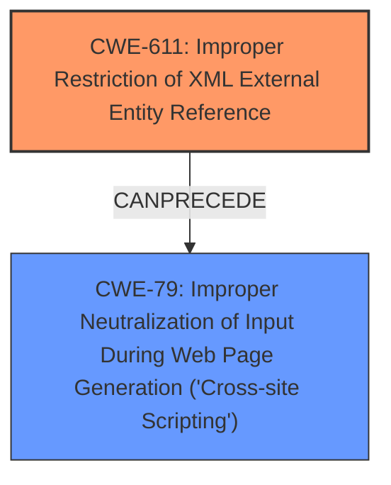

# Final Resolution for CVE-2020-25817

# Summary
| CWE ID | CWE Name | Confidence | CWE Abstraction Level | CWE Vulnerability Mapping Label | CWE-Vulnerability Mapping Notes |
|---|---|---|---|---|---|
| CWE-611 | Improper Restriction of XML External Entity Reference | 0.95 | Base | Primary | Allowed |
| CWE-79 | Improper Neutralization of Input During Web Page Generation ('Cross-site Scripting') | 0.75 | Base | Secondary | Allowed |

## Evidence and Confidence

*   **Confidence Score:** 0.93
*   **Evidence Strength:** HIGH

## Relationship Analysis
The primary relationship impacting the decision is the potential chain where **CWE-611** (**Improper Restriction of XML External Entity Reference**) can precede **CWE-79** (**Improper Neutralization of Input During Web Page Generation ('Cross-site Scripting')**). While **CWE-611** is the more direct and better-supported classification based on the vulnerability description (explicitly mentioning **XXE**), the possibility of **XSS** arising from the mishandling of data retrieved via **XXE** warrants including **CWE-79** as a secondary concern. The abstraction levels are appropriate, with both being Base level.

## Vulnerability Chain
The vulnerability chain starts with the **ROOTCAUSE** being **CWE-611** (**Improper Restriction of XML External Entity Reference**). An attacker exploits the `CSSContentParser` by injecting malicious XML containing external entity references. If the application then processes the data retrieved via **XXE** and renders it in a web page without proper neutralization, it can lead to **CWE-79** (**Improper Neutralization of Input During Web Page Generation ('Cross-site Scripting')**), resulting in **XSS**. The missing link is the specific code path that handles and renders the data retrieved via **XXE**. The vulnerability description mentions the XSS is introduced "on HTML output rendered through this custom code," implying that the **XXE** by itself does not cause the **XSS**.

## Summary of Analysis
The initial analysis and criticism are both well-reasoned. The decision to classify this as primarily **CWE-611** (**Improper Restriction of XML External Entity Reference**) is well-supported by the evidence: "SilverStripe through 4.6.0-rc1 has an **XXE Vulnerability** in CSSContentParser." This statement clearly indicates an **XXE** vulnerability. The inclusion of **CWE-79** (**Improper Neutralization of Input During Web Page Generation ('Cross-site Scripting')**) as a secondary concern is reasonable, as the vulnerability description explicitly mentions it "can lead to vulnerabilities such as **XSS** on HTML output rendered through this custom code." However, as the criticism pointed out, it's important to note that **XSS** is contingent on how the application handles the data retrieved via **XXE**. Both CWEs are at the Base level of abstraction, which is the preferred level. The graph relationships confirm the potential for **CWE-611** to precede **CWE-79**. The final decision is based on the evidence in the vulnerability description and the understanding of the relationships between the CWEs.