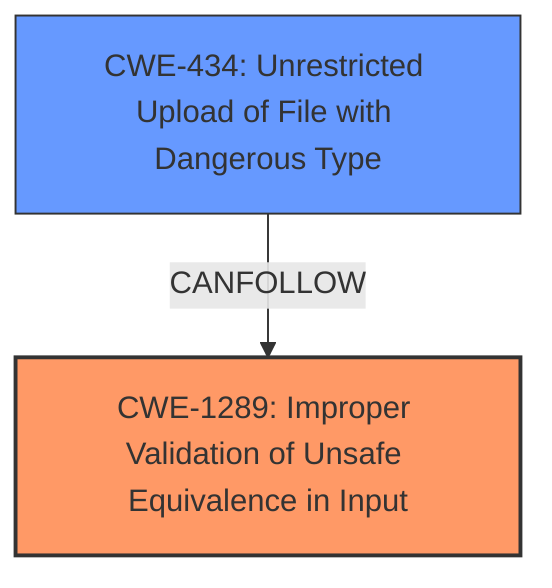

# Final Resolution for CVE-2020-26138

# Summary

| CWE ID    | CWE Name                                                                     | Confidence | CWE Abstraction Level | CWE Vulnerability Mapping Label | CWE-Vulnerability Mapping Notes |
| --------- | ---------------------------------------------------------------------------- | ---------- | --------------------- | ------------------------------- | ----------------------------- |
| CWE-1289 | Improper Validation of Unsafe Equivalence in Input                           | 0.95       | Base                  | Allowed                         | Primary CWE                   |
| CWE-434 | Unrestricted Upload of File with Dangerous Type | 0.70 | Base | Allowed | Secondary Candidate                               |

## Evidence and Confidence

*   **Confidence Score:** 0.90
*   **Evidence Strength:** HIGH

## Relationship Analysis
The primary relationship influencing the decision is the direct match between the **lack of validation** in the vulnerability description and the definition of CWE-1289. CWE-434 is a potential consequence, but the **root cause** is the **missing validation**. Both CWE-1289 and CWE-434 are at the Base level, which is preferred. There are no relevant parent-child or peer relationships to consider in this case.

## Vulnerability Chain
The vulnerability chain starts with the **root cause**: **CWE-1289 (Improper Validation of Unsafe Equivalence in Input)**. The Silverstripe application fails to properly validate file names containing square brackets (`[]`) during file upload. This **lack of validation** allows attackers to bypass file extension restrictions, leading to **CWE-434 (Unrestricted Upload of File with Dangerous Type)**. The final impact is the ability to upload and execute arbitrary files, potentially compromising the system.

## Summary of Analysis
The initial analysis and criticism both converge on CWE-1289 as the primary issue, but the criticism offers valuable refinements. The selection is heavily based on the provided evidence.

The vulnerability description states: "In SilverStripe through 4.6.0-rc1, a FormField with square brackets in the field name skips validation." This directly supports **CWE-1289 (Improper Validation of Unsafe Equivalence in Input)**, as it describes a scenario where input is used as a resource identifier (file name) without proper validation.

The graph relationships highlight that the **root cause** is the **improper validation (CWE-1289)**, which then allows the upload of dangerous file types **(CWE-434)**. The abstraction levels (Base for both) are optimal.

The decision to remove CWE-116 is based on the criticism's observation that the issue is not primarily about encoding or escaping, but about **failing to validate input**.

The final classification reflects the optimal level of specificity by focusing on the **root cause**: the **improper validation of file names (CWE-1289)**, rather than simply the ability to upload dangerous files (CWE-434).

The confidence score is increased to 0.90 due to the stronger justification and removal of the less relevant CWE-116.