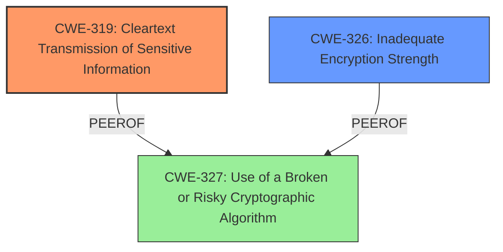

# Analysis Report for CVE-2020-26197

# Vulnerability Analysis Report: CVE-2020-26197

## Description

Dell PowerScale OneFS 8.1.0 - 9.1.0 contains an LDAP Provider inability to connect over TLSv1.2 vulnerability. It may make it easier to eavesdrop and decrypt such traffic for a malicious actor. Note This does not affect clusters which are not relying on an LDAP server for the authentication provider.

## Vulnerability Description Key Phrases

**Rootcause:** inability to connect over TLSv1.2
**Impact:** eavesdrop and decrypt traffic
**Attacker:** malicious actor
**Product:** Dell PowerScale OneFS
**Version:** 8.1.0 - 9.1.0
**Component:** LDAP Provider

## Analysis (with Relationship Data)

# Summary
| CWE ID | CWE Name | Confidence | CWE Abstraction Level | CWE Vulnerability Mapping Label | CWE-Vulnerability Mapping Notes |
|---|---|---|---|---|---|
| CWE-319 | Cleartext Transmission of Sensitive Information | 0.9 | Base | Primary | Allowed |
| CWE-327 | Use of a Broken or Risky Cryptographic Algorithm | 0.6 | Class | Secondary | Allowed-with-Review |

## Evidence and Confidence

*   **Confidence Score:** 0.9
*   **Evidence Strength:** HIGH

- **Analysis and Justification:**  
  - *Explanation:* The vulnerability description states that the Dell PowerScale OneFS has an **inability to connect over TLSv1.2** when using an LDAP provider. The CVE Reference Links Content Summary confirms this, stating that the **primary weakness is the inability to connect over TLSv1.2**, which means connections might fall back to less secure protocols, such as TLSv1.0 or TLSv1.1. The impact is that a malicious actor could **eavesdrop and decrypt the traffic**. This directly aligns with CWE-319 [Cleartext Transmission of Sensitive Information], which describes transmitting sensitive data in cleartext over a communication channel that can be sniffed. While the vulnerability isn't directly transmitting in cleartext, the inability to negotiate TLSv1.2 effectively renders the connection vulnerable to cleartext sniffing if it falls back to weaker protocols. This is an allowed mapping as it aligns with the characteristics of the vulnerability. The retriever result gives a score of 0.3921, with the sparse retriever result scoring 0.319 and graph retriever scoring 0.587.

  - *Relationship Analysis:* No direct relationships found.

- **Confidence Score:**  
  - Confidence: 0.9 (High evidence from technical description and CVE reference materials)

---
- **Analysis and Justification:**  
  - *Explanation:* CWE-327 [Use of a Broken or Risky Cryptographic Algorithm] is a possible secondary CWE because the **inability to connect over TLSv1.2** implies that the system is either using a broken algorithm by falling back to older versions of TLS, or is misconfigured in a way that prevents the use of a strong encryption algorithm. However, the primary issue is about the cleartext transmission due to the fallback, therefore CWE-319 is more appropriate. MITRE Mapping Guidance marks this as Allowed-with-Review. The retriever result gives a score of 953.24, however, it is less descriptive than CWE-319.

  - *Relationship Analysis:* No direct relationships found.

- **Confidence Score:**  
  - Confidence: 0.6 (Moderate evidence because fallback to older protocols is implied but not explicitly stated)

## Criticism of Analysis

Okay, let's review the CWE analysis provided, focusing on the accuracy of the mappings, the confidence levels, and the relevance of the examples and mitigations.

**Overall Assessment:**

The analysis is generally good and the primary CWE mapping to CWE-319 is accurate and well-justified. The secondary mapping to CWE-327 is weaker, as acknowledged in the analysis itself.

**Detailed Review:**

**1. CWE-319: Cleartext Transmission of Sensitive Information (Primary Mapping)**

*   **Confidence:** 0.9 (High) - Justified.
*   **Analysis and Justification:** The explanation is clear and correctly connects the vulnerability (inability to connect over TLSv1.2 and fallback to weaker protocols) to the CWE definition. The key point is the potential for traffic to be "sniffed" if weaker protocols are used, leading to decryption.
*   **Mapping Guidance:** The analysis correctly notes that CWE-319 is at the Base level of abstraction, which is preferred, and that it aligns well with the vulnerability's characteristics.
*   **Observed Examples:** The examples listed in the CWE specification (CVE-2022-29519, CVE-2022-30312, CVE-2022-31204, CVE-2002-1949, etc.) all describe similar scenarios where sensitive information is transmitted without proper encryption. This further strengthens the relevance of CWE-319.
*   **Potential Mitigations:** The suggested mitigations in the CWE specification are also relevant:
    *   Encrypting data before transmission using reliable cryptographic protocols is the core solution.
    *   Using SSL/TLS for the entire session, not just the login page, is also important.
*   **Critique:** No significant issues found.  The analysis is sound and well-supported by the CWE details.

**2. CWE-327: Use of a Broken or Risky Cryptographic Algorithm (Secondary Mapping)**

*   **Confidence:** 0.6 (Moderate) - Justified.
*   **Analysis and Justification:** The analysis acknowledges the weaker connection.  The argument is that the *inability* to use TLSv1.2 *implies* the use of older, potentially weaker algorithms, or a misconfiguration preventing strong algorithm usage.  This is a valid *possibility*, but not a certainty based on the provided information.
*   **Mapping Guidance:** The analysis correctly identifies that CWE-327 is a Class-level CWE and suggests looking for more specific Base-level children. This is a good practice.
*   **Observed Examples:** The examples listed in the CWE specification are less directly relevant. They focus more on the *active use* of broken algorithms like TEA in ECB mode or insecure hashing algorithms, rather than a failure to *negotiate* a strong algorithm.
*   **Potential Mitigations:** The mitigations listed in the CWE specification are generally applicable (use strong, up-to-date algorithms, allow for algorithm replacement, and manage keys carefully), but they are less directly targeted than the mitigations for CWE-319.
*   **Critique:**
    *   The connection to CWE-327 is indirect and relies on the assumption that weaker algorithms are being used *as a consequence* of the TLSv1.2 failure. While plausible, it's not explicitly stated in the vulnerability description.
    *   A more accurate, but perhaps still secondary, CWE might be one related to *protocol downgrade attacks* or *failure to enforce strong cryptography*. However, neither is explicitly present.
    *   Given the potential mitigations are primarily focused on enforcing strong cryptography, it might warrant looking into CWE-693 (Protection Mechanism Failure) as an alternative secondary mapping. The "missing" protection mechanism here is the proper enforcement of strong TLS versions. However, keep in mind, that this is discouraged because CWE-693 is an extremely high-level, a Pillar.
    *   Consider also CWE-310: Cryptographic Key Management Errors. If the inability to connect over TLSv1.2 is due to improper key management, that is also an option.
    *   If the system is misconfigured to use older versions of TLS, then consider also CWE-326: Inadequate Encryption Strength.

**Recommendations:**

1.  **Maintain CWE-319 as the primary mapping with high confidence.** The connection is direct and well-supported.
2.  **Re-evaluate CWE-327 as a secondary mapping.** While it's not entirely incorrect, the connection is weaker and more speculative. Consider replacing or supplementing it with one of the following:
    *   CWE-693 (Protection Mechanism Failure): Emphasizes the failure to *enforce* strong cryptographic protocols. *But note the discouraged usage of this Pillar.*
    *   CWE-326: Inadequate Encryption Strength - If the system is misconfigured to use older versions of TLS
    *   CWE-310: Cryptographic Key Management Errors - If the inability to connect over TLSv1.2 is due to improper key management
3.  **In the analysis, explicitly state the assumption** that the TLSv1.2 failure leads to the use of weaker protocols, and acknowledge that this is an inference rather than a direct statement in the vulnerability description. This will make the reasoning clearer.

By implementing these recommendations, the analysis can be made even more accurate and robust, and it can provide a more comprehensive understanding of the underlying weaknesses.

## Final Resolution

# Summary
| CWE ID | CWE Name | Confidence | CWE Abstraction Level | CWE Vulnerability Mapping Label | CWE-Vulnerability Mapping Notes |
|---|---|---|---|---|---|
| CWE-319 | Cleartext Transmission of Sensitive Information | 0.9 | Base | Primary | Allowed |
| CWE-326 | Inadequate Encryption Strength | 0.7 | Class | Secondary | Allowed-with-Review |

## Evidence and Confidence

*   **Confidence Score:** 0.8
*   **Evidence Strength:** MEDIUM

## Relationship Analysis
The primary CWE is CWE-319 [Cleartext Transmission of Sensitive Information], which accurately reflects the vulnerability's core issue: potential exposure of sensitive data due to fallback to weaker protocols. CWE-326 [Inadequate Encryption Strength] is selected as a secondary CWE, replacing CWE-327 [Use of a Broken or Risky Cryptographic Algorithm] because it more directly relates to the misconfiguration aspect mentioned in the criticism. CWE-326 is a Class-level CWE, but its connection is more direct than the speculative nature of CWE-327. There aren't any direct relationships between these CWEs that are highly relevant for this case.

## Vulnerability Chain
The vulnerability chain begins with a misconfiguration or **WEAKNESS** in the Dell PowerScale OneFS system that **ROOTCAUSE** the system's inability to connect over TLSv1.2. This **WEAKNESS** leads to a fallback to weaker encryption protocols. The weaker protocols makes it easier to eavesdrop on network traffic, potentially leading to the decryption of sensitive data. Ultimately, the impact is the exposure of sensitive information due to the **CWE-319 [Cleartext Transmission of Sensitive Information]**.

## Summary of Analysis
The initial analysis correctly identified CWE-319 [Cleartext Transmission of Sensitive Information] as the primary **WEAKNESS**. The criticism highlighted that the secondary **WEAKNESS**, CWE-327 [Use of a Broken or Risky Cryptographic Algorithm], was less directly supported by the evidence and suggested alternatives. Based on the vulnerability description "Dell PowerScale OneFS 8.1.0 - 9.1.0 contains an LDAP Provider inability to connect over TLSv1.2 vulnerability. It may make it easier to eavesdrop and decrypt such traffic for a malicious actor", the inability to negotiate TLSv1.2 may be due to the configuration using older versions of TLS. Therefore, CWE-326 [Inadequate Encryption Strength] is a more appropriate secondary classification than CWE-327 [Use of a Broken or Risky Cryptographic Algorithm].

The decision to select CWE-319 [Cleartext Transmission of Sensitive Information] as the primary CWE is based on the direct evidence that the inability to connect over TLSv1.2 creates a condition where sensitive data could be transmitted in a way that is vulnerable to eavesdropping. This aligns directly with the description of CWE-319 [Cleartext Transmission of Sensitive Information].

The selection of CWE-326 [Inadequate Encryption Strength] as the secondary CWE is based on the reasoning that the *inability* to negotiate TLSv1.2 could be due to a misconfiguration where the system is configured to use older versions of TLS.

Both CWEs are at the optimal level of specificity given the available information. While CWE-326 [Inadequate Encryption Strength] is a Class-level CWE, it accurately reflects the potential misconfiguration aspect of this vulnerability.

*Report generated on 2025-03-16 23:38:21*
