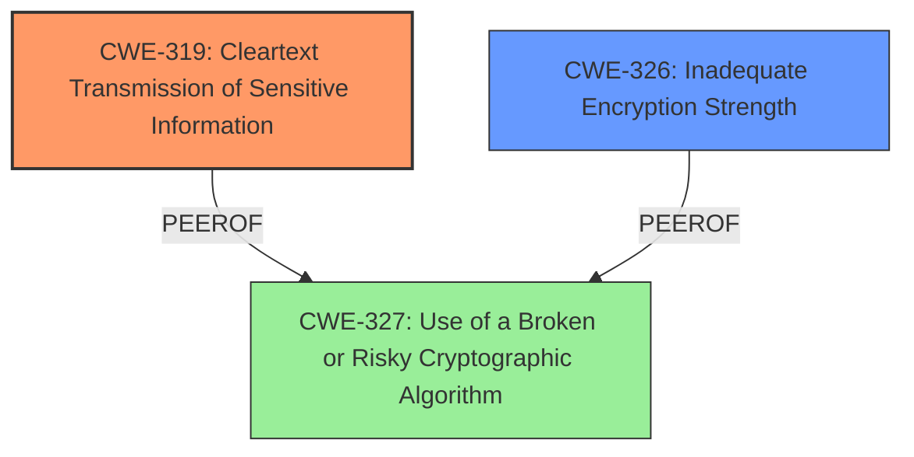

# Final Resolution for CVE-2020-26197

# Summary
| CWE ID | CWE Name | Confidence | CWE Abstraction Level | CWE Vulnerability Mapping Label | CWE-Vulnerability Mapping Notes |
|---|---|---|---|---|---|
| CWE-319 | Cleartext Transmission of Sensitive Information | 0.9 | Base | Primary | Allowed |
| CWE-326 | Inadequate Encryption Strength | 0.7 | Class | Secondary | Allowed-with-Review |

## Evidence and Confidence

*   **Confidence Score:** 0.8
*   **Evidence Strength:** MEDIUM

## Relationship Analysis
The primary CWE is CWE-319 [Cleartext Transmission of Sensitive Information], which accurately reflects the vulnerability's core issue: potential exposure of sensitive data due to fallback to weaker protocols. CWE-326 [Inadequate Encryption Strength] is selected as a secondary CWE, replacing CWE-327 [Use of a Broken or Risky Cryptographic Algorithm] because it more directly relates to the misconfiguration aspect mentioned in the criticism. CWE-326 is a Class-level CWE, but its connection is more direct than the speculative nature of CWE-327. There aren't any direct relationships between these CWEs that are highly relevant for this case.

## Vulnerability Chain
The vulnerability chain begins with a misconfiguration or **WEAKNESS** in the Dell PowerScale OneFS system that **ROOTCAUSE** the system's inability to connect over TLSv1.2. This **WEAKNESS** leads to a fallback to weaker encryption protocols. The weaker protocols makes it easier to eavesdrop on network traffic, potentially leading to the decryption of sensitive data. Ultimately, the impact is the exposure of sensitive information due to the **CWE-319 [Cleartext Transmission of Sensitive Information]**.

## Summary of Analysis
The initial analysis correctly identified CWE-319 [Cleartext Transmission of Sensitive Information] as the primary **WEAKNESS**. The criticism highlighted that the secondary **WEAKNESS**, CWE-327 [Use of a Broken or Risky Cryptographic Algorithm], was less directly supported by the evidence and suggested alternatives. Based on the vulnerability description "Dell PowerScale OneFS 8.1.0 - 9.1.0 contains an LDAP Provider inability to connect over TLSv1.2 vulnerability. It may make it easier to eavesdrop and decrypt such traffic for a malicious actor", the inability to negotiate TLSv1.2 may be due to the configuration using older versions of TLS. Therefore, CWE-326 [Inadequate Encryption Strength] is a more appropriate secondary classification than CWE-327 [Use of a Broken or Risky Cryptographic Algorithm].

The decision to select CWE-319 [Cleartext Transmission of Sensitive Information] as the primary CWE is based on the direct evidence that the inability to connect over TLSv1.2 creates a condition where sensitive data could be transmitted in a way that is vulnerable to eavesdropping. This aligns directly with the description of CWE-319 [Cleartext Transmission of Sensitive Information].

The selection of CWE-326 [Inadequate Encryption Strength] as the secondary CWE is based on the reasoning that the *inability* to negotiate TLSv1.2 could be due to a misconfiguration where the system is configured to use older versions of TLS.

Both CWEs are at the optimal level of specificity given the available information. While CWE-326 [Inadequate Encryption Strength] is a Class-level CWE, it accurately reflects the potential misconfiguration aspect of this vulnerability.