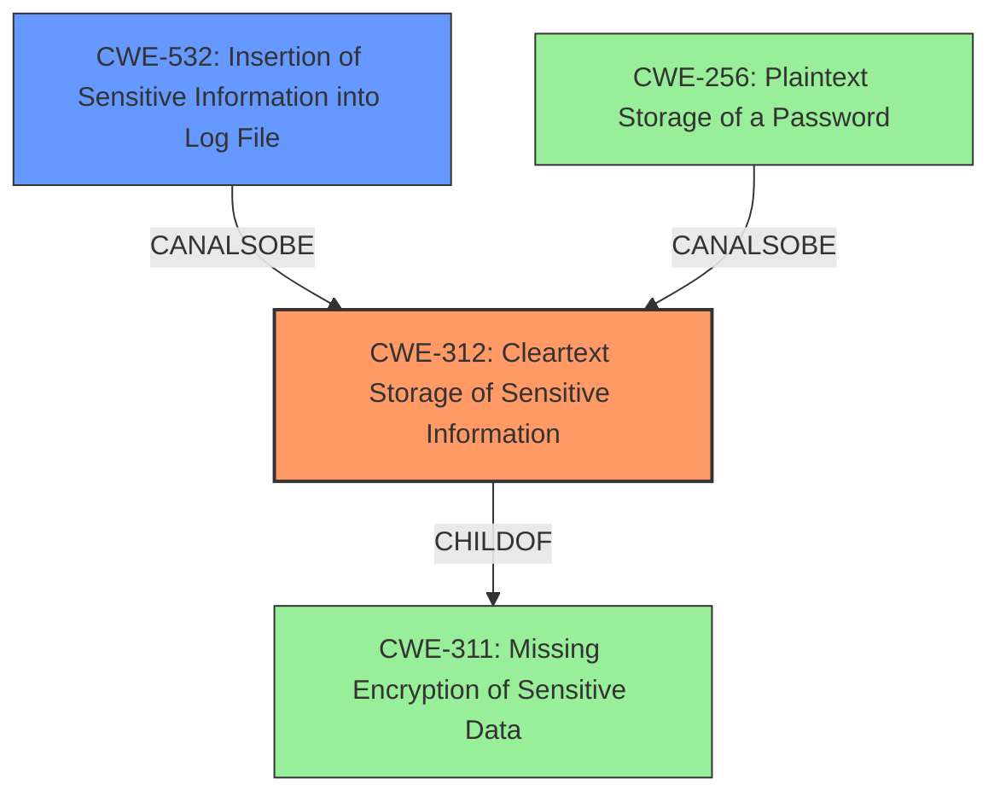

# Analysis Report for CVE-2020-26199

# Vulnerability Analysis Report: CVE-2020-26199

## Description

Dell EMC Unity, Unity XT, and UnityVSA versions prior to 5.0.4.0.5.012 contain a plain-text password storage vulnerability. A user credentials (including the Unisphere admin privilege user) password is stored in a plain text in multiple log files. A local authenticated attacker with access to the log files may use the exposed password to gain access with the privileges of the compromised user.

## Vulnerability Description Key Phrases

**Weakness:** plain-text password storage
**Attacker:** local authenticated attacker
**Product:** ['Dell EMC Unity', 'Unity XT', 'UnityVSA']
**Version:** prior to 5.0.4.0.5.012

## Analysis (with Relationship Data)

# Summary
| CWE ID  | CWE Name                                        | Confidence | CWE Abstraction Level | CWE Vulnerability Mapping Label | CWE-Vulnerability Mapping Notes |
| :-------- | :---------------------------------------------- | :--------- | :-------------------- | :------------------------------ | :------------------------------ |
| CWE-312 | Cleartext Storage of Sensitive Information | 0.95       | Base                  | Allowed                        | Primary CWE                       |
| CWE-532 | Insertion of Sensitive Information into Log File | 0.75       | Base                  | Allowed                         | Secondary Candidate             |

## Evidence and Confidence

*   **Confidence Score:** 0.90
*   **Evidence Strength:** HIGH

- **Analysis and Justification:**  
  - *Explanation:* The vulnerability description explicitly states a **"plain-text password storage"** vulnerability, where user credentials, including the Unisphere admin password, are stored in plain text in multiple log files. This directly aligns with CWE-312 (Cleartext Storage of Sensitive Information), which describes a product storing sensitive information in cleartext within a resource accessible to another control sphere. A local attacker with access to log files can exploit this to gain unauthorized access. The CWE for similar CVE Descriptions also lists CWE-312 as the Primary CWE Match and Top CWE. The Retriever results lists CWE-312 with a good score and usage is "Allowed".
  
  - *Relationship Analysis:* CWE-312 is a Base level CWE, which is appropriate. It is a child of CWE-311 (Missing Encryption of Sensitive Data), but CWE-312 is more specific because it highlights storage in cleartext, rather than just the absence of encryption.

- **Confidence Score:**  
  - Confidence: 0.95 (High confidence due to direct evidence and mapping guidance)

---
- **Analysis and Justification:**  
  - *Explanation:* The passwords being stored in plain text are specifically located in log files. This aligns with CWE-532 (Insertion of Sensitive Information into Log File). This CWE describes the product writing sensitive information to a log file. The "CVE Reference Links Content Summary" section supports this by stating "User credentials, including the Unisphere admin privilege user password, are stored in plain text within multiple log files". The CWE for similar CVE Descriptions also lists CWE-532 as a Top CWE. The Retriever results lists CWE-532 with a good score and usage is "Allowed".
  
  - *Relationship Analysis:* CWE-532 is a Base level CWE, which is appropriate.

- **Confidence Score:**  
  - Confidence: 0.75 (High confidence due to direct evidence and mapping guidance)

---

## Criticism of Analysis

Okay, here's a review of the provided CWE analysis, incorporating the full CWE specifications:

## Overall Assessment

The analysis is generally good and well-reasoned. The primary CWE mapping to **CWE-312 (Cleartext Storage of Sensitive Information)** and the secondary mapping to **CWE-532 (Insertion of Sensitive Information into Log File)** are both appropriate and well-justified. The confidence levels are also reasonable. The explanations clearly connect the vulnerability description to the CWE definitions.

## Detailed Review

### 1. CWE-312: Cleartext Storage of Sensitive Information (Primary)

*   **Confidence:** The assigned confidence of 0.95 is justified. The vulnerability description explicitly mentions "plain-text password storage," which directly aligns with CWE-312's definition: "The product stores sensitive information in cleartext within a resource that might be accessible to another control sphere."

*   **Abstraction Level:** The Base abstraction level is appropriate.

*   **Justification:** The justification is strong.  It accurately describes the alignment between the vulnerability and the CWE-312 description. The mention of the local attacker accessing log files to exploit the weakness further strengthens this mapping.

*   **Relationship Analysis:** The explanation that CWE-312 is a child of CWE-311 and a more specific case is correct.

*   **Mitigations:** It is good to keep the mitigations for CWE-312 in mind. As listed in the specification:
    *   *Mitigation 1:* Implementation, System Configuration, Operation - When storing data in the cloud (e.g., S3 buckets, Azure blobs, Google Cloud Storage, etc.), use the provider's controls to encrypt the data at rest. [REF-1297] [REF-1299] [REF-1301]

### 2. CWE-532: Insertion of Sensitive Information into Log File (Secondary)

*   **Confidence:** The assigned confidence of 0.75 is appropriate. While the core issue is cleartext storage, the *location* of the storage within log files is a significant factor.

*   **Abstraction Level:** The Base abstraction level is correct.

*   **Justification:** The justification is well-presented. The connection to the "CVE Reference Links Content Summary" is good evidence.

*   **Relationship Analysis:**  Mentioning it is a Base level CWE is appropriate.

*   **Mitigations:** As listed in the specification:
    *   *Mitigation 1:* Architecture and Design, Implementation - Consider seriously the sensitivity of the information written into log files. Do not write secrets into the log files.
    *   *Mitigation 2:* Distribution - Remove debug log files before deploying the application into production.
    *   *Mitigation 3:* Operation - Protect log files against unauthorized read/write.

### Potential Improvements/Considerations:
*   **CWE-256:** The retriever results list **CWE-256 (Plaintext Storage of a Password)** with a high score. It could be argued that CWE-256 is a more precise mapping than CWE-312 because it specifically calls out passwords.  However, CWE-312 is sufficient and more general, as it could apply to other sensitive information beyond passwords. I think the selection of CWE-312 is preferable here, because the weakness could apply to a wider range of sensitive data.
*   **CWE-313/314:** Mention the possibility of even more specific CWE's. CWE-313 (Cleartext Storage in a File or on Disk) or CWE-314 (Cleartext Storage in the Registry) could also apply.  Since the password is in a log file, CWE-313 is more appropriate than CWE-314. These are variant level descriptions, so CWE-312 is better because it is a more general Base level weakness.

## Conclusion

The analysis is sound and well-supported by the evidence and CWE specifications. The choice of CWE-312 and CWE-532 is well-justified, and the confidence levels are appropriate.

## Final Resolution

# Summary
| CWE ID  | CWE Name                                        | Confidence | CWE Abstraction Level | CWE Vulnerability Mapping Label | CWE-Vulnerability Mapping Notes |
| :-------- | :---------------------------------------------- | :--------- | :-------------------- | :------------------------------ | :------------------------------ |
| **CWE-312** | **Cleartext Storage of Sensitive Information** | 0.95       | Base                  | Allowed                        | Primary CWE                       |
| **CWE-532** | **Insertion of Sensitive Information into Log File** | 0.75       | Base                  | Allowed                         | Secondary Candidate             |

## Evidence and Confidence

*   **Confidence Score:** 0.95
*   **Evidence Strength:** HIGH

## Relationship Analysis
The decision was influenced by the hierarchical relationship between **CWE-312 (Cleartext Storage of Sensitive Information)** and its parent, **CWE-311 (Missing Encryption of Sensitive Data)**, favoring **CWE-312** for its increased specificity. While **CWE-256 (Plaintext Storage of a Password)** was considered due to its focus on passwords, **CWE-312** was deemed more appropriate as the vulnerability may involve other sensitive information beyond just passwords. The chain relationship wasn't applicable here, as we're focusing on the immediate cause. **CWE-532 (Insertion of Sensitive Information into Log File)** was chosen as a secondary CWE because it specifies the location of the **WEAKNESS**, adding context to the vulnerability. All selected CWEs are at the Base level, ensuring appropriate granularity.

## Vulnerability Chain
The chain starts with the **ROOTCAUSE**, a failure to encrypt sensitive information. This leads to **CWE-312 (Cleartext Storage of Sensitive Information)**, where user credentials are stored in plain text. The credentials being stored in log files is represented by **CWE-532 (Insertion of Sensitive Information into Log File)**. This allows a local authenticated attacker with access to these log files to gain unauthorized access, culminating in a compromise of the system.

## Summary of Analysis
The initial analysis and the criticism both identified **CWE-312 (Cleartext Storage of Sensitive Information)** as the primary **WEAKNESS**, which aligns perfectly with the vulnerability description stating "plain-text password storage". The evidence is strong, as quoted from the vulnerability description. The graph relationships confirm the appropriateness of selecting the Base level **CWE-312** over its parent **CWE-311 (Missing Encryption of Sensitive Data)** or potential variants like **CWE-256 (Plaintext Storage of a Password)**, allowing for optimal specificity. The inclusion of **CWE-532 (Insertion of Sensitive Information into Log File)** as a secondary CWE adds context by specifying the location of the **WEAKNESS**. The selected CWEs are at the optimal level of specificity because they accurately reflect the vulnerability while avoiding overly narrow variant classifications. The high confidence scores are justified due to the direct match between the vulnerability description and the CWE definitions, as well as the MITRE mapping guidance allowing the use of these CWEs.

*Report generated on 2025-03-16 22:45:04*
