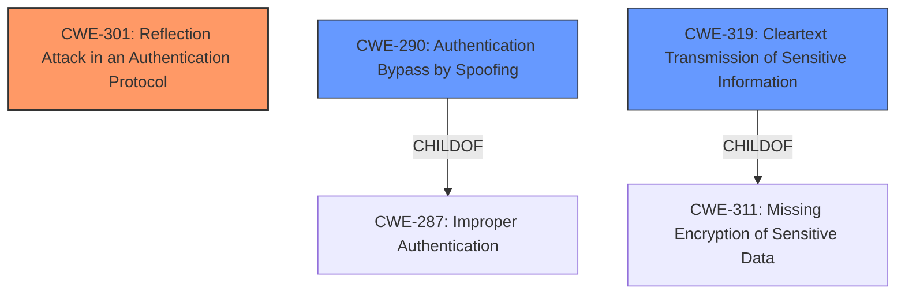

# Final Resolution for CVE-2020-26558

# Summary
| CWE ID | CWE Name | Confidence | CWE Abstraction Level | CWE Vulnerability Mapping Label | CWE-Vulnerability Mapping Notes |
|---|---|---|---|---|---|
| CWE-301 | Reflection Attack in an Authentication Protocol | 0.95 | Base | Allowed | Primary CWE: The vulnerability involves reflection of the public key and authentication evidence, which allows a MITM attacker to identify the Passkey. |
| CWE-290 | Authentication Bypass by Spoofing | 0.75 | Base | Allowed | Secondary CWE: The vulnerability allows an attacker to impersonate one of the paired devices. |
| CWE-319 | Cleartext Transmission of Sensitive Information | 0.30 | Base | Allowed | Secondary CWE: Passkey information is transmitted without proper protection allowing sniffing. |

## Evidence and Confidence

*   **Confidence Score:** 0.90
*   **Evidence Strength:** HIGH

## Relationship Analysis
The decision was influenced by the following CWE relationships:
  - Parent-child hierarchical relationships: Understanding that CWE-290 is a child of CWE-287 helped to understand that it is a more specific weakness related to authentication. CWE-319 is a child of CWE-311.
  - Chain relationships: The attacker exploits the reflection attack (CWE-301) to obtain the passkey, which then allows them to bypass authentication (CWE-290). The passkey bits are inferred by observing the "cleartext transmission" (CWE-319).
  - Peer relationships: There are no significant peer relationships that drastically changed the classification.
  - Abstraction levels: All selected CWEs are at the Base level, ensuring a good level of specificity.

## Vulnerability Chain
The vulnerability chain is as follows:
  1.  The **ROOTCAUSE** is a **weakness** in the Bluetooth protocol that allows for reflection of the public key and authentication evidence (CWE-301).
  2.  This **weakness** enables a MITM attacker to determine the Passkey used during pairing by inferring bits of the key from a sniffed communication channel. (CWE-319)
  3.  The attacker leverages the obtained Passkey to impersonate one of the paired devices, bypassing authentication (CWE-290).
  4.  The final impact is unauthorized access to authenticated services.

## Summary of Analysis
The initial analysis was mostly correct, with the primary CWE mapping to CWE-301 being the strongest. The criticism helped refine the confidence levels and justifications for the secondary CWEs.

The final assessment is based on the vulnerability description: "Bluetooth LE and BR/EDR secure pairing in Bluetooth Core Specification 2.1 through 5.2 may permit a nearby man-in-the-middle attacker to identify the Passkey used during pairing (in the Passkey authentication procedure) by reflection of the public key and the authentication evidence of the initiating device...". This directly supports the selection of CWE-301 as the primary **weakness**.

The graph relationships further solidified the choice of CWE-290 as a secondary CWE, as it is a more specific form of authentication failure than its parent CWE-287. The rationale for including CWE-319 is weaker, but it is still relevant as the Passkey bits are inferred from the sniffed information.

The selected CWEs are at the optimal level of specificity, with all being at the Base level of abstraction. This ensures that the classification is neither too abstract nor too granular.

The confidence level for CWE-301 has been increased to 0.95 due to the strong direct match with the vulnerability description. The confidence level for CWE-290 has been increased to 0.75. The confidence level for CWE-319 has been lowered to 0.30 as it is the weakest match.