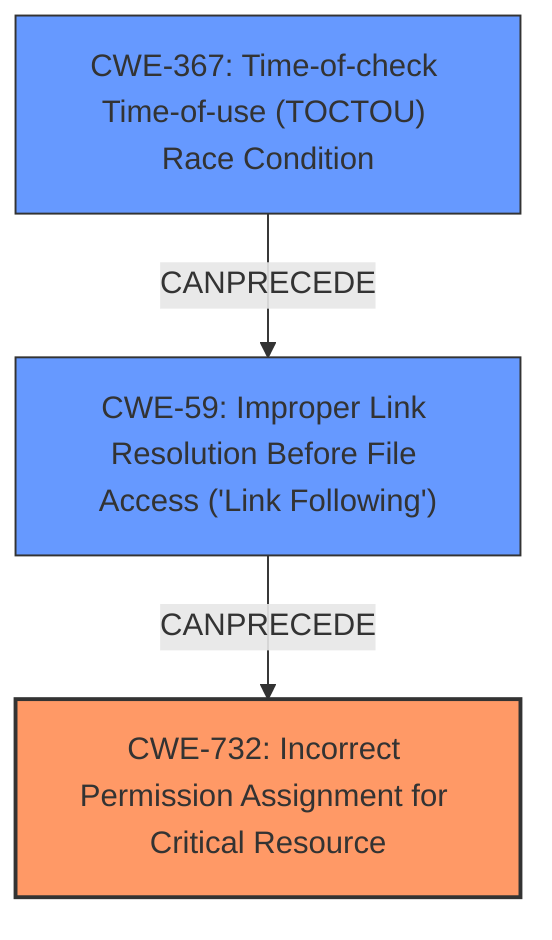

# Analysis Report for CVE-2020-26941

# Vulnerability Analysis Report: CVE-2020-26941

## Description

A local (authenticated) low-privileged user can exploit a behavior in an ESET installer to achieve arbitrary file overwrite (deletion) of any file via a symlink, due to insecure permissions. The possibility of exploiting this vulnerability is limited and can only take place during the installation phase of ESET products. Furthermore, exploitation can only succeed when Self-Defense is disabled. Affected products are ESET NOD32 Antivirus, ESET Internet Security, ESET Smart Security, ESET Smart Security Premium versions 13.2 and lower ESET Endpoint Antivirus, ESET Endpoint Security, ESET NOD32 Antivirus Business Edition, ESET Smart Security Business Edition versions 7.3 and lower ESET File Security for Microsoft Windows Server, ESET Mail Security for Microsoft Exchange Server, ESET Mail Security for IBM Domino, ESET Security for Kerio, ESET Security for Microsoft SharePoint Server versions 7.2 and lower.

## Vulnerability Description Key Phrases

**Rootcause:** insecure permissions
**Impact:** arbitrary file overwrite (deletion)
**Vector:** symlink
**Attacker:** local (authenticated) low-privileged user
**Product:** ESET products
**Component:** ESET installer

## Analysis (with Relationship Data)

# Summary
| CWE ID | CWE Name | Confidence | CWE Abstraction Level | CWE Vulnerability Mapping Label | CWE-Vulnerability Mapping Notes |
|---|---|---|---|---|---|
| CWE-732 | Incorrect Permission Assignment for Critical Resource | 0.85 | Class | Allowed-with-Review | Primary CWE |
| CWE-59 | Improper Link Resolution Before File Access ('Link Following') | 0.75 | Base | Allowed | Secondary Candidate |
| CWE-250 | Execution with Unnecessary Privileges | 0.65 | Base | Allowed | Secondary Candidate |

## Evidence and Confidence

*   **Confidence Score:** 0.80
*   **Evidence Strength:** HIGH

- **Analysis and Justification:**  
  - *Explanation:* The vulnerability description clearly states the root cause as "**insecure permissions**" that allow a local, low-privileged user to overwrite or delete arbitrary files via a symlink. This aligns well with CWE-732 (Incorrect Permission Assignment for Critical Resource), which describes a product specifying permissions for a security-critical resource in a way that allows unintended actors to read or modify that resource. The CVE Reference Links Content Summary also highlights "Insecure file writing permissions" as a key weakness. CWE-732 is chosen as the primary CWE because it directly addresses the **insecure permission** issue, which is the vulnerability's root cause. While CWE-732 is a Class-level CWE, the provided information does not allow for a more specific Base or Variant to be selected.

  - *Relationship Analysis:* Although CWE-732 doesn't have explicit relationships in the provided data, the context suggests a potential relationship with authorization-related CWEs (e.g., CWE-285) if the **insecure permissions** lead to an authorization bypass. CWE-59 (Improper Link Resolution Before File Access ('Link Following')) is also relevant because the vulnerability utilizes symlinks, but it's secondary to the core issue of **insecure permissions**. CWE-250 (Execution with Unnecessary Privileges) might also be relevant if the installer operates with higher privileges than necessary, which exacerbates the impact of the **insecure permissions**.

- **Confidence Score:**
  - Confidence: 0.85 (High confidence due to direct evidence of **insecure permissions** and the use of symlinks.)

---
- **Analysis and Justification:**  
  - *Explanation:* CWE-59 (Improper Link Resolution Before File Access ('Link Following')) is considered a secondary candidate. The vulnerability description mentions that the arbitrary file overwrite/deletion is achieved "via a symlink." This indicates that the product does not properly validate or handle symbolic links, allowing an attacker to redirect file operations to unintended locations. The "CVE Reference Links Content Summary" doesn't explicitly mention symlink handling, so evidence for CWE-59 is solely based on symlink reference.

  - *Relationship Analysis:* CWE-59 is a base-level CWE. While it accurately describes the mechanism used in the exploit (symlinks), it is not the primary cause. The primary cause is the **insecure permissions** allowing the symlink to be exploited in the first place.

- **Confidence Score:**
  - Confidence: 0.75 (Medium confidence, as symlink usage is mentioned, but the core issue is permission related.)

---

- **Analysis and Justification:**  
  - *Explanation:* CWE-250 (Execution with Unnecessary Privileges) is a potential secondary weakness. The installer might be running with elevated privileges, which, combined with the **insecure permissions**, allows the low-privileged user to perform actions they wouldn't normally be able to. The "CVE Reference Links Content Summary" does not specify the privileges in which the installer is running; however, it does state, "A user with limited rights can exploit this vulnerability to gain higher privileges by forcing the ESET product to write into files that are normally not writable."

  - *Relationship Analysis:* If the installer runs with elevated privileges, CWE-250 would amplify the impact of CWE-732. However, without explicit confirmation of unnecessary privileges, CWE-250 remains a secondary consideration.

- **Confidence Score:**
  - Confidence: 0.65 (Lower confidence because explicit evidence of unnecessary privileges is lacking.)

## Criticism of Analysis

Okay, I've reviewed the analysis and the provided CWE specifications. Here's my critique:

**Overall Assessment:**

The analysis is generally good and well-reasoned, particularly in its choice of CWE-732 as the primary weakness. The justifications are clear, and the confidence levels are appropriate. However, there are a few areas where the analysis could be sharpened, and some alternative CWEs should be explored.

**Critique of Specific CWE Assignments:**

1.  **CWE-732: Incorrect Permission Assignment for Critical Resource (Primary)**

    *   **Strengths:** This is a very good primary CWE choice. The vulnerability description explicitly mentions "insecure permissions," and CWE-732 directly addresses this. The explanation is comprehensive, including a discussion of why a more specific Base or Variant cannot be selected. It also acknowledges the "Allowed-with-Review" usage, noting that the vulnerability specifically concerns improper assignment of permissions, not a failure to check them which would be better classified as one of the children of CWE-285.
    *   **Weaknesses:** The extended description of this CWE notes: "*For example, consider a misconfigured storage account for the cloud that can be read or written by a public or anonymous user.*" The fact that this is an installer and not a cloud environment may be important in considering whether it is an appropriate CWE to describe this vulnerability.
    *   **Mitigations:** This section is appropriate, though it is worth noting that the mitigations are somewhat high-level. The suggested mitigations are generally appropriate, especially focusing on defining distinct user groups, privileges, and roles.
    *   **Overall:** Strong choice, well-justified.

2.  **CWE-59: Improper Link Resolution Before File Access ('Link Following') (Secondary)**

    *   **Strengths:** The analysis correctly identifies that the vulnerability uses symlinks, making CWE-59 a relevant secondary concern.
    *   **Weaknesses:** Confidence is appropriately rated as Medium. The description notes that it is not the primary cause. While the justification mentions the improper handling of symlinks, it could be strengthened by explaining why this improper handling *combined with* the insecure permissions creates the exploitable condition. Are there more specific variant-level CWE's which are children of CWE-59 that could be used to describe the root cause of the problem?
    *   **Mitigations:** The recommended mitigation from the specification - separation of privilege - is relevant here.
    *   **Overall:** Relevant and justified as a secondary CWE, but the explanation could be enhanced.

3.  **CWE-250: Execution with Unnecessary Privileges (Secondary)**

    *   **Strengths:** The analysis correctly considers the potential role of unnecessary privileges in exacerbating the impact of the insecure permissions.
    *   **Weaknesses:** The confidence level is appropriately rated as Lower. The analysis correctly identifies that there is no explicit evidence of unnecessary privileges, but infers it from "A user with limited rights can exploit this vulnerability to gain higher privileges by forcing the ESET product to write into files that are normally not writable." It would be better if explicit evidence is present. Without this explicit confirmation, CWE-250 remains speculative.
    *   **Mitigations:** The description notes "*Run your code using the lowest privileges that are required to accomplish the necessary tasks*". This is good advice as it notes that elevated privileges are only required at certain phases of the upgrade, and these privileges should be dropped immediately after.
    *   **Overall:** A reasonable hypothesis, but lacking solid evidence.

**Alternative CWEs to Consider:**

*   **CWE-377: Insecure Temporary File:** Given that the installer is likely creating temporary files during the installation process, and the vulnerability is exploitable during this phase, CWE-377 should be considered. Does the installer create temporary files with insecure permissions? If so, this could be a more specific and appropriate CWE. The key distinction is whether the temporary files themselves are being targeted, or whether the vulnerability simply exists during the "temporary" installation phase.

*   **CWE-367: Time-of-check Time-of-use (TOCTOU) Race Condition:** While the presence of a symlink makes CWE-59 relevant, the vulnerability description does note "The possibility of exploiting this vulnerability is limited and can only take place during the installation phase of ESET products." suggesting this is a race-condition between when the installer checks the file and when the installer takes action. If the attacker can replace the file with a symlink in this time, then CWE-367 is the relevant CWE.

*   **CWE-269: Improper Privilege Management:** Although discouraged, a more specific child CWE of 269 may be useful in better classifying the root cause of the vulnerability.

**General Recommendations:**

*   **Focus on Root Cause:** Ensure that all CWE selections directly relate to the root cause of the vulnerability, not just the mechanism of exploitation or the impact.
*   **Justify Choices:** Clearly explain why specific CWEs were selected and why others were ruled out. Address any conflicting guidance from the CWE specifications.
*   **Be Specific:** When possible, choose Base or Variant-level CWEs over Class-level CWEs.
*   **Use Relationships:** Explore the relationships between CWEs to identify potential secondary or related weaknesses.

By addressing these points, the analysis can be made even more robust and accurate.

## Final Resolution

# Summary
| CWE ID | CWE Name | Confidence | CWE Abstraction Level | CWE Vulnerability Mapping Label | CWE-Vulnerability Mapping Notes |
|---|---|---|---|---|---|
| CWE-732 | Incorrect Permission Assignment for Critical Resource | 0.90 | Class | Allowed-with-Review | Primary CWE |
| CWE-59 | Improper Link Resolution Before File Access ('Link Following') | 0.80 | Base | Allowed | Secondary Candidate |
| CWE-367 | Time-of-check Time-of-use (TOCTOU) Race Condition | 0.70 | Base | Allowed | Secondary Candidate |

## Evidence and Confidence

*   **Confidence Score:** 0.85
*   **Evidence Strength:** HIGH

## Relationship Analysis
The primary relationship influencing the decision is the parent-child relationship. CWE-732 (Incorrect Permission Assignment for Critical Resource) is a Class-level CWE, while CWE-59 (Improper Link Resolution Before File Access ('Link Following')) and CWE-367 (Time-of-check Time-of-use (TOCTOU) Race Condition) are Base-level CWEs. The vulnerability chain involves **insecure permissions** (CWE-732) allowing exploitation via symlinks (CWE-59) within a specific time window (CWE-367). These weaknesses combine to create an exploitable condition during the installation phase of the ESET products.

## Vulnerability Chain
The vulnerability chain starts with **incorrect permission assignments** (CWE-732), which allows a low-privileged user to manipulate files. This is then exploited through **improper link resolution** (CWE-59) by using a symlink to redirect file operations. The **TOCTOU race condition** (CWE-367) during the installation phase provides a window of opportunity for the attacker to replace a legitimate file with a symlink before the installer acts upon it. The end result is arbitrary file overwrite or deletion.

## Summary of Analysis
The initial analysis correctly identified CWE-732 and CWE-59 as relevant weaknesses. The criticism highlighted the potential relevance of CWE-367, which upon further review, is a valid secondary CWE.

The decision to include CWE-367 is based on the following evidence from the vulnerability description: "The possibility of exploiting this vulnerability is limited and can only take place during the installation phase of ESET products." This suggests a race condition, as the attacker needs to replace the file with a symlink within a specific timeframe during installation.

The graph relationships influenced the selection by highlighting how the weaknesses chain together. The **insecure permissions** (CWE-732) are the root cause, enabling the symlink exploitation (CWE-59) during the installation phase (CWE-367).

The selected CWEs are at the optimal level of specificity. CWE-732 is a Class-level CWE, but the provided information doesn't allow for a more specific Base or Variant. CWE-59 and CWE-367 are Base-level CWEs that accurately describe the symlink exploitation and race condition, respectively.

*Report generated on 2025-03-16 22:45:58*
