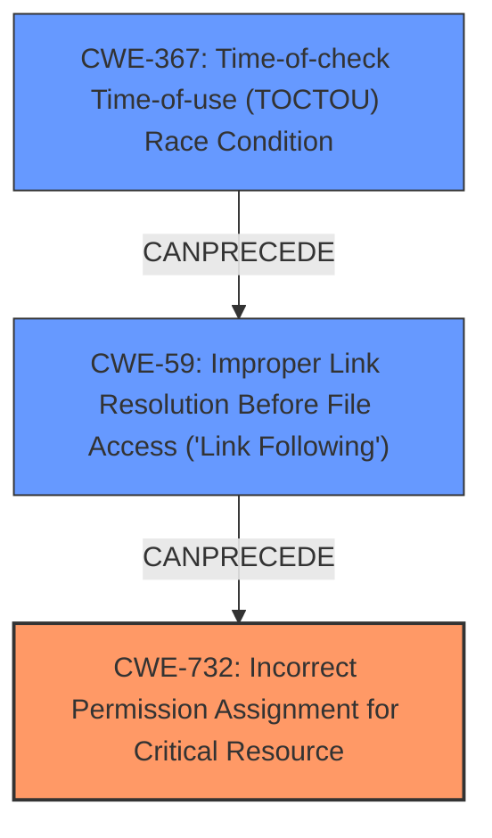

# Final Resolution for CVE-2020-26941

# Summary
| CWE ID | CWE Name | Confidence | CWE Abstraction Level | CWE Vulnerability Mapping Label | CWE-Vulnerability Mapping Notes |
|---|---|---|---|---|---|
| CWE-732 | Incorrect Permission Assignment for Critical Resource | 0.90 | Class | Allowed-with-Review | Primary CWE |
| CWE-59 | Improper Link Resolution Before File Access ('Link Following') | 0.80 | Base | Allowed | Secondary Candidate |
| CWE-367 | Time-of-check Time-of-use (TOCTOU) Race Condition | 0.70 | Base | Allowed | Secondary Candidate |

## Evidence and Confidence

*   **Confidence Score:** 0.85
*   **Evidence Strength:** HIGH

## Relationship Analysis
The primary relationship influencing the decision is the parent-child relationship. CWE-732 (Incorrect Permission Assignment for Critical Resource) is a Class-level CWE, while CWE-59 (Improper Link Resolution Before File Access ('Link Following')) and CWE-367 (Time-of-check Time-of-use (TOCTOU) Race Condition) are Base-level CWEs. The vulnerability chain involves **insecure permissions** (CWE-732) allowing exploitation via symlinks (CWE-59) within a specific time window (CWE-367). These weaknesses combine to create an exploitable condition during the installation phase of the ESET products.

## Vulnerability Chain
The vulnerability chain starts with **incorrect permission assignments** (CWE-732), which allows a low-privileged user to manipulate files. This is then exploited through **improper link resolution** (CWE-59) by using a symlink to redirect file operations. The **TOCTOU race condition** (CWE-367) during the installation phase provides a window of opportunity for the attacker to replace a legitimate file with a symlink before the installer acts upon it. The end result is arbitrary file overwrite or deletion.

## Summary of Analysis
The initial analysis correctly identified CWE-732 and CWE-59 as relevant weaknesses. The criticism highlighted the potential relevance of CWE-367, which upon further review, is a valid secondary CWE.

The decision to include CWE-367 is based on the following evidence from the vulnerability description: "The possibility of exploiting this vulnerability is limited and can only take place during the installation phase of ESET products." This suggests a race condition, as the attacker needs to replace the file with a symlink within a specific timeframe during installation.

The graph relationships influenced the selection by highlighting how the weaknesses chain together. The **insecure permissions** (CWE-732) are the root cause, enabling the symlink exploitation (CWE-59) during the installation phase (CWE-367).

The selected CWEs are at the optimal level of specificity. CWE-732 is a Class-level CWE, but the provided information doesn't allow for a more specific Base or Variant. CWE-59 and CWE-367 are Base-level CWEs that accurately describe the symlink exploitation and race condition, respectively.