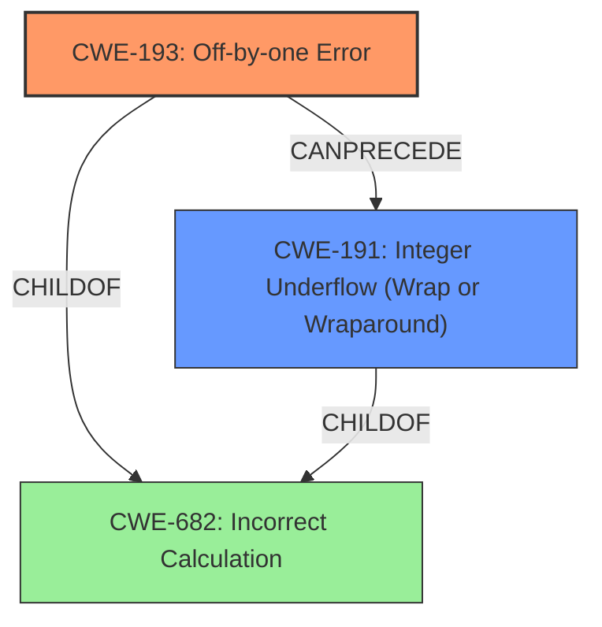

# Final Resolution for CVE-2020-27171

# Summary
| CWE ID | CWE Name | Confidence | CWE Abstraction Level | CWE Vulnerability Mapping Label | CWE-Vulnerability Mapping Notes |
|---|---|---|---|---|---|
| CWE-193 | Off-by-one Error | 0.95 | Base | Primary | Allowed |
| CWE-191 | Integer Underflow (Wrap or Wraparound) | 0.8 | Base | Secondary Candidate | Allowed |

## Evidence and Confidence

*   **Confidence Score:** 0.9
*   **Evidence Strength:** HIGH

## Relationship Analysis
The primary relationship identified is the *CanPrecede* relationship where **CWE-193 (Off-by-one Error)** leads to **CWE-191 (Integer Underflow (Wrap or Wraparound))**. The analysis considered the potential inclusion of **CWE-682 (Incorrect Calculation)**, but it was deemed too abstract.

## Vulnerability Chain
The vulnerability chain starts with an **off-by-one error (CWE-193)** in the kernel code, which leads to an **integer underflow (CWE-191)**. This underflow results in incorrect mask generation and out-of-bounds speculation on pointer arithmetic, ultimately allowing for side-channel attacks that expose sensitive kernel memory.

## Summary of Analysis
The initial analysis and criticism are both accurate and well-justified. The primary **WEAKNESS** is clearly the **CWE-193 (Off-by-one Error)**, directly stated in the vulnerability description: "kernel/bpf/verifier.c has an **off-by-one error** (with a resultant integer underflow)...". The subsequent **CWE-191 (Integer Underflow (Wrap or Wraparound))** is a direct consequence of this **ROOTCAUSE**. The graph relationships reinforce this understanding, showing how the off-by-one error precedes the integer underflow. Both CWEs are at the optimal Base level of specificity. The high confidence score is supported by the explicit mention of these errors in the vulnerability description.