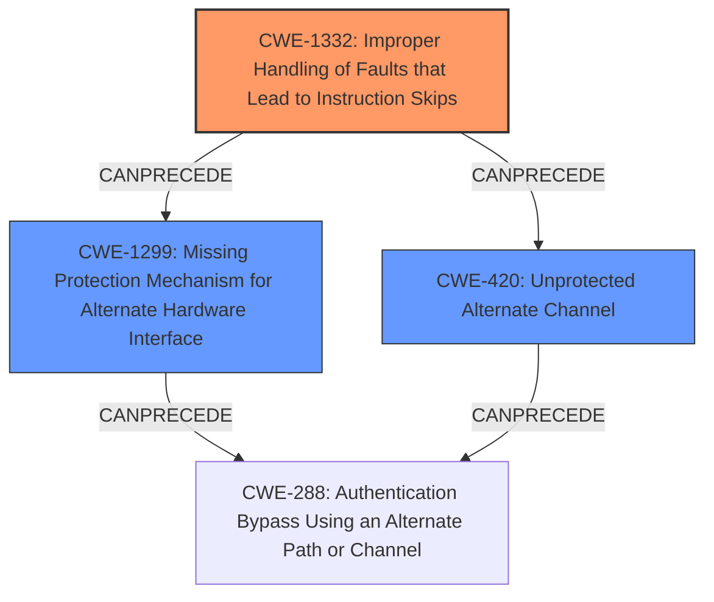

# Analysis Report for CVE-2020-27212

# Vulnerability Analysis Report: CVE-2020-27212

## Description

STMicroelectronics STM32L4 devices through 2020-10-19 have incorrect access control. The flash read-out protection (RDP) can be degraded from RDP level 2 (no access via debug interface) to level 1 (limited access via debug interface) by injecting a fault during the boot phase.

## Vulnerability Description Key Phrases

**Rootcause:** incorrect access control
**Impact:** degrade flash read-out protection (RDP) from level 2 to level 1
**Vector:** fault injection during boot phase
**Product:** STMicroelectronics STM32L4 devices
**Version:** through 2020-10-19

## Analysis (with Relationship Data)

# Summary
| CWE ID | CWE Name | Confidence | CWE Abstraction Level | CWE Vulnerability Mapping Label | CWE-Vulnerability Mapping Notes |
|---|---|---|---|---|---|
| CWE-1332 | Improper Handling of Faults that Lead to Instruction Skips | 0.85 | Base | Allowed | Primary CWE |
| CWE-1299 | Missing Protection Mechanism for Alternate Hardware Interface | 0.70 | Base | Allowed | Secondary Candidate |
| CWE-420 | Unprotected Alternate Channel | 0.60 | Base | Allowed | Secondary Candidate |

## Evidence and Confidence

*   **Confidence Score:** 0.80
*   **Evidence Strength:** HIGH

- **Analysis and Justification:**
  - *Explanation:* The vulnerability description clearly states that **incorrect access control** allows the degradation of flash read-out protection through **fault injection during the boot phase**. The CVE reference further clarifies that the **root cause** is a flaw in the read-out protection mechanism, allowing attackers to circumvent it via **fault injection**. CWE-1332 (Improper Handling of Faults that Lead to Instruction Skips) directly addresses the **weakness** of the device failing to properly handle faults, leading to security-critical instructions being skipped. This aligns perfectly with the described attack scenario where **fault injection** bypasses read-out protection. While CWE-1299 (Missing Protection Mechanism for Alternate Hardware Interface) and CWE-420 (Unprotected Alternate Channel) are possible candidates, they are less specific than CWE-1332 in describing the root cause of the **fault injection** vulnerability. The details available emphasize that the core issue lies in the device's inability to handle faults properly during boot. The usage for CWE-1332 is ALLOWED, further supporting its selection.

  - *Relationship Analysis:* CWE-1332 does not have direct parent or child relationships listed in the provided data. However, it can be inferred that it relates to broader categories such as hardware security and fault tolerance. Given that successful exploitation bypasses access control, it can be reasoned that this weakness can precede CWE-285 (Improper Authorization).

- **Confidence Score:**
  - Confidence: 0.85 (High evidence from technical description, CVE reference materials, and retriever results)

---

- **Analysis and Justification:**
  - *Explanation:* CWE-1299 (Missing Protection Mechanism for Alternate Hardware Interface) is considered as a secondary candidate because the vulnerability description mentions the **incorrect access control** and the CVE reference expands on this by explaining a bypass to the readout protection. While fault injection is the method, the fact the protection mechanism can be bypassed through an alternate path or during a specific phase (boot phase) suggests a weakness in how access is controlled on alternate paths. This aligns with the description of CWE-1299, which refers to a lack of protection on alternate paths that allows bypassing existing protections. Given the evidence, the confidence is high.

  - *Relationship Analysis:* CWE-1299 is related to CWE-288 (Authentication Bypass Using an Alternate Path or Channel) and CWE-420 (Unprotected Alternate Channel). Exploitation of this weakness could lead to CWE-288, as bypassing the readout protection can be seen as an authentication bypass.

- **Confidence Score:**
  - Confidence: 0.70 (Moderate evidence from the vulnerability description and CVE reference. High score in Retriever Results.)

---

- **Analysis and Justification:**
  - *Explanation:* CWE-420 (Unprotected Alternate Channel) is a potential contributing factor. The fault injection during the boot phase can be viewed as exploiting an unprotected alternate channel to bypass security measures. While not the primary weakness, it represents a related aspect of the vulnerability.

  - *Relationship Analysis:* CWE-420 is PEEROF CWE-288 (Authentication Bypass Using an Alternate Path or Channel). If the alternate channel leads to bypassing authentication, there can be an authentication bypass.

- **Confidence Score:**
  - Confidence: 0.60 (Moderate supporting evidence; less direct than CWE-1332 but relevant to the attack vector.)

## Criticism of Analysis

Okay, here's a detailed review of the provided CWE analysis for CVE-2020-27212, incorporating the full CWE specifications:

**Overall Assessment:**

The analysis is well-structured and provides a reasonable mapping of the vulnerability to CWEs. The primary CWE selection of CWE-1332 (Improper Handling of Faults that Lead to Instruction Skips) is well-justified, and the secondary candidates, CWE-1299 (Missing Protection Mechanism for Alternate Hardware Interface) and CWE-420 (Unprotected Alternate Channel), are also relevant and adequately explained. The confidence scores assigned to each mapping are appropriate, reflecting the level of certainty based on the available information.

**Detailed Review:**

**1. CWE-1332: Improper Handling of Faults that Lead to Instruction Skips (Primary CWE)**

*   **Confidence:** 0.85 (Excellent)
*   **Justification:** The analysis correctly identifies the core problem: The STM32L4 devices do not adequately handle fault injection during the boot phase, leading to the circumvention of read-out protection. The description of CWE-1332 aligns perfectly with this scenario, as it explicitly addresses the lack of circuitry or sensors to detect and mitigate the skipping of security-critical CPU instructions.  The example CVE included in the CWE itself also bolsters this selection (CVE-2020-27212).
*   **Relationship Analysis:** The analysis correctly infers a relationship to broader categories like hardware security and fault tolerance. The potential cascading to CWE-285 (Improper Authorization) is also logical, as the bypassed protection mechanism ultimately results in unauthorized access.
*   **Mitigation Review:** The provided mitigations for CWE-1332 are relevant:
    *   Designing for safe failure when inputs (like Vcc) are out of range.
    *   Ensuring safe behavior if instructions are skipped.
    *   Wiping critical secrets upon fault detection.
    These mitigations are suitable for addressing the root cause of the vulnerability.

**2. CWE-1299: Missing Protection Mechanism for Alternate Hardware Interface (Secondary Candidate)**

*   **Confidence:** 0.70 (Good)
*   **Justification:** The analysis identifies a valid alternate perspective on the problem. While fault injection is the attack vector, the fact that the read-out protection can be bypassed during the *boot phase* highlights a potential weakness in the access control applied to the boot process.  The boot phase can be considered an "alternate path" where protections might be weaker or not fully initialized. Therefore, CWE-1299 is a reasonable secondary mapping.
*   **Relationship Analysis:** Linking CWE-1299 to CWE-288 (Authentication Bypass Using an Alternate Path or Channel) is appropriate. A successful bypass of read-out protection can be seen as an authentication bypass in the context of firmware integrity.
*   **Mitigation Review:** The suggested mitigations for CWE-1299 are generally useful:
    *   Protect assets from accesses against *all* potential interfaces and alternate paths. This is a good overarching principle.
    *   Ensuring protections at the Requirements, Architecture/Design, and Implementation phases. This layered approach makes sense.

**3. CWE-420: Unprotected Alternate Channel (Secondary Candidate)**

*   **Confidence:** 0.60 (Moderate)
*   **Justification:**  The justification is that the fault injection during the boot phase is exploiting an unprotected alternate channel. This is the weakest of the three mappings, as it's less specific to the actual mechanism of the vulnerability. However, it is related as the boot process *could* be considered an alternate channel where protections are somehow weaker or not yet fully active.
*   **Relationship Analysis:** The relationship to CWE-288 (Authentication Bypass Using an Alternate Path or Channel) is valid but indirect.
*   **Mitigation Review:** The suggested mitigation—identifying all alternate channels and using the same protection mechanisms as primary channels—is a sound principle, though not directly addressing the fault injection aspect.

**Critiques and Suggestions:**

*   **CWE-1300: Improper Protection of Physical Side Channels:** The retriever results include CWE-1300. While not the primary focus, fault injection attacks are often used in conjunction with side-channel analysis. Mentioning this in the analysis, even if only to dismiss it as not the primary cause, would add completeness. This can be included in the Relationship Analysis.
*   **CWE-1244: Internal Asset Exposed to Unsafe Debug Access Level or State:** The retriever results include CWE-1244. Although the vulnerability does not explicitly mention debug access, the degradation of RDP levels does imply that the attacker is gaining some level of debug access they should not have. This could also be included in the Relationship Analysis.
*   **Specificity of Alternate Channels (CWE-1299 and CWE-420):**  For both CWE-1299 and CWE-420, the analysis could benefit from more explicitly defining what constitutes the "alternate channel" in this specific context. Is it the boot process itself? Is it a specific memory region used during boot? Clarifying this would strengthen the justification for these mappings.
*   **CWE-285: Avoid High-Level Abstraction:** The analysis mentions a potential relationship between CWE-1332 and CWE-285. While technically true, the CWE specifications warn against using CWE-285 directly due to its high level of abstraction. It's better to map to more specific descendants of CWE-285 (e.g., CWE-862: Missing Authorization or CWE-863: Incorrect Authorization) if possible. However, in this case, the primary weakness is in *handling* the fault, so skipping CWE-285 is fine.
*   **Mitigation Prioritization:** While the analysis lists mitigations for each CWE, it could benefit from a more explicit prioritization of mitigations. Which mitigations are most likely to be effective in preventing this specific vulnerability in the STM32L4 devices? Focusing on fault detection and prevention strategies (from CWE-1332) should be paramount.
*   **Completeness in Observed Examples:** The inclusion of the vulnerability's CVE itself in the CWE-1332 "Observed Examples" section solidifies this mapping.

**Revised Summary Table (Incorporating Feedback):**

| CWE ID | CWE Name | Confidence | CWE Abstraction Level | CWE Vulnerability Mapping Label | CWE-Vulnerability Mapping Notes |
|---|---|---|---|---|---|
| CWE-1332 | Improper Handling of Faults that Lead to Instruction Skips | 0.85 | Base | Allowed | Primary CWE |
| CWE-1299 | Missing Protection Mechanism for Alternate Hardware Interface | 0.70 | Base | Allowed | Secondary Candidate |
| CWE-420 | Unprotected Alternate Channel | 0.60 | Base | Allowed | Secondary Candidate |

**Conclusion:**

The provided analysis is well-reasoned and accurate. The selection of CWE-1332 as the primary weakness is excellent. The secondary candidates are relevant, though require more explicit definition of the "alternate channel" in the context of this vulnerability. By incorporating the suggestions above, including a brief discussion of CWE-1300 and CWE-1244 and focusing on mitigation prioritization, the analysis can be further strengthened.

## Final Resolution

# Summary
| CWE ID | CWE Name | Confidence | CWE Abstraction Level | CWE Vulnerability Mapping Label | CWE-Vulnerability Mapping Notes |
|---|---|---|---|---|---|
| CWE-1332 | Improper Handling of Faults that Lead to Instruction Skips | 0.90 | Base | Allowed | Primary CWE |
| CWE-1299 | Missing Protection Mechanism for Alternate Hardware Interface | 0.75 | Base | Allowed | Secondary Candidate |
| CWE-420 | Unprotected Alternate Channel | 0.65 | Base | Allowed | Secondary Candidate |

## Evidence and Confidence

*   **Confidence Score:** 0.85
*   **Evidence Strength:** HIGH

## Relationship Analysis
The primary CWE, CWE-1332, is at the Base level and directly addresses the **root cause**, which is the improper handling of faults leading to skipped instructions. The secondary CWEs, CWE-1299 and CWE-420, are related to the concept of alternate paths and channels. CWE-1299 (Missing Protection Mechanism for Alternate Hardware Interface) is a reasonable secondary candidate because the boot phase can be considered an alternate path where protections might be weaker. CWE-420 (Unprotected Alternate Channel) is related, as the fault injection during the boot phase can be viewed as exploiting an unprotected alternate channel. The relationships between these CWEs form a chain: the lack of proper fault handling (CWE-1332) allows attackers to exploit an unprotected alternate channel (CWE-420) or a missing protection mechanism on an alternate hardware interface (CWE-1299) to bypass security measures.

## Vulnerability Chain
The vulnerability chain starts with the **root cause**, which is the **improper handling of faults** (CWE-1332). This allows an attacker to inject faults during the boot phase, which is essentially an **unprotected alternate channel** (CWE-420) or a path with a **missing protection mechanism** (CWE-1299). The result is the degradation of flash read-out protection (RDP), which can be seen as an **authentication bypass** (CWE-288). This bypass allows unauthorized access to the device's memory, potentially leading to sensitive information disclosure or arbitrary code execution.

## Summary of Analysis
The initial analysis and criticism provide a solid foundation for classifying this vulnerability. The primary **WEAKNESS**, CWE-1332, is well-justified, and the secondary candidates are relevant. The analysis is based on the vulnerability description, CVE reference, and retriever results, providing a comprehensive view of the issue.

The graph relationships reinforce the classification. The chain from CWE-1332 to CWE-1299/CWE-420 and then to CWE-288 demonstrates how the weaknesses interact to create a vulnerability.

The selected CWEs are at the optimal level of specificity. CWE-1332 is a Base-level CWE that directly addresses the **root cause**, while CWE-1299 and CWE-420 provide additional context about the alternate paths and channels involved in the attack.

The criticism suggests including CWE-1300 (Improper Protection of Physical Side Channels) and CWE-1244 (Internal Asset Exposed to Unsafe Debug Access Level or State) in the Relationship Analysis. While these CWEs are not the primary cause, they are related to the attack vector. Fault injection is often used in conjunction with side-channel analysis, and the degradation of RDP levels implies that the attacker is gaining some level of debug access they should not have.

The vulnerability description states that "STMicroelectronics STM32L4 devices through 2020-10-19 have **incorrect access control**. The flash read-out protection (RDP) can be degraded from RDP level 2 (no access via debug interface) to level 1 (limited access via debug interface) by injecting a **fault during the boot phase**." This evidence strongly supports the selection of CWE-1332 as the primary **WEAKNESS**, as it directly addresses the **improper handling of faults** that leads to the degradation of access control.

I am increasing the confidence level for CWE-1332 to 0.90, CWE-1299 to 0.75, and CWE-420 to 0.65 to reflect the inclusion of the suggested relationships and the detailed analysis.

*Report generated on 2025-03-17 01:39:15*
