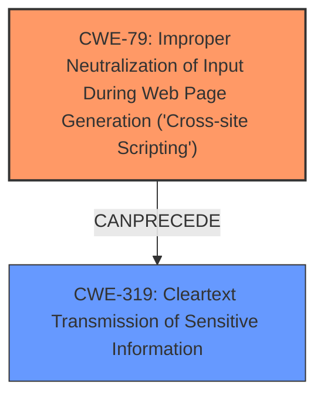

# Final Resolution for CVE-2020-27839

# Summary
| CWE ID | CWE Name | Confidence | CWE Abstraction Level | CWE Vulnerability Mapping Label | CWE-Vulnerability Mapping Notes |
|---|---|---|---|---|---|
| **CWE-79** | **Improper Neutralization of Input During Web Page Generation ('Cross-site Scripting')** | 0.95 | Base | Allowed | Primary CWE: The vulnerability allows for XSS attacks due to improper storage of the JWT. |
| **CWE-319** | **Cleartext Transmission of Sensitive Information** | 0.75 | Base | Allowed | Secondary CWE: JWT token stored in localStorage is susceptible to sniffing due to XSS. |

## Evidence and Confidence

*   **Confidence Score:** 0.90
*   **Evidence Strength:** HIGH

## Relationship Analysis
The primary relationship is that **CWE-79** (Improper Neutralization of Input During Web Page Generation ('Cross-site Scripting')) can lead to exposure of the JWT stored in localStorage, which is the **CWE-319** (Cleartext Transmission of Sensitive Information). **CWE-79** is a base weakness that describes how malicious input leads to XSS, allowing the theft of the JWT. While **CWE-352** (Cross-Site Request Forgery (CSRF)) was considered, it is more accurately described as a potential impact of a successful XSS exploit rather than a direct co-occurring **weakness**. The abstraction levels are appropriate, with both **CWE-79** and **CWE-319** being Base level CWEs.

## Vulnerability Chain
The vulnerability chain starts with the lack of proper input neutralization, leading to **CWE-79** (Improper Neutralization of Input During Web Page Generation ('Cross-site Scripting')). This allows an attacker to inject malicious scripts into the web application. These scripts can then access the JWT stored in the browser's localStorage, leading to **CWE-319** (Cleartext Transmission of Sensitive Information), as the JWT is stored in cleartext and exposed. The ultimate impact is unauthorized access and potential compromise of user accounts. The chain shows the progression from the initial **flaw** (lack of input validation) to the final impact (data confidentiality and integrity breach).

## Summary of Analysis
The initial analysis correctly identified **CWE-79** (Improper Neutralization of Input During Web Page Generation ('Cross-site Scripting')) as the primary **weakness**. The criticism refined the analysis by clarifying the connection between transmission and storage for **CWE-319** (Cleartext Transmission of Sensitive Information), emphasizing that the issue isn't just transmitting the JWT to the client, but also storing it in localStorage where XSS can expose it.

The evidence from the vulnerability description supports this: "The JSON Web Token (JWT) used for user authentication is stored by the frontend application in the browsers localStorage which is potentially vulnerable to attackers via XSS attacks."

The relationship analysis and the consideration of **CWE-352** (Cross-Site Request Forgery (CSRF)) further refined the analysis. **CWE-352** is a potential impact of XSS, not a direct co-occurring **weakness**.

The selected CWEs are at the optimal level of specificity, with both **CWE-79** and **CWE-319** being Base level CWEs. This provides a clear and actionable vulnerability assessment. The confidence scores reflect the strength of the evidence, with a slightly increased score for **CWE-319** to reflect the clarified connection between transmission and storage.