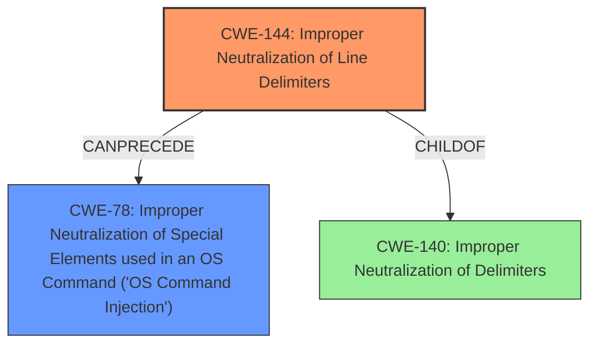

# Final Resolution for CVE-2020-28026

# Summary
| CWE ID | CWE Name | Confidence | CWE Abstraction Level | CWE Vulnerability Mapping Label | CWE-Vulnerability Mapping Notes |
|---|---|---|---|---|---|
| CWE-144 | Improper Neutralization of Line Delimiters | 0.95 | Variant | Allowed | Primary CWE |
| CWE-78 | Improper Neutralization of Special Elements used in an OS Command ('OS Command Injection') | 0.7 | Base | Allowed | Secondary Candidate |

## Evidence and Confidence

*   **Confidence Score:** 0.90
*   **Evidence Strength:** HIGH

## Relationship Analysis
The primary weakness is **CWE-144 (Improper Neutralization of Line Delimiters)**, a Variant of **CWE-140 (Improper Neutralization of Delimiters)**. The injection of newline characters, due to the **lack of proper neutralization**, allows an attacker to inject OS commands, leading to **CWE-78 (Improper Neutralization of Special Elements used in an OS Command ('OS Command Injection'))**. Thus, there's a clear chain relationship where **CWE-144** can precede **CWE-78**.

## Vulnerability Chain
The vulnerability chain starts with the **improper handling of newline characters** (**CWE-144**) in the `spool_read_header()` function, where `fgets()` reads lines, potentially leading to line truncation and newline injection. This allows an attacker to inject malicious OS commands, resulting in arbitrary command execution as root (**CWE-78**). The root cause is the **lack of proper input validation and neutralization of line delimiters**. The impact is the execution of arbitrary commands with root privileges.

## Summary of Analysis
The initial analysis correctly identifies **CWE-144** as the primary weakness, which is directly supported by the vulnerability description mentioning "**Improper Neutralization of Line Delimiters**." The analysis also reasonably suggests **CWE-78** as a secondary concern, given the possibility of arbitrary command execution.

The criticism highlights the importance of emphasizing the chaining relationship between **CWE-144** and **CWE-78**. **CWE-78** is a consequence of **CWE-144**; the line delimiter injection enables command injection.

Based on the evidence, relationship analysis, and criticism, the final determination maintains **CWE-144** as the primary **weakness** and **CWE-78** as the secondary concern. The confidence score for **CWE-78** is increased to 0.7 to reflect the direct consequence of the **improper neutralization of line delimiters**.

The selected CWEs are at the optimal level of specificity. **CWE-144** is a Variant that directly addresses the line delimiter issue, while **CWE-78** captures the impact of arbitrary command execution. Using **CWE-74 (Improper Neutralization of Special Elements in Output Used by a Downstream Component ('Injection'))** would be too high-level, as suggested in the criticism.