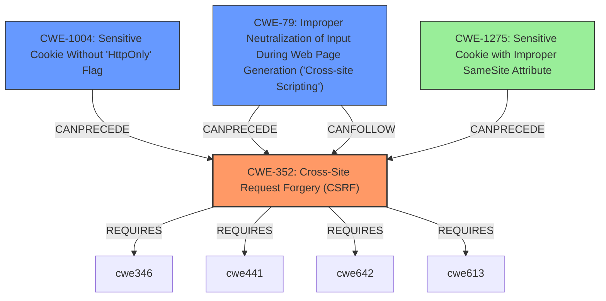

# Analysis Report for CVE-2020-28482

# Vulnerability Analysis Report: CVE-2020-28482

## Description

This affects the package fastify-csrf before 3.0.0. 1. The generated cookie used insecure defaults, and did not have the httpOnly flag on cookieOpts { path /, sameSite true } 2. The CSRF token was available in the GET query parameter

## Vulnerability Description Key Phrases

**Impact:** CSRF vulnerability
**Vector:** CSRF token in GET query parameter
**Product:** fastify-csrf
**Version:** before 3.0.0

## Analysis (with Relationship Data)

# Summary
| CWE ID | CWE Name | Confidence | CWE Abstraction Level | CWE Vulnerability Mapping Label | CWE-Vulnerability Mapping Notes |
|---|---|---|---|---|---|
| CWE-352 | Cross-Site Request Forgery (CSRF) | 0.9 | Compound | Primary | Allowed |
| CWE-1004 | Sensitive Cookie Without 'HttpOnly' Flag | 0.8 | Variant | Secondary | Allowed |
| CWE-79 | Improper Neutralization of Input During Web Page Generation ('Cross-site Scripting') | 0.7 | Base | Secondary | Allowed |

## Evidence and Confidence

*   **Confidence Score:** 0.85
*   **Evidence Strength:** HIGH

- **Analysis and Justification:**  
  - *Explanation:* The vulnerability description clearly states that this affects the package fastify-csrf before 3.0.0 due to two reasons: 1. The generated cookie used insecure defaults, and did not have the httpOnly flag on cookieOpts { path /, sameSite true } 2. The **CSRF token was available in the GET query parameter**, which is a clear indication of a **CSRF vulnerability**. Therefore, CWE-352 (Cross-Site Request Forgery (CSRF)) is the most appropriate primary CWE. The presence of the cookie without the `httpOnly` flag contributes to potential exposure of the token, thus CWE-1004 (Sensitive Cookie Without 'HttpOnly' Flag) is a secondary contributing weakness. The lack of `httpOnly` flag also can cause a **Cross-site Scripting (XSS)** vulnerability (CWE-79), hence, it's added as a secondary CWE. MITRE mapping guidance for CWE-352 indicates this is ALLOWED.
  
  - *Relationship Analysis:* "CWE-352 (Cross-Site Request Forgery (CSRF)) is related to CWE-1275 (Sensitive Cookie with Improper SameSite Attribute) since improper cookie settings can lead to CSRF. CWE-352 Requires weaknesses such as CWE-613, CWE-642, CWE-441, and CWE-346. CWE-1004 and CWE-79 are potential root causes that can enable or worsen CSRF attacks."

- **Confidence Score:**  
  - *Example:* Confidence: 0.9 (High evidence from technical description and CVE reference materials)

---

## Criticism of Analysis

Okay, here's a detailed review of the CWE analysis, considering the full CWE specifications:

**Overall Assessment:**

The analysis is generally sound and identifies the key weaknesses associated with the described vulnerability in `fastify-csrf` before version 3.0.0. The mapping to CWE-352, CWE-1004, and CWE-79 is justified, and the confidence levels are reasonable. The provided explanations and relationships are also well-articulated.

**Detailed Review:**

| CWE ID  | CWE Name                                                                                                                            | Confidence | Abstraction Level | Assessment                                                                                                                                                                                                                                                                                                                          |
| :------- | :---------------------------------------------------------------------------------------------------------------------------------- | :--------- | :---------------- | :-------------------------------------------------------------------------------------------------------------------------------------------------------------------------------------------------------------------------------------------------------------------------------------------------------------------- |
| CWE-352   | Cross-Site Request Forgery (CSRF)                                                                                                   | 0.9        | Compound          | **Correct**. The primary vulnerability is indeed CSRF.  The description clearly indicates a failure to properly verify the origin of requests, as the CSRF token was exposed in the GET query parameter.  This aligns perfectly with CWE-352's description.  The provided examples for CWE-352 are also relevant. Allowed.                                                                       |
| CWE-1004  | Sensitive Cookie Without 'HttpOnly' Flag                                                                                            | 0.8        | Variant           | **Correct**. The absence of the `httpOnly` flag directly contributes to the risk of token theft via XSS.  This makes CWE-1004 a suitable secondary weakness.  The mapping guidance (Allowed) aligns. The examples for CWE-1004 are relevant.                                                                       |
| CWE-79    | Improper Neutralization of Input During Web Page Generation ('Cross-site Scripting')                                            | 0.7        | Base              | **Correct**. The lack of `httpOnly` on the cookie enables a reflected XSS vector to access the CSRF token. Using the full specifications for CWE-79, the mitigation techniques are also relevant. The attacker could then transfer the private information. Allowed.                                                                        |

**Recommendations and Potential Improvements:**

1.  **CWE-1275: Sensitive Cookie with Improper SameSite Attribute:** Consider including CWE-1275 as a tertiary weakness.  While the description mainly focuses on the `httpOnly` flag and GET parameter exposure, the `SameSite` attribute is mentioned in the original analyzer input, and its absence (or incorrect value) could exacerbate CSRF.  If the `SameSite` attribute is not properly configured, it could allow cross-origin requests to include the cookie, further undermining CSRF protection.

    *   **Justification:**  The CWE-1275 description specifically mentions how the `None` value may lead to CSRF attacks. The relationship between `CWE-1275` and `CWE-352` is also clearly defined as `CanPrecede -> CWE-352`.
    *  Given the lack of specific details about the SameSite configuration, it should be a lower confidence level (e.g., 0.5 or 0.6) and marked as a potential, rather than a definite, contributor.

2.  **Relationship Analysis:** Expand the Relationship Analysis to include more CWEs that are relevant as per the MITRE specifications.
    *CWE-352 is related to CWE-1275 (Sensitive Cookie with Improper SameSite Attribute) since improper cookie settings can lead to CSRF. CWE-352 Requires weaknesses such as CWE-346 (Origin Validation Error), CWE-441 (Unintended Proxy or Intermediary), CWE-642 (External Control of Critical State Data), and CWE-613 (Insufficient Session Expiration). CWE-1004 and CWE-79 are potential root causes that can enable or worsen CSRF attacks. The `CanFollow` relationship between CWE-79 and CWE-352 should also be mentioned.

3.  **CWE Mitigation Considerations:** In the evidence and justification section, consider expanding the analysis with potential mitigations mentioned under each weakness in the MITRE specifications. For example,

    *   For `CWE-352`, suggest using a vetted library or framework with anti-CSRF packages such as OWASP CSRFGuard, generating unique nonces for each form and verifying the nonce.
    *   For `CWE-1004`, stress the importance of leveraging the HttpOnly flag.
    *   For `CWE-79`, suggest libraries like Microsoft's Anti-XSS library or OWASP ESAPI Encoding module and the XSS Prevention Cheat Sheet for encoding and escaping.

4. **Review Combined Results:** Refer to the "Top Combined Results" table from the Retriever Results. The high scores for CWE-1275 (Sensitive Cookie with Improper SameSite Attribute) and CWE-201 (Insertion of Sensitive Information Into Sent Data) indicate that these should be strongly considered as potential CWEs, even if they're not ultimately selected.

5.  **Specificity of Attack Vector:** Consider whether CWE-201, Insertion of Sensitive Information Into Sent Data is an issue. The CSRF token itself is being sent in the GET query parameter, but whether that classifies as *sensitive* depends on the specific context and whether other information besides the token is also sent.

**Revised Summary (with suggested changes):**

| CWE ID  | CWE Name                                                                                                                            | Confidence | Abstraction Level | CWE Vulnerability Mapping Label | CWE-Vulnerability Mapping Notes |
| :------- | :---------------------------------------------------------------------------------------------------------------------------------- | :--------- | :---------------- | :------------------------------ | :------------------------------ |
| CWE-352   | Cross-Site Request Forgery (CSRF)                                                                                                   | 0.9        | Compound          | Primary                       | Allowed                       |
| CWE-1004  | Sensitive Cookie Without 'HttpOnly' Flag                                                                                            | 0.8        | Variant           | Secondary                     | Allowed                       |
| CWE-79    | Improper Neutralization of Input During Web Page Generation ('Cross-site Scripting')                                            | 0.7        | Base              | Secondary                     | Allowed                       |
| CWE-1275   | Sensitive Cookie with Improper SameSite Attribute                                                                                                   | 0.5        | Variant          | Tertiary                    | Allowed                       |

**Revised Evidence and Confidence**

*   **Confidence Score:** 0.80
*   **Evidence Strength:** HIGH

- **Analysis and Justification:**  
  - *Explanation:* The vulnerability description clearly states that this affects the package fastify-csrf before 3.0.0 due to two reasons: 1. The generated cookie used insecure defaults and did not have the httpOnly flag on cookieOpts { path /, sameSite true } 2. The **CSRF token was available in the GET query parameter**, which is a clear indication of a **CSRF vulnerability**. Therefore, CWE-352 (Cross-Site Request Forgery (CSRF)) is the most appropriate primary CWE. The presence of the cookie without the `httpOnly` flag contributes to potential exposure of the token, thus CWE-1004 (Sensitive Cookie Without 'HttpOnly' Flag) is a secondary contributing weakness. The lack of `httpOnly` flag also can cause a **Cross-site Scripting (XSS)** vulnerability (CWE-79), hence, it's added as a secondary CWE. The improper configuration of the `SameSite` attribute (CWE-1275) can allow cross-origin requests to include the cookie, further undermining CSRF protection, and is added as a tertiary CWE. MITRE mapping guidance for CWE-352 indicates this is ALLOWED. The mitigation methods include using an anti-CSRF package, generating unique nonces for each form, setting the HttpOnly flag, libraries like the OWASP ESAPI Encoding module and encoding and escaping the outputs.
  
  - *Relationship Analysis:* "CWE-352 (Cross-Site Request Forgery (CSRF)) is related to CWE-1275 (Sensitive Cookie with Improper SameSite Attribute) since improper cookie settings can lead to CSRF. CWE-352 Requires weaknesses such as CWE-346 (Origin Validation Error), CWE-441 (Unintended Proxy or Intermediary), CWE-642 (External Control of Critical State Data), and CWE-613 (Insufficient Session Expiration). CWE-1004 and CWE-79 are potential root causes that can enable or worsen CSRF attacks. "CWE-79 CanFollows CWE-352".

By incorporating these suggestions, the analysis becomes more comprehensive and aligns even better with the nuances of the CWE specifications.

## Final Resolution

# Summary
| CWE ID | CWE Name | Confidence | CWE Abstraction Level | CWE Vulnerability Mapping Label | CWE-Vulnerability Mapping Notes |
|---|---|---|---|---|---|
| CWE-352 | Cross-Site Request Forgery (CSRF) | 0.9 | Compound | Primary | Allowed |
| CWE-1004 | Sensitive Cookie Without 'HttpOnly' Flag | 0.8 | Variant | Secondary | Allowed |
| CWE-79 | Improper Neutralization of Input During Web Page Generation ('Cross-site Scripting') | 0.7 | Base | Secondary | Allowed |
| CWE-1275 | Sensitive Cookie with Improper SameSite Attribute | 0.5 | Variant | Tertiary | Allowed |

## Evidence and Confidence

*   **Confidence Score:** 0.80
*   **Evidence Strength:** HIGH

## Relationship Analysis
The primary CWE is CWE-352 (**Cross-Site Request Forgery (CSRF)**), a compound weakness. This is supported by the fact that the **CSRF token was available in the GET query parameter**, which violates CSRF protection mechanisms. CWE-352 Requires weaknesses such as CWE-346 (Origin Validation Error), CWE-441 (Unintended Proxy or Intermediary), CWE-642 (External Control of Critical State Data), and CWE-613 (Insufficient Session Expiration). CWE-1004 (Sensitive Cookie Without 'HttpOnly' Flag) and CWE-79 (Improper Neutralization of Input During Web Page Generation ('Cross-site Scripting')) are contributing factors. CWE-1275 (Sensitive Cookie with Improper SameSite Attribute) is included as a tertiary weakness with lower confidence, as the original description mentions `SameSite` but doesn't provide specifics. The `CanPrecede` relationship between `CWE-1275` and `CWE-352` further supports this addition.

## Vulnerability Chain
The vulnerability chain starts with insecure cookie handling and the exposure of the **CSRF token in the GET query parameter**. This leads to:
1.  **Root Cause:** **Improper cookie configuration** (missing `HttpOnly` flag and potentially incorrect `SameSite` attribute).
2.  **Weakness:** **CSRF token is exposed and vulnerable to theft** via XSS or other means.
3.  **Vulnerability:** **Cross-Site Request Forgery (CSRF)** due to the ability of an attacker to forge requests on behalf of the user.
4.  **Impact:** Unauthorized actions performed by the attacker on behalf of the user.

## Summary of Analysis
The initial analysis and the criticism both correctly identified the main issues. The primary weakness is CWE-352 (**Cross-Site Request Forgery (CSRF)**), as explicitly indicated by the exposure of the **CSRF token in the GET query parameter**. The secondary CWEs, CWE-1004 (Sensitive Cookie Without 'HttpOnly' Flag) and CWE-79 (Improper Neutralization of Input During Web Page Generation ('Cross-site Scripting')), are valid contributors as the lack of `HttpOnly` increases the risk of XSS and token theft.

I have added CWE-1275 (Sensitive Cookie with Improper SameSite Attribute) as a tertiary concern with a lower confidence score (0.5) due to the mention of `SameSite` in the initial description and the `CanPrecede` relationship with `CWE-352`, despite a lack of specific details.

The retriever scores were considered.

The CWEs selected are at the appropriate level of specificity (Base and Variant levels for contributing factors, Compound for the primary). The inclusion of specific cookie attributes and the method of token transmission makes these choices more precise than higher-level classifications.

*Report generated on 2025-03-16 22:29:18*
