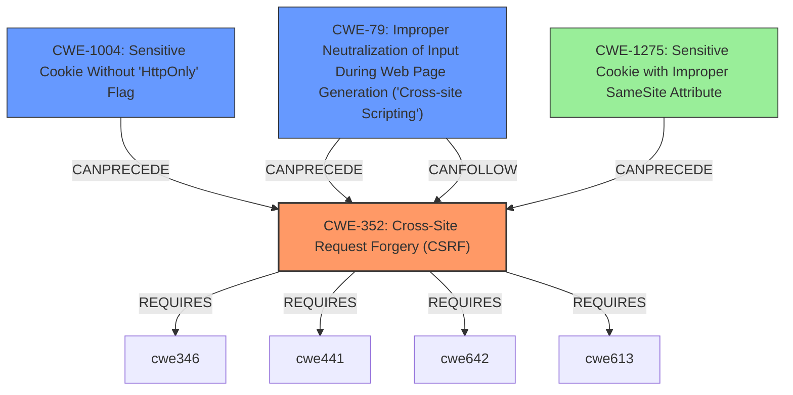

# Final Resolution for CVE-2020-28482

# Summary
| CWE ID | CWE Name | Confidence | CWE Abstraction Level | CWE Vulnerability Mapping Label | CWE-Vulnerability Mapping Notes |
|---|---|---|---|---|---|
| CWE-352 | Cross-Site Request Forgery (CSRF) | 0.9 | Compound | Primary | Allowed |
| CWE-1004 | Sensitive Cookie Without 'HttpOnly' Flag | 0.8 | Variant | Secondary | Allowed |
| CWE-79 | Improper Neutralization of Input During Web Page Generation ('Cross-site Scripting') | 0.7 | Base | Secondary | Allowed |
| CWE-1275 | Sensitive Cookie with Improper SameSite Attribute | 0.5 | Variant | Tertiary | Allowed |

## Evidence and Confidence

*   **Confidence Score:** 0.80
*   **Evidence Strength:** HIGH

## Relationship Analysis
The primary CWE is CWE-352 (**Cross-Site Request Forgery (CSRF)**), a compound weakness. This is supported by the fact that the **CSRF token was available in the GET query parameter**, which violates CSRF protection mechanisms. CWE-352 Requires weaknesses such as CWE-346 (Origin Validation Error), CWE-441 (Unintended Proxy or Intermediary), CWE-642 (External Control of Critical State Data), and CWE-613 (Insufficient Session Expiration). CWE-1004 (Sensitive Cookie Without 'HttpOnly' Flag) and CWE-79 (Improper Neutralization of Input During Web Page Generation ('Cross-site Scripting')) are contributing factors. CWE-1275 (Sensitive Cookie with Improper SameSite Attribute) is included as a tertiary weakness with lower confidence, as the original description mentions `SameSite` but doesn't provide specifics. The `CanPrecede` relationship between `CWE-1275` and `CWE-352` further supports this addition.

## Vulnerability Chain
The vulnerability chain starts with insecure cookie handling and the exposure of the **CSRF token in the GET query parameter**. This leads to:
1.  **Root Cause:** **Improper cookie configuration** (missing `HttpOnly` flag and potentially incorrect `SameSite` attribute).
2.  **Weakness:** **CSRF token is exposed and vulnerable to theft** via XSS or other means.
3.  **Vulnerability:** **Cross-Site Request Forgery (CSRF)** due to the ability of an attacker to forge requests on behalf of the user.
4.  **Impact:** Unauthorized actions performed by the attacker on behalf of the user.

## Summary of Analysis
The initial analysis and the criticism both correctly identified the main issues. The primary weakness is CWE-352 (**Cross-Site Request Forgery (CSRF)**), as explicitly indicated by the exposure of the **CSRF token in the GET query parameter**. The secondary CWEs, CWE-1004 (Sensitive Cookie Without 'HttpOnly' Flag) and CWE-79 (Improper Neutralization of Input During Web Page Generation ('Cross-site Scripting')), are valid contributors as the lack of `HttpOnly` increases the risk of XSS and token theft.

I have added CWE-1275 (Sensitive Cookie with Improper SameSite Attribute) as a tertiary concern with a lower confidence score (0.5) due to the mention of `SameSite` in the initial description and the `CanPrecede` relationship with `CWE-352`, despite a lack of specific details.

The retriever scores were considered.

The CWEs selected are at the appropriate level of specificity (Base and Variant levels for contributing factors, Compound for the primary). The inclusion of specific cookie attributes and the method of token transmission makes these choices more precise than higher-level classifications.